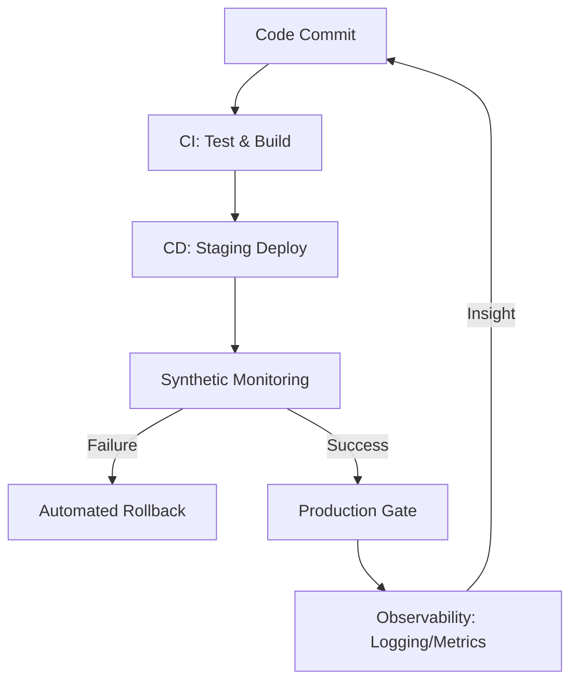

# ✈️ Operation: Day in the Life (Professional Onboarding)

Welcome to the **SRE Bridge**. In this module, we move beyond definitions. You are no longer reading about a role; you are stepping into the "Staff Standard" operational rhythm of a high-tier DevOps team.

> ### 🎮 The Analogy: The Air Traffic Controller
> "A DevOps Engineer is like an Air Traffic Controller. You aren't flying the planes (**Writing the App**), but you are responsible for the radar (**Monitoring**), the runway (**Infrastructure**), and ensuring every landing (**Deployment**) is safe."

---

## 🕒 The Operational Rhythm (Your Daily 24)

### 🌅 08:00 - 09:30 | The Morning Triage
*   **The Goal**: Establish situational awareness.
*   **The Routine**: Check `#alerts-critical`, scan the Grafana dashboard for overnight spikes, and triage the JIRA/ServiceNow board.
*   **The Simulation**: Head to [01-Morning-Triage-Sim](./01-Morning-Triage-Sim/README.md).

### ⚙️ 10:00 - 12:30 | Infrastructure & Pipelines
*   **The Goal**: Clean the runway.
*   **The Routine**: Reviewing Pull Requests (PRs), fixing broken build dependencies, and executing planned IaC changes.
*   **The Standard**: [02-The-Code-Review-Gate](./02-The-Code-Review-Gate/README.md).

### 🚨 13:30 - 16:00 | The Afternoon "Incident"
*   **The Goal**: Restore service; avoid finger-pointing.
*   **The Routine**: Handling production outages, participating in war rooms, and executing rollbacks if a change went south.
*   **The Recovery**: [03-Rollback-Procedures](./03-Rollback-Procedures/README.md).

### 📚 16:30 - Evening | The Long Game
*   **The Goal**: Sharpen the axe.
*   **The Routine**: Updating documentation, working on long-term automation projects (to reduce toil), and reading CNCF whitepapers or tool release notes.

---

## 📊 SRE KPI Dashboard (The Staff Standard)
As a Junior, your value isn't just in "fixing things"; it's in the metrics. These are the three numbers that define our team's success:

| Metric | Definition | The Junior Goal |
| :--- | :--- | :--- |
| **MTTR** | **Mean Time To Repair**. How fast we recover from a failure. | Lower this by improving runbooks and monitoring. |
| **MTBF** | **Mean Time Between Failures**. How stable the system is. | Increase this by building resilient, self-healing code. |
| **Def. Freq** | **Deployment Frequency**. How often we push to Prod. | Increase this by making the CI/CD pipeline "Invisible & Fast." |

---

## 🗺️ Mental Map: The Continuous Feedback Loop

---

## 📅 Weekly & Monthly Responsibilities

### 1. The Blameless Post-Mortem
When things break, we don't look for people to blame; we look for systems to fix. Use our [Post-Mortem Template](./Templates/Post-Mortem-Template.md) to document every incident.

### 2. The On-Call Rotation (Holding the Pager)
You will eventually join the "Pager Rotation." This means being available 24/7 for a week to respond to high-priority alerts via **PagerDuty** or **OpsGenie**.
*   **Rule 1**: Your laptop is your lifeline.
*   **Rule 2**: Silence is only okay if the dashboard is green.

---

## 🏁 Your Next Steps
1.  Complete the [Morning Triage Simulation](./01-Morning-Triage-Sim/README.md).
2.  Review the [Security-First Gate](./02-The-Code-Review-Gate/README.md).
3.  Print the [Daily Success Checklist](../DAILY_CHECKLIST.md) and keep it on your desk.
