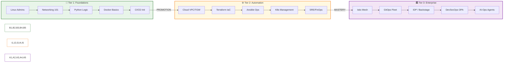

# 🎯 Part 01: Strategic Career Architecture (2026 Edition)

DevOps is not just a job title; it is the intersection of **Culture**, **Process**, and **Tools**. This module bridges the gap between your technical knowledge and professional employment.

---

## 🏗️ The Three-Tier Mastery Journey

---

## 🏛️ The DevOps Trinity

True DevOps excellence occurs at the intersection of three fundamental pillars:

1. **Culture**: Breaking down silos between Development and Operations. Focus on shared responsibility and "Blameless Post-mortems."
2. **Process**: Implementing Lean principles, minimizing "Work in Progress" (WIP), and ensuring fast feedback loops.
3. **Tools**: The automation engine (Terraform, Jenkins, Kubernetes) that makes the process repeatable and scalable.

---

## 🧗 Skill Matrix: Must-Have vs. Differentiators

| Domain | **Must-Have (Core)** | **Differentiators (Expert)** |
| :--- | :--- | :--- |
| **Foundations** | Linux, Bash, Git | Go, eBPF, Kernel Tuning |
| **Cloud** | AWS/Azure/GCP Basics | Multi-Cloud Landing Zones, IAM Governance |
| **Automation** | Terraform, Ansible | Pulumi, CDK, Custom Providers |
| **Orchestration** | Docker, K8s Core | Service Mesh (Istio), Operators, CRDs |
| **Delivery** | Jenkins, CI/CD basic | GitOps (ArgoCD), Spinnaker, Canary Releases |
| **Intelligence** | Monitoring (Prometheus) | AI-Ops, Self-Healing Agents, LLM Ops |

---

## 📜 Professional Certification Path

Certifications validate your baseline knowledge for recruiters and ATS systems.

1. **Foundational**:
   * AWS Certified Cloud Practitioner
   * HashiCorp Certified: Terraform Associate

2. **Professional**:
   * CKA (Certified Kubernetes Administrator)
   * AWS Certified DevOps Engineer - Professional

3. **Specialty**:
   * CKS (Certified Kubernetes Security Specialist)
   * HashiCorp Certified: Vault Associate

---

## 👔 Interview Preparation (Professional Growth)

1. **Q: How do you define "DevOps" to a non-technical stakeholder?**
   * A: DevOps is a cultural mindset and a set of practices that combines software development (Dev) and IT operations (Ops) to shorten the systems development life cycle and provide continuous delivery with high software quality.

2. **Q: When should you prioritize "Reliability" over "Feature Speed"?**
   * A: When your Error Budget is exhausted. In SRE, we use SLOs to determine if the system is unstable enough to warrant a halt on new features to focus on stability engineering.

3. **Q: Explain the concept of "Shift Left" in a CI/CD context.**
   * A: Shifting left means moving tasks like security testing, performance audits, and compliance checks earlier into the development cycle (to the "left" on the timeline) to catch issues before they reach production.

4. **Q: What is the "Bus Factor," and how do you mitigate it through documentation?**
   * A: The Bus Factor is the number of team members that can be unavailable before a project stalls. We mitigate it via "Documentation as Code," ensuring every process is scripted, versioned, and documented in the README.

5. **Q: How do you keep your skills relevant in the rapidly evolving cloud-native ecosystem?**
   * A: By focusing on **Patterns over Tools**. Tools like Jenkins may be replaced by GitHub Actions, but the patterns of CI/CD, Artifact Management, and Quality Gates remain constant.

---

**Next Part**: [02-Resume-Engineering](../03-Resume-Engineering/README.md)
