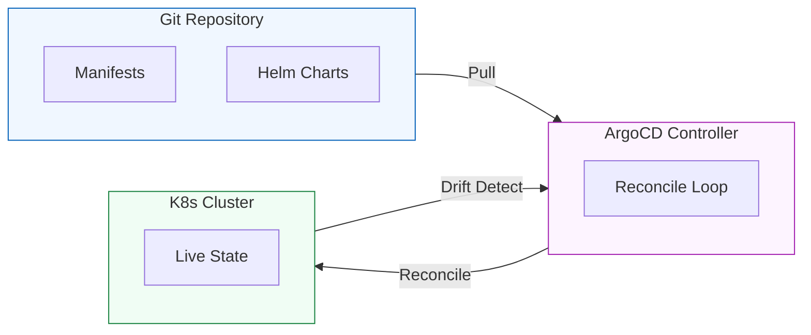

# 🎡 ArgoCD & GitOps: The Technical Deep-Dive

GitOps is the industry-standard paradigm for modern infrastructure management. In this deep-dive, we explore how **ArgoCD** implements the declarative state of truth.

---

## 🏛️ The Core Philosophy: "Git as the Source of Truth"
In traditional DevOps, you "push" changes to a cluster (e.g., `kubectl apply`). In GitOps, you "declare" the state in a Git repo, and a controller (ArgoCD) "pulls" and reconciles the cluster to match that state.

---

## 🛠️ Key Architectural Components

### 1. The Application Controller
The "Brain" of ArgoCD. it continuously monitors the running applications and compares the live state against the desired state defined in the repository.

### 2. The Repository Server
Maintains a local cache of Git repositories and generates the final Kubernetes manifests (Templating Helm/Kustomize) to be applied.

### 3. ApplicationSets (Fleet Management)
The "Advanced Tier" of ArgoCD. It allows you to automate the creation of hundreds of "Applications" based on patterns (e.g., "Create an app for every folder in this Git repo").

---

## ⚙️ Advanced Reconcile Strategies

| Strategy | Description | Best For |
| :--- | :--- | :--- |
| **Manual Sync** | Requires a human to click "Sync" to apply changes. | Learning & Sensitive Production. |
| **Auto-Sync** | Automatically applies changes as soon as they hit Git. | Dev/Staging & High-Velocity teams. |
| **Self-Healing** | Automatically reverts manual `kubectl` changes in the cluster. | Drift Protection and Security. |
| **Pruning** | Automatically deletes resources in K8s that were removed from Git. | Preventing "Zombie" resources. |

---

## 📖 Real-World Scenario: The "Hot-Fix" Disaster
**Incident**: An engineer manually changed a ServicePort in production using `kubectl edit` to bypass a routing issue. He forgot to update Git.
**Reaction**: If **Self-Healing** was ON, ArgoCD would have detected the drift and immediately overwritten his manual change back to the Git state, possibly breaking his "fix."
**Lesson**: In GitOps, **all changes MUST go through Git**. The cluster is a "read-only" environment for humans.

---

## 👔 Interview Preparation

1. **Q: What is the main benefit of GitOps over traditional CI/CD?**
   - *A: Auditability and Disaster Recovery. You have a full Git history of every infrastructure change, and you can recover an entire cluster simply by pointing ArgoCD to your repository.*
2. **Q: Explain "Drift Detection."**
   - *A: It is the process where ArgoCD identifies discrepancies between the YAML in Git (Desired) and the resources in K8s (Live). If They don't match, the app is marked "Out of Sync."*
3. **Q: How does ArgoCD handle Helm charts?**
   - *A: ArgoCD acts as a Helm controller. It template-renders the chart using your `values.yaml` and applies the resulting raw manifests to the cluster.*

---

## 🔗 Learning Links
- [Practice Lab: Install ArgoCD](../../00-Resources/01-Scripts-Code/ArgoCD/install-argo.sh)
- [Mastery Challenges: GitOps](../../2-Intermediate/02-Phase-2/02-Delivery-and-Governance/02-GitOps-Mastery/CHALLENGES.md)
