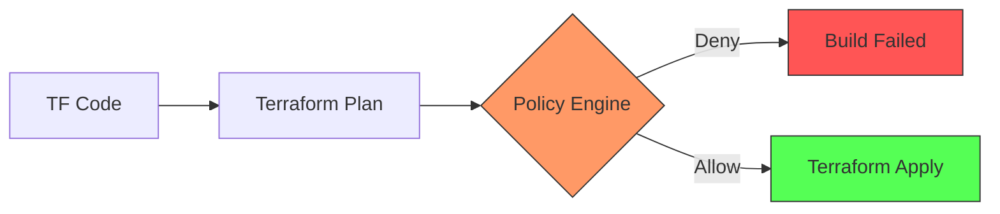

# 🏗️ Terraform Policy-as-Code (OPA & Sentinel)

Moving beyond simple automation to **Governance**. Policy-as-Code ensures that your infrastructure is not only deployed automatically but also compliant with security and cost standards by default.

---

## 🏛️ The Core Concept: "Shift-Left" Governance
Traditional security audits happen *after* resources are created. Policy-as-Code (PaC) allows you to audit the `terraform plan` file **before** any real-world changes occur.

---

## 🛠️ The Leading Tools

### 1. Open Policy Agent (OPA) & Rego
OPA is a general-purpose policy engine. In Terraform, it uses the **Rego** language to parse the JSON output of a plan.
- **Example Rule**: "All S3 buckets must have encryption enabled."
- **Benefit**: Vendor-neutral and highly extensible to K8s, Envoy, and CI/CD.

### 2. HashiCorp Sentinel
A proprietary PaC framework embedded in Terraform Enterprise/Cloud.
- **Enforcement Levels**: 
    - `Advisory`: Just a warning.
    - `Soft-Mandatory`: Requires an admin override.
    - `Hard-Mandatory`: Prevents the build entirely.

---

## 🚀 The "Why" for DevOps
1. **Automated Compliance**: Stop manually checking if subnets have the right tags.
2. **Security Guardrails**: Prevent engineers from accidentally opening Port 22 (SSH) to the entire internet (`0.0.0.0/0`).
3. **Cost Prevention**: Block the creation of expensive `p3.16xlarge` instances in a development environment.

---

## 👔 Interview Preparation

1. **Q: What is the main file analyzed by OPA in a Terraform workflow?**
   - *A: The **JSON Plan File**. You generate it using `terraform plan -out=tfplan` and then convert it using `terraform show -json tfplan > plan.json` for OPA to ingest.*

2. **Q: Explain the benefit of "Soft-Mandatory" enforcement.**
   - *A: It allows for exceptions. If a production emergency requires a non-standard change, an authorized manager can override the policy without rewriting the code.*

3. **Q: How does Policy-as-Code improve the Developer Experience (DevEx)?**
   - *A: It provides **Immediate Feedback**. Instead of waiting for a security team to review their work days later, the developer gets an error message in their Pull Request telling them exactly what is wrong.*

---

## 🔗 Learning Links
- [Terraform Modules Guide](../side_modules/README.md)
- [Advanced Terraform Challenges](./CHALLENGES.md)
