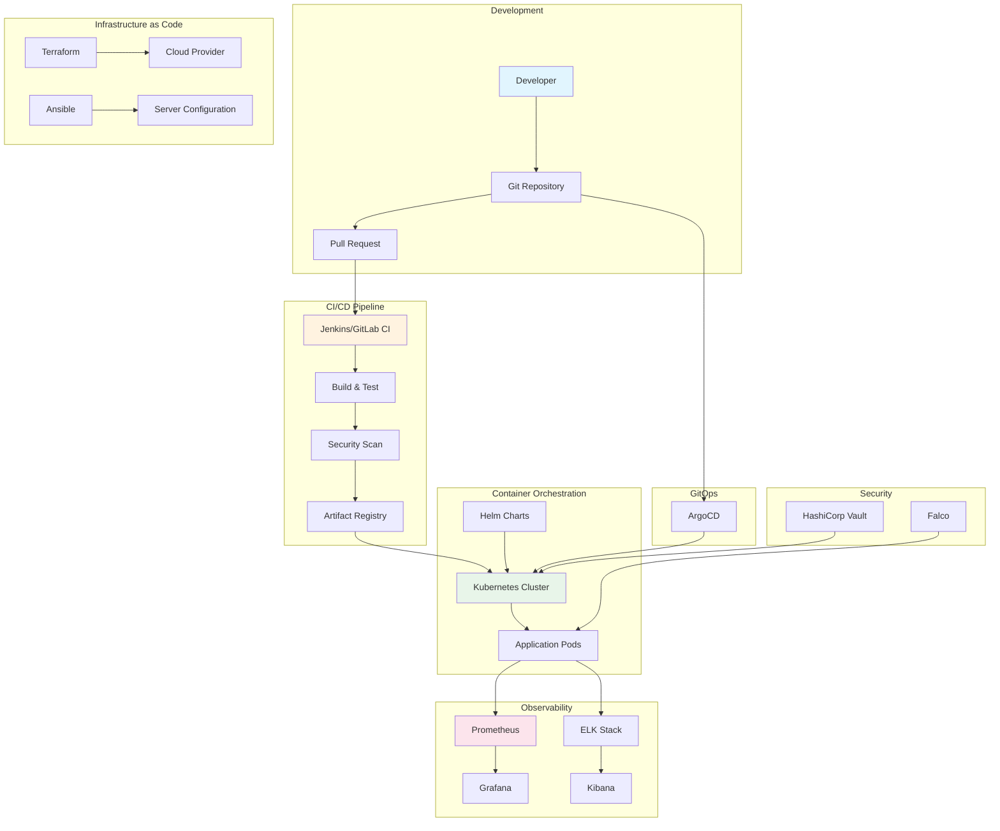
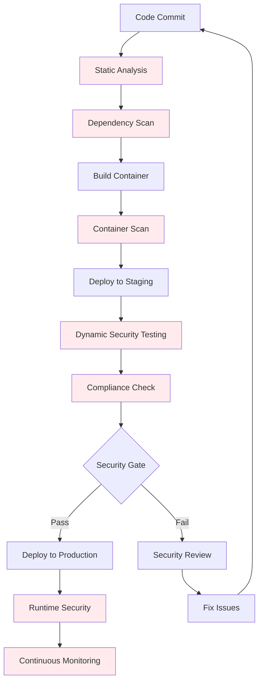
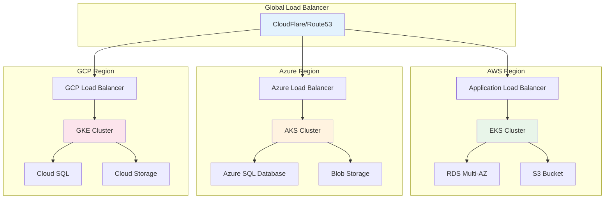
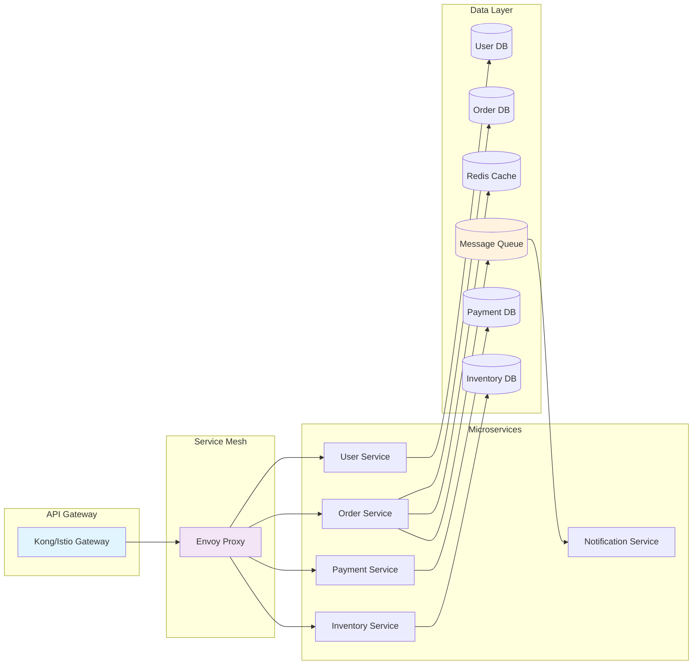

# DevOps Architecture Diagrams

## Complete DevOps Pipeline Architecture

```mermaid
graph TB
    subgraph "Development"
        DEV[Developer] --> GIT[Git Repository]
        GIT --> PR[Pull Request]
    end
    
    subgraph "CI/CD Pipeline"
        PR --> JENKINS[Jenkins/GitLab CI]
        JENKINS --> BUILD[Build & Test]
        BUILD --> SCAN[Security Scan]
        SCAN --> ARTIFACT[Artifact Registry]
    end
    
    subgraph "Infrastructure as Code"
        TERRAFORM[Terraform] --> CLOUD[Cloud Provider]
        ANSIBLE[Ansible] --> CONFIG[Server Configuration]
    end
    
    subgraph "Container Orchestration"
        ARTIFACT --> K8S[Kubernetes Cluster]
        K8S --> PODS[Application Pods]
        HELM[Helm Charts] --> K8S
    end
    
    subgraph "GitOps"
        ARGOCD[ArgoCD] --> K8S
        GIT --> ARGOCD
    end
    
    subgraph "Observability"
        PODS --> PROMETHEUS[Prometheus]
        PODS --> LOGS[ELK Stack]
        PROMETHEUS --> GRAFANA[Grafana]
        LOGS --> KIBANA[Kibana]
    end
    
    subgraph "Security"
        VAULT[HashiCorp Vault] --> K8S
        FALCO[Falco] --> PODS
    end
    
    style DEV fill:#e1f5fe
    style JENKINS fill:#fff3e0
    style K8S fill:#e8f5e9
    style PROMETHEUS fill:#fce4ec
```

## DevSecOps Security Integration

```mermaid
flowchart TD
    A[Code Commit] --> B[Static Analysis]
    B --> C[Dependency Scan]
    C --> D[Build Container]
    D --> E[Container Scan]
    E --> F[Deploy to Staging]
    F --> G[Dynamic Security Testing]
    G --> H[Compliance Check]
    H --> I{Security Gate}
    I -->|Pass| J[Deploy to Production]
    I -->|Fail| K[Security Review]
    K --> L[Fix Issues]
    L --> A
    
    J --> M[Runtime Security]
    M --> N[Continuous Monitoring]
    
    style B fill:#ffebee
    style C fill:#ffebee
    style E fill:#ffebee
    style G fill:#ffebee
    style H fill:#ffebee
    style M fill:#ffebee
    style N fill:#ffebee
```

## Multi-Cloud Architecture

```mermaid
graph TB
    subgraph "Global Load Balancer"
        GLB[CloudFlare/Route53]
    end
    
    subgraph "AWS Region"
        ALB1[Application Load Balancer]
        EKS1[EKS Cluster]
        RDS1[RDS Multi-AZ]
        S31[S3 Bucket]
    end
    
    subgraph "Azure Region"
        ALB2[Azure Load Balancer]
        AKS2[AKS Cluster]
        SQLDB2[Azure SQL Database]
        BLOB2[Blob Storage]
    end
    
    subgraph "GCP Region"
        GLB3[GCP Load Balancer]
        GKE3[GKE Cluster]
        CLOUDSQL3[Cloud SQL]
        GCS3[Cloud Storage]
    end
    
    GLB --> ALB1
    GLB --> ALB2
    GLB --> GLB3
    
    ALB1 --> EKS1
    ALB2 --> AKS2
    GLB3 --> GKE3
    
    EKS1 --> RDS1
    EKS1 --> S31
    AKS2 --> SQLDB2
    AKS2 --> BLOB2
    GKE3 --> CLOUDSQL3
    GKE3 --> GCS3
    
    style GLB fill:#e3f2fd
    style EKS1 fill:#e8f5e9
    style AKS2 fill:#fff3e0
    style GKE3 fill:#fce4ec
```

## Microservices Communication Pattern

```mermaid
graph LR
    subgraph "API Gateway"
        GATEWAY[Kong/Istio Gateway]
    end
    
    subgraph "Service Mesh"
        ENVOY[Envoy Proxy]
    end
    
    subgraph "Microservices"
        USER[User Service]
        ORDER[Order Service]
        PAYMENT[Payment Service]
        INVENTORY[Inventory Service]
        NOTIFICATION[Notification Service]
    end
    
    subgraph "Data Layer"
        USERDB[(User DB)]
        ORDERDB[(Order DB)]
        PAYMENTDB[(Payment DB)]
        INVENTORYDB[(Inventory DB)]
        CACHE[(Redis Cache)]
        QUEUE[(Message Queue)]
    end
    
    GATEWAY --> ENVOY
    ENVOY --> USER
    ENVOY --> ORDER
    ENVOY --> PAYMENT
    ENVOY --> INVENTORY
    
    USER --> USERDB
    ORDER --> ORDERDB
    PAYMENT --> PAYMENTDB
    INVENTORY --> INVENTORYDB
    
    ORDER --> CACHE
    ORDER --> QUEUE
    QUEUE --> NOTIFICATION
    
    style GATEWAY fill:#e1f5fe
    style ENVOY fill:#f3e5f5
    style QUEUE fill:#fff3e0
```