# DevOps Directory Mind Map

```mermaid
mindmap
  root((DevOps))
    AI-ML-Integration
      MLOps-Fundamentals
      Model-Lifecycle
      CI-CD-for-ML
      Model-Deployment
      ML-Infrastructure
      Data-Pipelines
      Model-Monitoring
      ML-Security
      Cloud-ML-Services
      Experiment-Tracking
    
    Ansible
      Fundamentals
        Basics
        Inventory
        Playbooks
        Roles
      Advanced
        Collections
        Galaxy
        Vault
      Modules
        Core
        Cloud
        Database
        Network
      Examples
        Infrastructure
        Web-Applications
        Database-Setup
        Monitoring
      Best-Practices
      CI-CD-Integration
      Security
      Troubleshooting
    
    ArgoCD
      Installation
      Applications
      Projects
      Repositories
      Clusters
      Sync-Policies
      Helm-Integration
      Security
      Monitoring
      Best-Practices
      Troubleshooting
    
    Cloud_Computing
      AWS
        EC2
        ECS
        EKS
        S3-Bucket
        IAM-Security
        Networking-VPC
        Monitoring-Logging
        Cost-Optimization
        CI-CD-DevOps
      Azure
        Compute
        Storage
        Networking
        Security
        DevOps
        Fundamentals
      GCP
        Compute
        Storage
        Networking
        Security
        DevOps
        Fundamentals
      Fundamentals
        Cloud-Basics
        Service-Models
        Deployment-Models
      Multi-Cloud
        Fundamentals
        Management
        Security
      Load_Balancing
        Algorithms
        Configuration
        Monitoring
        Best-Practices
      Best-Practices
      Cost-Optimization
      DevOps-Integration
      Monitoring
      Networking
      Security
      Storage
      Troubleshooting
    
    Docker
      Fundamentals
        Basics
        Installation
        Images
        Containers
      Commands
      Docker-Compose
      Networking
      Storage
      Security
      Best-Practices
      CI-CD-Integration
      Practical-Examples
        Web-Apps
        Databases
        Microservices
      Troubleshooting
    
    Edge-Computing
      Edge-Fundamentals
      Container-Orchestration
      IoT-Integration
      Edge-Security
      CI-CD-Edge
      Edge-Storage
      Monitoring-Observability
      Network-Management
      Security-Best-Practices
    
    Git&GitHub
      Git-Fundamentals
      Git-Commands
      Git-Workflows
      Git-Advanced
      GitHub-Actions
      GitHub-Integration
      Security-Best-Practices
    
    Jenkins
      Installation
      Pipelines
      Plugins
      Security
      Integration
      Monitoring
      Scaling
      Backup-Recovery
      Best-Practices
    
    Kubernetes
      Architecture
        Control-Plane
        Node-Components
        Networking
        Storage
        Security
        Workload-Resources
        Configuration
        Autoscaling
      Commands
    
    Terraform
      Fundamentals
      Infrastructure-as-Code
      Modules
      State-Management
      Advanced-Topics
      Best-Practices
      Aws_Projects
        Multi_Tier_Apps
        Microservices
        Production_Examples
    
    Monitoring
      Prometheus-Grafana
      ELK-Stack
      APM
      Observability
      Infrastructure-Monitoring
      Cloud-Monitoring
      Metrics-and-KPIs
      Alerting
    
    Security
      DevSecOps
        SAST-Tools
        DAST-Tools
        Container-Security
        Infrastructure-Security
        Secret-Management
        Policy-as-Code
        Security-Testing
        Compliance
      Trivy
        Fundamentals
        Container-Scanning
        Infrastructure-Scanning
        CI-CD-Integration
        Best-Practices
        Advanced-Topics
        Practical-Examples
      Open_SCAP
      Scripts
      Windows-11
    
    Databases
      MySQL
      PostgreSQL
      MongoDB
      Redis
      Best-Practices
      Migration
      Monitoring
    
    Testing
      Unit-Testing
      Integration-Testing
      API-Testing
      Performance-Testing
      Security-Testing
    
    Network
      CyberSecurity
      Network Model
        OSI Model
      Ports
      KaliLinux
      FinishLab
    
    SysAdmin
      Linux
        Basic
        Commands
        Architecture
        Server
        Firewall
        Encryption
        Virtual
        Apparmor
      Windows
        Server2022
        PowerShell
        Container
        Debloat
        Performance
        Hacks&Tricks
        WinGet
    
    Languages
      Java
      Python$DevOps
    
    SSH
      Configuration
      Key-Management
      Security
      Tunneling
      Automation
      Best-Practices
      Troubleshooting
    
    Maven
      Installation
      Project-Structure
      POM-Configuration
      Dependencies
      Build-Lifecycle
      Profiles
      Multi-Module
      Plugins
      Repositories
      CI-CD-Integration
      Best-Practices
      Troubleshooting
    
    sonarQube
      Installation
        Native
        Docker
        Kubernetes
      Configuration
        Database
        Security
        Performance
      Administration
        Quality-Gates
        Rules
        User-Management
      CI-CD-Integration
        Jenkins
        GitHub-Actions
        GitLab
      Best-Practices
      Advanced-Topics
      Practical-Examples
    
    Script-Files
      Ansible
      AWS
      Docker
      Jenkins
      Kubernetes
      MySQL
      Terraform
      Shell-Scripting
      Prometheus
      SonarQube
    
    Resources
      Books
        CheatSheets
        DevOps-Books
        Security-Books
        Technical-Manuals
      Images
      Slides
      Resume
      Youtube_Lessons
```

## Directory Overview

### 🎯 **Core DevOps Tools & Practices**
- **CI/CD**: Jenkins, GitHub Actions, ArgoCD
- **Infrastructure**: Terraform, Ansible, Kubernetes
- **Containerization**: Docker, Container Orchestration
- **Version Control**: Git & GitHub workflows

### ☁️ **Cloud & Infrastructure**
- **Multi-Cloud**: AWS, Azure, GCP comprehensive coverage
- **Edge Computing**: IoT integration, edge orchestration
- **Load Balancing**: Algorithms, configuration, monitoring
- **Networking**: Security, troubleshooting, optimization

### 🔒 **Security & Compliance**
- **DevSecOps**: SAST/DAST tools, policy as code
- **Container Security**: Trivy scanning, best practices
- **Infrastructure Security**: Compliance, audit logging
- **Secret Management**: Secure credential handling

### 📊 **Monitoring & Observability**
- **Metrics**: Prometheus, Grafana, ELK Stack
- **APM**: Application performance monitoring
- **Infrastructure Monitoring**: System health, alerting
- **Observability**: Distributed tracing, logging

### 🤖 **AI/ML Integration**
- **MLOps**: Model lifecycle, deployment automation
- **Data Pipelines**: ETL/ELT processes, data engineering
- **Model Monitoring**: Performance tracking, drift detection
- **Cloud ML Services**: AWS, Azure, GCP ML platforms

### 🗄️ **Data & Storage**
- **Databases**: MySQL, PostgreSQL, MongoDB, Redis
- **Storage Solutions**: Cloud storage, backup strategies
- **Data Migration**: Database migration best practices
- **Performance Optimization**: Query tuning, indexing

### 🧪 **Testing & Quality**
- **Testing Types**: Unit, integration, API, performance
- **Security Testing**: Vulnerability assessment, penetration testing
- **Code Quality**: SonarQube, static analysis
- **Automation**: Test automation frameworks

### 💻 **System Administration**
- **Linux**: System administration, security hardening
- **Windows**: Server management, PowerShell automation
- **SSH**: Secure remote access, key management
- **Network Administration**: Configuration, troubleshooting

### 📚 **Learning Resources**
- **Documentation**: Comprehensive guides and references
- **Scripts**: Automation scripts and examples
- **Books**: Technical references and cheat sheets
- **Practical Examples**: Real-world implementations

## Key Features

### ✅ **Comprehensive Coverage**
- **30+ Major Topics** across DevOps landscape
- **200+ Subdirectories** with specialized content
- **Production-Ready** configurations and examples
- **Security-First** approach throughout

### 🎯 **Practical Focus**
- **Real-World Examples** and use cases
- **Step-by-Step Guides** for implementation
- **Troubleshooting Sections** for common issues
- **Best Practices** for enterprise environments

### 🔄 **Continuous Integration**
- **CI/CD Pipelines** for multiple platforms
- **Automation Scripts** for deployment
- **Infrastructure as Code** templates
- **Monitoring Integration** examples

### 🛡️ **Security Integration**
- **Security Scanning** in all workflows
- **Compliance Frameworks** implementation
- **Secret Management** best practices
- **Vulnerability Assessment** procedures

This mind map represents a comprehensive DevOps learning and reference repository covering all essential aspects of modern DevOps practices, from fundamentals to advanced enterprise implementations.