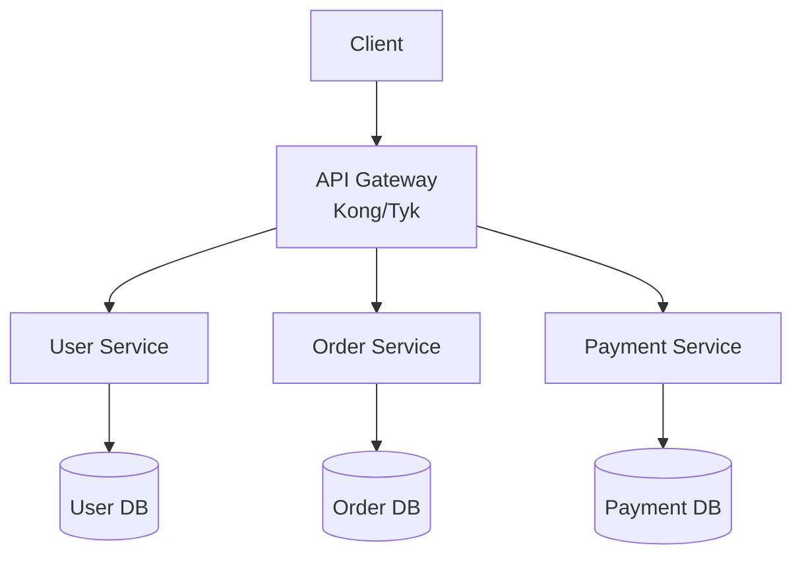

# Microservices Audit - Quick Action Plan

**Generated:** 2026-01-19  
**Full Report:** [MICROSERVICES_AUDIT_REPORT.md](./MICROSERVICES_AUDIT_REPORT.md)

---

## 🎯 Critical Findings Summary

| Level | Score | Status |
|-------|-------|--------|
| **Beginner** | 4/10 | ⚠️ No dedicated microservices module |
| **Intermediate** | 5/10 | ⚠️ Fragmented, missing hands-on labs |
| **Advanced** | 9/10 | ✅ Excellent, production-ready |

**Overall Grade:** 6.5/10 → **9/10 (with fixes)**

---

## 🔴 Critical Actions (Do First)

### 1. CREATE: Beginner Microservices Module
**File:** `1-Beginner/02-Phase-2/03-Microservices-Intro/README.md`

**Content Required:**
- What is a Microservice? (vs Monolith)
- Single Responsibility Principle
- Decoupling concepts
- Simple diagram: Monolith block vs Microservices boxes
- When to use (and when NOT to)

**Why Critical:** Students currently encounter microservices only "in passing" (API module line 51). No authoritative definition exists at Beginner level.

---

### 2. FIX: Intermediate Broken Link
**File:** `2-Intermediate/03-Phase-3/03-API-Gateways-Security/README.md`

**Line 49:** Update broken link
```markdown
- BEFORE: [Cloud Engineering](../12-Cloud-Engineering/)
- AFTER: [Cloud Engineering](../../02-Phase-2/04-Cloud-Engineering/)
```

**ADD:** Architecture diagram


---

### 3. CREATE: Service Mesh Introduction
**File:** `2-Intermediate/03-Phase-3/08-Service-Mesh-Intro/README.md`

**Content Required:**
- What problems do service meshes solve?
- Sidecar proxy pattern basics
- Service Mesh vs API Gateway comparison
- When to introduce a service mesh
- Simple Envoy sidecar example
- Link to Advanced: `3-Advanced/02-Phase-2/Part-01-Service-Mesh/`

**Why Critical:** Students jump from K8s Services (Intermediate) directly to Istio control planes (Advanced) without understanding service mesh concepts.

---

### 4. CREATE: Docker Compose Lab
**File:** `2-Intermediate/02-Phase-2/05-Docker-Compose-Microservices/README.md`

**Content Required:**
- Multi-container applications with docker-compose.yml
- Service-to-service communication
- Sample stack: Web → API → Database
- Environment variables for service discovery
- Link to Kubernetes module

**Why Critical:** No hands-on multi-service practice before K8s. Students need local development experience.

---

## 🟡 Medium Priority (Week 2-3)

### 5. COMPLETE: Advanced Pending Sections
**File:** `3-Advanced/.../02-Microservices-Architecture/README.md`

**Sections to Add:**
1. **Observability** (~200 lines)
   - Distributed Tracing with OpenTelemetry/Jaeger
   - How trace_id follows requests
   - Log aggregation: FluentBit → Kafka → Elasticsearch → Grafana

2. **Deployment Strategies** (~200 lines)
   - Blue/Green deployment
   - Canary deployment with Istio
   - Rolling updates

3. **Cost of Microservices** (~300 lines)
   - Death Star Architecture (circular dependencies diagram)
   - Distributed Monolith anti-pattern
   - When NOT to use microservices
   - Service mapping to avoid complexity

**Status:** Already outlined in `ENHANCEMENT_SUMMARY.md`. Implementation templates provided.

---

### 6. ADD: Health Check Boilerplate
**Files:**
- `boilerplates/health-check-go/main.go`
- `boilerplates/health-check-python/app.py`

**Content:**
```go
// GET /health - Liveness probe (is container running?)
func healthHandler(w http.ResponseWriter, r *http.Request) {
    w.WriteHeader(http.StatusOK)
    json.NewEncoder(w).Encode(map[string]string{"status": "UP"})
}

// GET /ready - Readiness probe (can it handle traffic?)
func readyHandler(w http.ResponseWriter, r *http.Request) {
    if dbReachable() && cacheReachable() {
        w.WriteHeader(http.StatusOK)
        json.NewEncoder(w).Encode(map[string]string{"status": "READY"})
    } else {
        w.WriteHeader(http.StatusServiceUnavailable)
        json.NewEncoder(w).Encode(map[string]string{"status": "NOT_READY"})
    }
}
```

---

## 🟢 Low Priority (Enhancements)

### 7. Add Transition Narratives
**Locations:**
- `3-Advanced/.../02-Microservices-Architecture/README.md` (new section)

**Content:**
```markdown
## Architectural Evolution: From Beginner to Advanced

### Database Strategy Evolution
- **Beginner (Correct):** One application = One database
  - Simpler data integrity (ACID transactions)
  - Good for: Learning SQL, small apps
  
- **Advanced (Microservices):** Database per service
  - Trade-off: Complexity for independence
  - Solved with: Saga patterns, eventual consistency
  - **When to transition:** Multiple bounded contexts (DDD)
```

---

### 8. Fix Link Fragment Warnings
**File:** `3-Advanced/.../02-Microservices-Architecture/README.md`

**Action:** Either add missing sections OR remove TOC links:
- `#observability`
- `#deployment-strategies`
- `#health-check-patterns`
- `#bff-backend-for-frontend`

**Status:** ~15 warnings from markdownlint (non-blocking)

---

## 📊 Impact Analysis

### Before Fixes:
```
Beginner ────┐ (Weak connection)
             ↓
Intermediate ──┐ (Moderate gap)
               ↓
Advanced ────── (Steep learning curve)

Result: Students struggle with Advanced content
```

### After Fixes:
```
Beginner ══════ (Solid foundation)
  ↓
Intermediate ══ (Hands-on practice)
  ↓
Advanced ══════ (Smooth transition)

Result: World-class microservices curriculum
```

---

## 🎓 Estimated Effort

| Task | Lines | Time Estimate |
|------|-------|---------------|
| 1. Beginner Microservices Intro | ~300 | 2-3 hours |
| 2. Fix Intermediate Link + Diagram | ~50 | 30 minutes |
| 3. Service Mesh Intro | ~400 | 3-4 hours |
| 4. Docker Compose Lab | ~250 + YAML | 2-3 hours |
| 5. Complete Advanced Sections | ~700 | 5-6 hours |
| 6. Health Check Boilerplates | ~150 (both langs) | 1-2 hours |
| **TOTAL** | **~1,850 lines** | **14-18 hours** |

---

## ✅ Quick Wins (Do Today)

1. ✏️ Fix broken link in Intermediate API Gateway (5 mins)
2. 📝 Create placeholder for Beginner module with outline (15 mins)
3. 📋 Add "Coming Soon" notes to Advanced pending sections (10 mins)

---

**Next Step:** Prioritize Critical Actions 1-4 to establish vertical alignment.

**Full Details:** See [MICROSERVICES_AUDIT_REPORT.md](./MICROSERVICES_AUDIT_REPORT.md)
