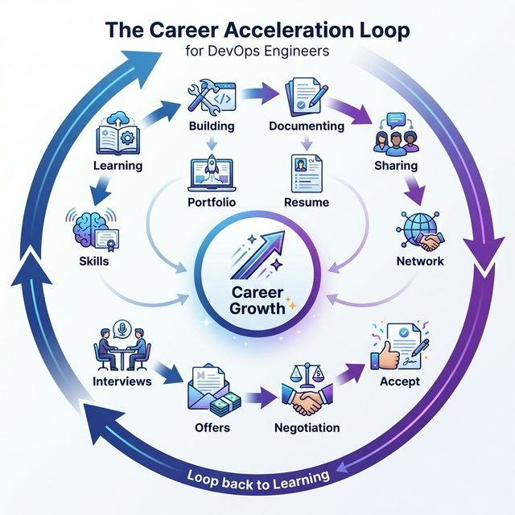

# 🚀 Career & Persona Mastery Hub (Zero to Architect)

## Overview

Welcome to the **Command Center** for your professional DevOps journey. This module bridges the gap between "learning tools" and "being an engineer" by providing the cultural context, strategic roadmap, and job-market tactics needed to succeed in enterprise environments and high-growth startups.

**Mission:** Transform you from **Student → Junior Engineer → Mid-Level → Senior → Staff** with clear frameworks, templates, and proven strategies at every stage.

---

## 🗺️ The Complete Career Journey

This module is organized into **10 progressive stages**, designed to be followed sequentially or accessed as needed based on your current career phase.

---

## 📚 Module Structure

### **Phase 1: Foundation & Mindset** (Weeks 1-4)

#### 🎭 [01. The DevOps Persona](./01-devops-persona/readme.md)
**What:** Master the cultural mindset beyond just technical tools  
**Why:** Technical skills get you interviews; the DevOps mindset gets you seniority  
**Key Topics:**
- Definition of DevOps beyond the job title
- The **CALMS** framework (Culture, Automation, Lean, Measurement, Sharing)
- DevOps vs. SRE vs. Platform Engineering distinctions
- Common junior-level misconceptions

**Outcome:** Understand the "why" behind every tool you learn

---

#### 🛠️ [02. The Tool Landscape](./02-the-tool-landscape/readme.md)
**What:** Categorize the DevOps ecosystem and understand tool relationships  
**Why:** Prevents "tutorial hell" by showing how tools fit into the bigger picture  
**Key Topics:**
- The DevOps Toolchain architecture (SCM → CI/CD → IaC → Observability)
- Tool categories: Configuration Management, Orchestration, Monitoring
- When to use Tool A vs. Tool B (decision frameworks)
- The "Golden Stack" for startups vs. enterprises

**Outcome:** Make informed tool choices, not random ones

---

#### 🗣️ [03. Soft Skills for Engineers](./03-soft-skills/readme.md)
**What:** Communication strategies for technical teams  
**Why:** 40% of senior engineering work is communication, not coding  
**Key Topics:**
- Blameless post-mortems and incident communication
- Writing effective technical documentation
- Stakeholder management (translating tech → business value)
- Empathy-driven engineering and cross-team collaboration

**Outcome:** Communicate incidents without blame, explain tech to non-technical stakeholders

---

#### ✈️ [04. Day in the Life: Operations](./04-day-in-the-life-operations/readme.md)
**What:** Simulate the operational rhythm of a DevOps engineer  
**Why:** Know what the actual job looks like before you get hired  
**Key Topics:**
- **Morning Triage**: Log analysis and Slack simulation exercises
- [**Prioritization Framework**](./04-day-in-the-life-operations/prioritization-framework.md): Eisenhower Matrix for incidents
- **Rollback Procedures**: Emergency recovery commands and runbooks
- [**Daily Success Checklist**](./daily-checklist.md): What "done" looks like

**Outcome:** Build operational muscle memory before production incidents

---

### **Phase 2: Strategic Planning** (Months 2-3)

#### 🗺️ [05. Strategic Roadmap](./05-strategic-roadmap/readme.md)
**What:** Navigate the career progression from Junior → Staff  
**Why:** Random learning leads to burnout; strategic learning leads to promotions  
**Key Topics:**
- **Career Ladder Matrix**: Skills required for each level (Junior/Mid/Senior/Staff)
- Certification paths (AWS, CKA, Terraform Associate - which to prioritize)
- **T-Shaped Engineer** framework (depth vs. breadth)
- 90-day learning plans for each career stage

**Outcome:** Clear understanding of what skills are needed for your next promotion

---

#### 🏗️ [06. Portfolio Guide](./06-portfolio-guide/readme.md)
**What:** Build a GitHub portfolio that gets you interviews  
**Why:** 60% of hiring managers check GitHub before first interview  
**Key Topics:**
- The "Deployable Repo" standard (README, architecture diagrams, setup scripts)
- **Golden Project Design**: What makes a portfolio project interview-worthy
- Documentation as Code principles
- GitHub profile optimization (pinned repos, contribution graph, profile README)

**Outcome:** 3-5 production-grade projects that prove your skills

---

### **Phase 3: Job Search & Applications** (Month 4)

#### 📄 [07. Resume Engineering](./07-resume-engineering/readme.md)
**What:** Craft ATS-friendly resumes that maximize keyword match scores  
**Why:** 75% of resumes are rejected by ATS before human review  
**Key Topics:**
- **Keyword Optimization Matrix**: Technical terms ATS systems scan for
- **Quantifying Results**: The X-Y-Z formula ("Accomplished [X] by doing [Z] measured by [Y]")
- ATS-safe formatting (no tables, columns, icons)
- Professional templates (Markdown and DOCX)
- Before/after resume transformations

**Outcome:** Resume that passes ATS and gets 3-5x more recruiter responses

---

#### 🤖 [10. Prompt Engineer (AI Career Tools)](./10-prompt-engineer/README.md)
**What:** AI-powered prompts for every stage of the job search  
**Why:** Use AI as your personal career coach, available 24/7  

**The 7-Prompt Arsenal:**

1. **[Skills Gap Analyzer](./10-prompt-engineer/skills-gap-analyzer.md)**  
   → Identify critical skill gaps + 90-day learning roadmap

2. **[Portfolio Project Evaluator](./10-prompt-engineer/portfolio-project-evaluator.md)**  
   → Validate project ideas + GitHub profile audit

3. **[High-Octane DevOps Recruiter](./10-prompt-engineer/recruiter-prompt.md)**  
   → Match score analysis + resume keyword optimization

4. **[ATS Stress Test](./10-prompt-engineer/ats-stress-test.md)**  
   → Formatting vulnerability scan + risk report

5. **[LinkedIn Profile Optimizer](./10-prompt-engineer/linkedin-optimizer.md)**  
   → Headline/About section rewrite + engagement strategy

6. **[Networking & Cold Outreach](./10-prompt-engineer/networking-cold-outreach.md)**  
   → Personalized email templates (30-40% response rate)

7. **[Final Round Interview](./10-prompt-engineer/final-round-interview.md)**  
   → STAR-method answers for scenario questions

8. **[Salary Negotiation Strategist](./10-prompt-engineer/salary-negotiation.md)**  
   → Market analysis + negotiation scripts + equity calculator

**Outcome:** AI-assisted career acceleration with measurable improvements

---

### **Phase 4: Interviews & Offers** (Months 5-6)

#### 👔 [08. Interview Mastery](./08-interview-mastery/readme.md)
**What:** Prepare for technical and behavioral interview rounds  
**Why:** Strong technical skills ≠ strong interview performance (different skill sets)  
**Key Topics:**
- **[STAR Method](./08-interview-mastery/03-behavioral-star-method/)**: Situation, Task, Action, Result framework
- **[Technical Deep Dives](./08-interview-mastery/01-technical-deep-dives/)**: Linux, Kubernetes, CI/CD, AWS (8 topics)
- **[Scenario Architecture](./08-interview-mastery/02-scenario-architecture/)**: "Design a CI/CD pipeline for..."
- **[Live Coding Challenges](./08-interview-mastery/04-live-coding-challenges/)**: Bash scripting, Python automation
- **[Assessment Tests](./08-interview-mastery/05-assessment-tests/)**: Online screenings and take-home project logic
- **[Hiring Logic](./08-interview-mastery/hiring-logic.md)**: Understand what interviewers are really evaluating
- **[Mock Interview Scripts](./08-interview-mastery/00-MOCK-INTERVIEW-SCRIPTS.md)**: Practice scenarios

**Outcome:** Pass technical screens and tell compelling stories in behavioral rounds

---

#### 💰 [09. Salary Negotiation & Job Search](./09-salary-negotiation/readme.md)
**What:** Maximize total compensation and negotiate strategically  
**Why:** Not negotiating costs you $5k-$15k per year (compounded over your career)  
**Key Topics:**
- **Market Benchmarking**: Using Levels.fyi, Blind, H1B data
- **Total Compensation (TC) Logic**: Base + Equity + Bonus + Benefits
- Negotiation scripts and frameworks
- The "Operational Value" argument (quantifying your impact)
- When to walk away from an offer

**Outcome:** Accept offers at or above market 75th percentile

---

## 🎯 Quick Navigation by Career Stage

### **I'm a Student / Career Changer (0-6 months learning)**
**Start Here:**
1. [01. DevOps Persona](./01-devops-persona/) - Understand the mindset
2. [02. Tool Landscape](./02-the-tool-landscape/) - Know what to learn
3. [05. Strategic Roadmap](./05-strategic-roadmap/) - Build a 90-day plan
4. [Prompt: Skills Gap Analyzer](./10-prompt-engineer/skills-gap-analyzer.md) - Get your learning roadmap

**Goal:** Build foundational knowledge and 1-2 portfolio projects

---

### **I'm Actively Job Hunting (Ready to apply)**
**Start Here:**
1. [07. Resume Engineering](./07-resume-engineering/) - Optimize your resume
2. [Prompt: Recruiter Prompt](./10-prompt-engineer/recruiter-prompt.md) - Get match scores
3. [Prompt: ATS Stress Test](./10-prompt-engineer/ats-stress-test.md) - Fix formatting issues
4. [Prompt: LinkedIn Optimizer](./10-prompt-engineer/linkedin-optimizer.md) - Boost visibility
5. [Prompt: Networking](./10-prompt-engineer/networking-cold-outreach.md) - Start outreach

**Goal:** Get 5+ interviews in 30-60 days

---

### **I Have Interviews Scheduled (Prep mode)**
**Start Here:**
1. [08. Interview Mastery](./08-interview-mastery/) - Technical + behavioral prep
2. [Prompt: Final Round Interview](./10-prompt-engineer/final-round-interview.md) - Practice STAR answers
3. [04. Day in the Life](./04-day-in-the-life-operations/) - Understand operational scenarios

**Goal:** Pass technical screens and tell compelling stories

---

### **I Have an Offer (Negotiation time)**
**Start Here:**
1. [09. Salary Negotiation](./09-salary-negotiation/) - Understand TC components
2. [Prompt: Salary Strategist](./10-prompt-engineer/salary-negotiation.md) - Get counter-offer scripts

**Goal:** Negotiate +10-20% above initial offer

---

### **I'm Employed, Planning Next Move (6-12 months out)**
**Start Here:**
1. [05. Strategic Roadmap](./05-strategic-roadmap/) - Plan for promotion
2. [06. Portfolio Guide](./06-portfolio-guide/) - Build 1 new project/quarter
3. [Prompt: Skills Gap Analyzer](./10-prompt-engineer/skills-gap-analyzer.md) - Stay competitive
4. [Prompt: LinkedIn Optimizer](./10-prompt-engineer/linkedin-optimizer.md) - Build passive brand

**Goal:** Position yourself for promotion or better opportunities

---

## 📈 Success Metrics (Track Your Progress)

### Leading Indicators (Weekly)
- [ ] Resume match score: 70+ out of 100 (run Recruiter Prompt)
- [ ] LinkedIn profile views: 50+/week
- [ ] GitHub contribution graph: 4+ days green/week
- [ ] Learning hours logged: 10+ hrs/week
- [ ] Cold emails sent: 5-10/week (if job hunting)

### Lagging Indicators (Monthly)
- [ ] Resume response rate: 25-30%
- [ ] Recruiter InMails: 5+/month
- [ ] Informational interviews: 2-3/month
- [ ] Technical interviews scheduled: 1-2/month
- [ ] Offer negotiations: 1+ (if actively job hunting)

---

## 🛠️ Essential Resources

### Tools Mentioned Throughout This Module
- **Resume:** Google Docs (DOCX export), Markdown parsers
- **ATS Testing:** Jobscan.co, Resume Worded
- **Salary Data:** Levels.fyi, Blind, H1B Salary Database
- **Networking:** LinkedIn Sales Navigator, Loom (video outreach)
- **Learning:** KillerCoda, HashiCorp Learn, AWS Workshops
- **AI Assistants:** ChatGPT, Claude, Gemini

### External Communities
- **Reddit:** r/devops, r/sre, r/cscareerquestions
- **Discord:** DevOps Chat, Kubernetes Community
- **LinkedIn Groups:** DevOps Engineers, Platform Engineering
- **Conferences:** KubeCon, DevOpsDays, AWS re:Invent

---

## 🔄 The Career Acceleration Loop



**Key Insight:** This is a continuous loop, not a one-time journey. Even after landing a job, you continue learning → building → sharing to position yourself for promotions.

---

## 📅 Recommended Study Schedule

### **Full-Time Focus (0-6 months to first job)**
- **40 hrs/week total commitment**
- 20 hrs: Technical skills (via other modules)
- 10 hrs: Portfolio projects
- 5 hrs: Resume/LinkedIn optimization
- 5 hrs: Networking/interview prep

### **Part-Time (6-12 months while employed)**
- **15 hrs/week total commitment**
- 8 hrs: Learning new skills
- 4 hrs: Portfolio/side projects
- 2 hrs: LinkedIn engagement
- 1 hr: Resume updates

### **Passive Mode (maintaining for future opportunities)**
- **5 hrs/week total commitment**
- 3 hrs: Stay current with industry trends
- 1 hr: Build/maintain 1 project/quarter
- 1 hr: LinkedIn posting/engagement

---

## 💡 Pro Tips

### Tip #1: Don't Skip the Soft Skills
Many engineers ignore [03. Soft Skills](./03-soft-skills/) because it's "not technical." **This is a mistake.** The difference between mid-level and senior is often communication, not coding.

### Tip #2: Use the AI Prompts Early and Often
The [Prompt Engineer](./10-prompt-engineer/) directory isn't just for resume optimization. Use it to:
- Plan your learning roadmap (Skills Gap Analyzer)
- Validate project ideas (Portfolio Evaluator)
- Practice interview answers (Final Round Interview)

### Tip #3: Build in Public
Every project you build → write a blog post. Every skill you learn → share on LinkedIn. This:
- Forces you to solidify your understanding (teaching = learning)
- Builds your personal brand
- Creates conversation starters with recruiters

### Tip #4: Quality > Quantity
Better to have:
- 3 polished portfolio projects than 10 abandoned tutorials
- 5 meaningful networking conversations than 50 generic LinkedIn connection requests
- 10 tailored job applications than 100 spray-and-pray

### Tip #5: Track Everything
Create a spreadsheet:
- Applications sent → Response rate
- Skills learned → Hours invested
- Projects built → Interview mentions
- Networking emails → Response rate

What gets measured gets improved.

---

## 🚨 Common Mistakes to Avoid

### ❌ Mistake #1: "I'll apply when I'm ready"
**Fix:** You'll never feel "ready." Start applying when you're 70% qualified. Interviews are the best learning experience.

### ❌ Mistake #2: "I'll just learn all the tools first, then worry about resumes"
**Fix:** Build your resume and portfolio in parallel. Every tool you learn should go into a project → resume bullet.

### ❌ Mistake #3: "I don't need to network, my skills will speak for themselves"
**Fix:** 70% of jobs are filled through referrals. Networking is not optional.

### ❌ Mistake #4: "I'll accept the first offer I get"
**Fix:** Always negotiate. Always. Even if you're desperate. The worst they can say is "no" and you're back to the original offer.

### ❌ Mistake #5: "I don't have time for soft skills or communication practice"
**Fix:** Soft skills are THE differentiator at senior+ levels. Make time.

---

## 🎓 Next Steps

### If This Is Your First Time Here:
1. Read [01. DevOps Persona](./01-devops-persona/) to understand the mindset
2. Run the [Skills Gap Analyzer](./10-prompt-engineer/skills-gap-analyzer.md) to get your roadmap
3. Review the [Strategic Roadmap](./05-strategic-roadmap/) for your career stage
4. Set up tracking (spreadsheet or Notion) for your progress
5. Block calendar time for weekly study and portfolio work

### If You're Returning:
- Check which phase you're in (Foundation/Planning/Job Search/Interview/Negotiation)
- Jump to the relevant module
- Re-run the AI prompts quarterly to refresh your materials

---

## 📊 Module Completion Checklist

Use this to track your progress through the career mastery journey:

**Phase 1: Foundation (Weeks 1-4)**
- [ ] Read DevOps Persona and understand CALMS framework
- [ ] Study Tool Landscape and map out your "T-shaped" focus
- [ ] Practice soft skills scenarios (post-mortem writing)
- [ ] Complete Day in the Life operational simulations

**Phase 2: Strategic Planning (Months 2-3)**
- [ ] Run Skills Gap Analyzer and create 90-day learning plan
- [ ] Build 1-2 portfolio projects using Portfolio Guide
- [ ] Set up GitHub profile with professional README
- [ ] Map out career ladder (Junior → Mid → Senior goals)

**Phase 3: Job Search (Month 4)**
- [ ] Optimize resume using Resume Engineering guide
- [ ] Run Recruiter Prompt for 3+ target job descriptions
- [ ] Pass ATS Stress Test (0 high-risk issues)
- [ ] Optimize LinkedIn profile (target: 300+ views/month)
- [ ] Send 20+ networking emails using Cold Outreach templates

**Phase 4: Interviews & Offers (Months 5-6)**
- [ ] Practice 10+ STAR-method stories
- [ ] Complete 5+ technical deep-dive mock interviews
- [ ] Schedule 5+ informational interviews
- [ ] Receive 2+ offers
- [ ] Negotiate using Salary Strategist scripts
- [ ] Accept offer at 75th+ percentile for role/YOE

---

## 🏆 Success Stories Template

Track your wins to stay motivated:

```
Date: [YYYY-MM-DD]
Milestone: [e.g., "Landed first DevOps role"]
Before: [e.g., "0 interviews in 2 months, 5% resume response rate"]
After: [e.g., "5 interviews in 30 days, 28% response rate"]
What Worked: [e.g., "Recruiter Prompt + ATS Test + 3 portfolio projects"]
Proof: [Link to offer letter folder, screenshot of LinkedIn analytics, etc.]
```

---

**Last Updated:** 2026-02-11  
**Version:** 3.0  
**Maintained By:** Career Mastery Module

---

> **"Technical skills get you the interview; the DevOps mindset and career strategy get you the seniority."**

🚀 **Now go build your career systematically, not randomly.**
