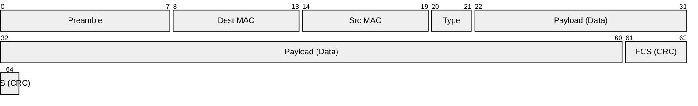
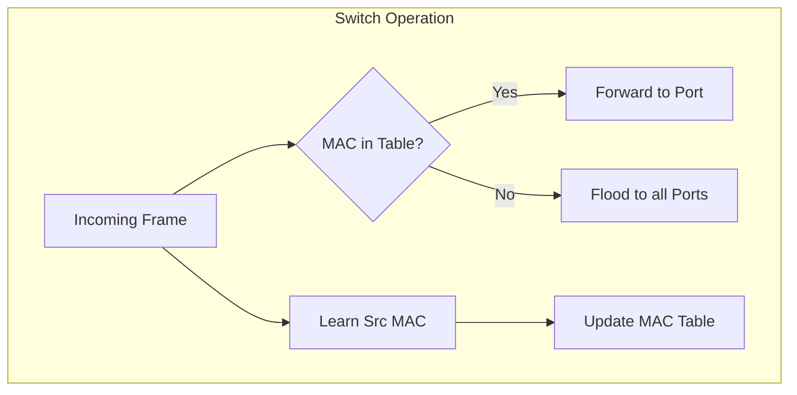

# Data Link Layer (Layer 2) - OSI Model

## Overview

The Data Link Layer is the second layer of the OSI model, responsible for reliable data transfer between directly connected nodes. It provides error detection, flow control, and manages access to the physical medium.

## Key Functions

### 1. Framing
- **Frame Structure**: Organizes data into frames with headers and trailers
- **Frame Delimiting**: Identifies start and end of frames
- **Frame Synchronization**: Ensures proper frame alignment
- **Error Detection**: Adds checksums and error detection codes



### 2. Media Access Control (MAC)
- **Channel Access**: Controls access to shared communication medium
- **Collision Detection**: Detects and handles data collisions
- **MAC Addressing**: Uses hardware addresses for local delivery
- **Flow Control**: Manages data transmission rate

### 3. Logical Link Control (LLC)
- **Error Recovery**: Handles retransmission of corrupted frames
- **Flow Control**: Prevents buffer overflow at receiver
- **Multiplexing**: Supports multiple network layer protocols
- **Connection Management**: Establishes and maintains data links



## Data Link Layer Protocols

### Ethernet (IEEE 802.3)
```bash
# Ethernet Frame Structure
+----------+----------+------+--------+------+-----+
| Preamble | Dest MAC | Src  | Length/| Data | FCS |
|  8 bytes | 6 bytes  | MAC  | Type   |46-1500| 4   |
|          |          |6bytes| 2bytes |bytes |bytes|
+----------+----------+------+--------+------+-----+

# MAC Address Format
Example: 00:1B:44:11:3A:B7
- First 3 octets: Organizationally Unique Identifier (OUI)
- Last 3 octets: Network Interface Controller specific

# Ethernet Types
10BASE-T:    10 Mbps over twisted pair
100BASE-TX:  100 Mbps Fast Ethernet
1000BASE-T:  1 Gbps Gigabit Ethernet
10GBASE-T:   10 Gbps over twisted pair
```

### Wi-Fi (IEEE 802.11)
```bash
# 802.11 Frame Format
+--------+----------+--------+--------+--------+------+-----+
| Frame  | Duration | Addr1  | Addr2  | Addr3  | Seq  | Data| FCS |
|Control | 2 bytes  |6 bytes |6 bytes |6 bytes |Ctrl  |     | 4   |
|2 bytes |          |        |        |        |2bytes|     |bytes|
+--------+----------+--------+--------+--------+------+-----+

# Wi-Fi Standards
802.11a:   54 Mbps, 5 GHz
802.11b:   11 Mbps, 2.4 GHz
802.11g:   54 Mbps, 2.4 GHz
802.11n:   600 Mbps, 2.4/5 GHz
802.11ac:  6.93 Gbps, 5 GHz
802.11ax:  9.6 Gbps, 2.4/5 GHz (Wi-Fi 6)
```

### Point-to-Point Protocol (PPP)
```bash
# PPP Frame Format
+------+--------+--------+----------+-----+------+
| Flag | Address| Control| Protocol | Data| FCS  |
|1byte | 1 byte | 1 byte | 2 bytes  |     |2bytes|
+------+--------+--------+----------+-----+------+

# PPP Configuration
# /etc/ppp/options
lock
noauth
defaultroute
usepeerdns
persist
maxfail 0
holdoff 20
```

## Switching and Bridging

### Layer 2 Switching
```bash
# Switch Operation
1. Learning: Build MAC address table
2. Flooding: Forward unknown unicast frames
3. Filtering: Drop frames destined for same segment
4. Forwarding: Send frames to correct port
5. Aging: Remove old MAC entries

# MAC Address Table
MAC Address       Port    VLAN    Age
00:1B:44:11:3A:B7  1      100     5
00:22:55:AA:BB:CC  2      100     12
00:33:66:DD:EE:FF  3      200     8

# Switch Configuration (Cisco)
switch(config)# interface fastethernet0/1
switch(config-if)# switchport mode access
switch(config-if)# switchport access vlan 100
switch(config-if)# spanning-tree portfast
```

### Virtual LANs (VLANs)
```bash
# VLAN Configuration
# Create VLAN
switch(config)# vlan 100
switch(config-vlan)# name Sales
switch(config-vlan)# exit

# Assign port to VLAN
switch(config)# interface fastethernet0/1
switch(config-if)# switchport access vlan 100

# Trunk Configuration
switch(config)# interface fastethernet0/24
switch(config-if)# switchport mode trunk
switch(config-if)# switchport trunk allowed vlan 100,200,300

# 802.1Q VLAN Tagging
+----------+------+----------+------+--------+------+-----+
| Dest MAC | Src  | 802.1Q   | Ether| Data   | FCS  |
| 6 bytes  | MAC  | Tag      | Type |        | 4    |
|          |6bytes| 4 bytes  |2bytes|        |bytes |
+----------+------+----------+------+--------+------+-----+
```

### Spanning Tree Protocol (STP)
```bash
# STP Port States
Blocking:    Receives BPDUs, blocks data
Listening:   Processes BPDUs, no data forwarding
Learning:    Builds MAC table, no data forwarding
Forwarding:  Normal operation, forwards data
Disabled:    Port administratively down

# STP Configuration
switch(config)# spanning-tree mode rapid-pvst
switch(config)# spanning-tree vlan 1 priority 4096
switch(config)# interface fastethernet0/1
switch(config-if)# spanning-tree portfast
switch(config-if)# spanning-tree bpduguard enable

# Root Bridge Selection
<b>1. Lowest Bridge Priority</b>
<details>
<summary>Show Answer</summary>
Answer: default 32768
</details>

<b>2. Lowest MAC Address</b>
<details>
<summary>Show Answer</summary>
Answer: tie-breaker
</details>


# Path Cost Calculation
10 Mbps:     100
100 Mbps:    19
1 Gbps:      4
10 Gbps:     2
```

## Error Detection and Correction

### Cyclic Redundancy Check (CRC)
```python
# CRC-32 Implementation
def crc32(data):
    crc = 0xFFFFFFFF
    polynomial = 0x04C11DB7
    
    for byte in data:
        crc ^= byte << 24
        for _ in range(8):
            if crc & 0x80000000:
                crc = (crc << 1) ^ polynomial
            else:
                crc <<= 1
            crc &= 0xFFFFFFFF
    
    return crc ^ 0xFFFFFFFF

# Usage
data = b"Hello, World!"
checksum = crc32(data)
print(f"CRC-32: {checksum:08X}")
```

### Automatic Repeat Request (ARQ)
```bash
# Stop-and-Wait ARQ
Sender → Receiver: Frame 1
Receiver → Sender: ACK 1
Sender → Receiver: Frame 2
Receiver → Sender: ACK 2

# Go-Back-N ARQ
Sender → Receiver: Frames 1,2,3,4
Receiver → Sender: ACK 1, ACK 2, NAK 3
Sender → Receiver: Frames 3,4,5,6 (retransmit from error)

# Selective Repeat ARQ
Sender → Receiver: Frames 1,2,3,4
Receiver → Sender: ACK 1, ACK 2, NAK 3, ACK 4
Sender → Receiver: Frame 3 only (selective retransmit)
```

## Flow Control Mechanisms

### Stop-and-Wait Protocol
```python
# Stop-and-Wait Implementation
class StopAndWaitSender:
    def __init__(self, timeout=1.0):
        self.sequence_number = 0
        self.timeout = timeout
    
    def send_frame(self, data, receiver):
        frame = {
            'sequence': self.sequence_number,
            'data': data,
            'checksum': self.calculate_checksum(data)
        }
        
        while True:
            receiver.receive_frame(frame)
            
            # Wait for ACK with timeout
            ack = self.wait_for_ack(self.timeout)
            
            if ack and ack['sequence'] == self.sequence_number:
                self.sequence_number = 1 - self.sequence_number  # Toggle
                break
            else:
                print(f"Timeout or error, retransmitting frame {self.sequence_number}")

class StopAndWaitReceiver:
    def __init__(self):
        self.expected_sequence = 0
    
    def receive_frame(self, frame):
        if self.verify_checksum(frame) and frame['sequence'] == self.expected_sequence:
            # Frame is correct
            self.process_data(frame['data'])
            self.send_ack(frame['sequence'])
            self.expected_sequence = 1 - self.expected_sequence  # Toggle
        else:
            # Frame is corrupted or out of order
            self.send_nak(frame['sequence'])
```

### Sliding Window Protocol
```python
# Sliding Window Implementation
class SlidingWindowSender:
    def __init__(self, window_size=4):
        self.window_size = window_size
        self.send_base = 0
        self.next_seq_num = 0
        self.window = {}
        self.timers = {}
    
    def send_data(self, data_list, receiver):
        for data in data_list:
            # Wait if window is full
            while self.next_seq_num >= self.send_base + self.window_size:
                self.wait_for_ack()
            
            # Send frame
            frame = {
                'sequence': self.next_seq_num,
                'data': data,
                'checksum': self.calculate_checksum(data)
            }
            
            self.window[self.next_seq_num] = frame
            receiver.receive_frame(frame)
            self.start_timer(self.next_seq_num)
            self.next_seq_num += 1
    
    def receive_ack(self, ack_num):
        # Cumulative acknowledgment
        while self.send_base <= ack_num:
            if self.send_base in self.window:
                del self.window[self.send_base]
                self.stop_timer(self.send_base)
            self.send_base += 1
    
    def timeout_handler(self, seq_num):
        # Retransmit all frames in window
        for i in range(self.send_base, self.next_seq_num):
            if i in self.window:
                self.retransmit_frame(self.window[i])
                self.start_timer(i)
```

## Network Interface Configuration

### Linux Network Interface Management
```bash
# View network interfaces
ip link show
ifconfig -a

# Configure interface
ip link set eth0 up
ip addr add 192.168.1.100/24 dev eth0
ip route add default via 192.168.1.1

# Persistent configuration (Ubuntu/Debian)
# /etc/netplan/01-network-manager-all.yaml
network:
  version: 2
  renderer: networkd
  ethernets:
    eth0:
      dhcp4: false
      addresses:
        - 192.168.1.100/24
      gateway4: 192.168.1.1
      nameservers:
        addresses: [8.8.8.8, 8.8.4.4]

# Apply configuration
netplan apply

# RHEL/CentOS configuration
# /etc/sysconfig/network-scripts/ifcfg-eth0
DEVICE=eth0
BOOTPROTO=static
IPADDR=192.168.1.100
NETMASK=255.255.255.0
GATEWAY=192.168.1.1
DNS1=8.8.8.8
DNS2=8.8.4.4
ONBOOT=yes
```

### Bonding and Teaming
```bash
# Network bonding configuration
# /etc/sysconfig/network-scripts/ifcfg-bond0
DEVICE=bond0
BONDING_OPTS="mode=active-backup miimon=100"
BOOTPROTO=static
IPADDR=192.168.1.100
NETMASK=255.255.255.0
ONBOOT=yes

# Slave interfaces
# /etc/sysconfig/network-scripts/ifcfg-eth0
DEVICE=eth0
BOOTPROTO=none
ONBOOT=yes
MASTER=bond0
SLAVE=yes

# Bonding modes
mode=0 (balance-rr):     Round-robin load balancing
mode=1 (active-backup):  Active-backup fault tolerance
mode=2 (balance-xor):    XOR load balancing
mode=3 (broadcast):      Broadcast fault tolerance
mode=4 (802.3ad):        IEEE 802.3ad dynamic link aggregation
mode=5 (balance-tlb):    Adaptive transmit load balancing
mode=6 (balance-alb):    Adaptive load balancing
```

## Troubleshooting Data Link Layer

### Common Issues and Solutions
```bash
# Check interface status
ip link show eth0
ethtool eth0

# Monitor interface statistics
cat /proc/net/dev
ip -s link show eth0

# Check for errors
ethtool -S eth0 | grep -i error
ethtool -S eth0 | grep -i drop

# Duplex mismatch detection
ethtool eth0 | grep -E "Speed|Duplex"

# Cable testing
ethtool --test eth0

# Packet capture at data link layer
tcpdump -i eth0 -e  # Show Ethernet headers
wireshark           # GUI packet analyzer

# Common problems:
# 1. Duplex mismatch
ethtool -s eth0 speed 1000 duplex full autoneg off

# 2. MTU issues
ip link set eth0 mtu 1500

# 3. MAC address conflicts
ip link set eth0 address 00:11:22:33:44:55

# 4. VLAN configuration
ip link add link eth0 name eth0.100 type vlan id 100
ip addr add 192.168.100.1/24 dev eth0.100
ip link set eth0.100 up
```

### Performance Monitoring
```bash
# Interface utilization
sar -n DEV 1 10  # Network device statistics

# Bandwidth monitoring
iftop -i eth0    # Real-time bandwidth usage
nload eth0       # Network load monitor

# Error analysis
netstat -i       # Interface statistics
cat /proc/net/snmp | grep -i error

# Buffer and queue monitoring
ss -i            # Socket statistics with internal info
tc qdisc show dev eth0  # Traffic control queues
```

## DevOps Integration

### Infrastructure as Code
```yaml
# Ansible network configuration
---
- name: Configure network interfaces
  hosts: servers
  tasks:
    - name: Configure static IP
      template:
        src: ifcfg-eth0.j2
        dest: /etc/sysconfig/network-scripts/ifcfg-eth0
      notify: restart network
    
    - name: Configure bonding
      template:
        src: ifcfg-bond0.j2
        dest: /etc/sysconfig/network-scripts/ifcfg-bond0
      notify: restart network
    
    - name: Load bonding module
      modprobe:
        name: bonding
        params: "mode=1 miimon=100"
  
  handlers:
    - name: restart network
      service:
        name: network
        state: restarted
```

### Container Networking
```bash
# Docker bridge network
docker network create --driver bridge \
  --subnet=172.20.0.0/16 \
  --ip-range=172.20.240.0/20 \
  --gateway=172.20.0.1 \
  custom-bridge

# Macvlan network (direct L2 access)
docker network create -d macvlan \
  --subnet=192.168.1.0/24 \
  --gateway=192.168.1.1 \
  -o parent=eth0 \
  macvlan-net

# Container with specific MAC
docker run --network macvlan-net \
  --mac-address 02:42:ac:11:00:02 \
  --ip 192.168.1.100 \
  nginx
```

## Best Practices

### 1. Network Design
- Use VLANs for network segmentation
- Implement redundancy with bonding/teaming
- Plan IP addressing scheme carefully
- Document network topology

### 2. Performance Optimization
- Tune MTU size appropriately
- Use full-duplex connections
- Monitor interface utilization
- Implement QoS when needed

### 3. Security
- Disable unused ports
- Implement port security
- Use 802.1X authentication
- Monitor for MAC address spoofing

### 4. Troubleshooting
- Maintain network documentation
- Use systematic troubleshooting approach
- Monitor error counters regularly
- Keep firmware updated