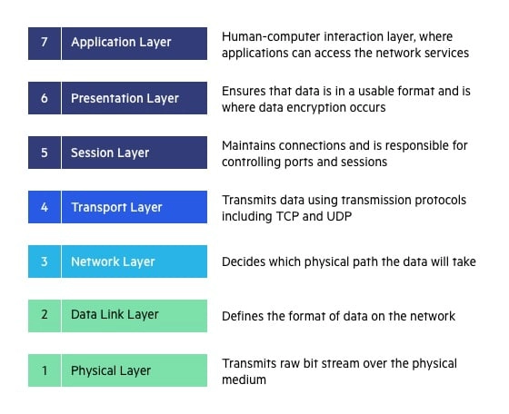
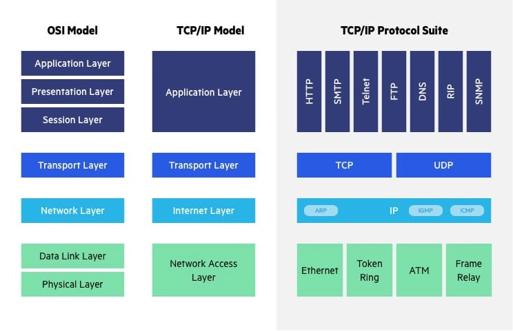

A communication subsystem is a complex piece of Hardware and software. Early attempts for implementing the software for such subsystems were based on a single, complex, unstructured program with many interacting components. The resultant software was very difficult to test and modify. To overcome such problem, the ISO has developed a layered approach. In a layered approach, networking concept is divided into several layers, and each layer is assigned a particular task. Therefore, we can say that networking tasks depend upon the layers. 

Layered Architecture The main aim of the layered architecture is to divide the design into small pieces.  

  

- Each lower layer adds its services to the higher layer to provide a full set of services to manage communications and run the applications.
    
- It provides modulator and clear interfaces, i.e., provides interaction between subsystems.
    
-  It ensures the independence between layers by providing the services from lower to higher layer without defining how the services are implemented. Therefore, any modification in a layer will not affect the other layers.
    
- The number of layers, functions, contents of each layer will vary from network to network. However, the purpose of each layer is to provide the service from lower to a higher layer and hiding the details from the layers of how the services are implemented.
    
-  The basic elements of layered architecture are services, protocols, and interfaces.
    
- Service: It is a set of actions that a layer provides to the higher layer.
 - Protocol: It defines a set of rules that a layer uses to exchange the information with peer entity. These rules mainly concern about both the contents and order of the messages used.
    
- Interface:  It is a way through which the message is transferred from one layer to another layer.

- In a layer n architecture, layer n on one machine will have a communication with the layer n on another machine and the rules used in a conversation are known as a layer-n protocol.
    
  Let's take an example of the five-layered architecture.
- In case of layered architecture, no data is transferred from layer n of one machine to layer n of another machine. Instead, each layer passes the data to the layer immediately just below it, until the lowest layer is reached.
- Below layer 1 is the physical medium through which the actual communication takes place.
- In a layered architecture, unmanageable tasks are divided into several small and manageable tasks.
- The data is passed from the upper layer to lower layer through an interface. A Layered architecture provides a clean-cut interface so that minimum information is shared among different layers. It also ensures that the implementation of one layer can be easily replaced by another implementation.
- A set of layers and protocols is known as network architecture.

  Why do we require Layered architecture?

- **Divide-and-conquer approach:** Divide-and-conquer approach makes a design process in such a way that the unmanageable tasks are divided into small and manageable tasks. In short, we can say that this approach reduces the complexity of the design.
- **Modularity:** Layered architecture is more modular. Modularity provides the independence of layers, which is easier to understand and implement.
- **Easy to modify:** It ensures the independence of layers so that implementation in one layer can be changed without affecting other layers.
- **Easy to test:** Each layer of the layered architecture can be analyzed and tested individually.

### Comparison of Models
