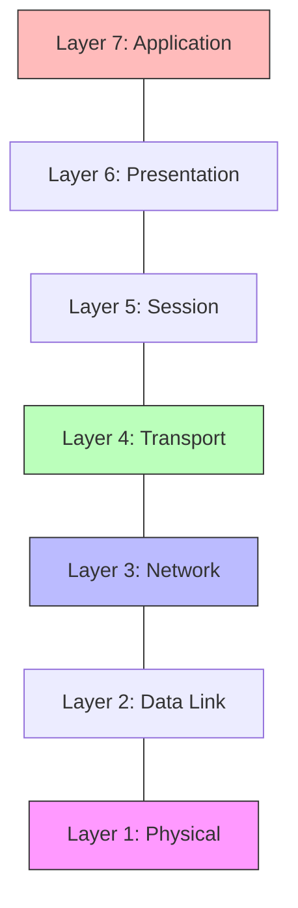
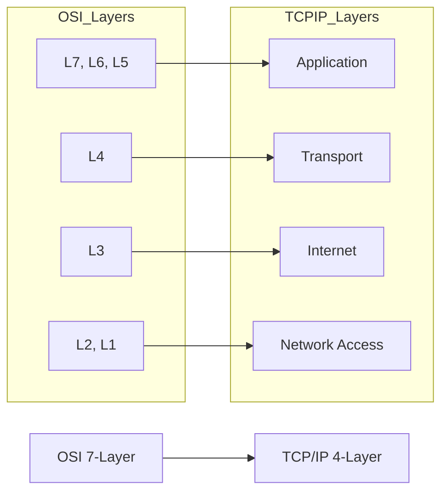
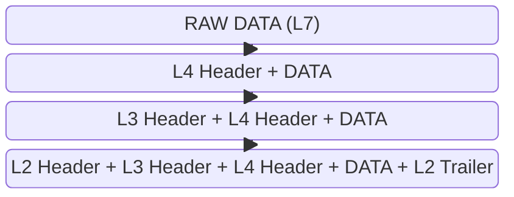

# 🏗️ Network Models: The Blueprint of the Wire

> **"Listen up, Junior. The OSI model isn't just a list to memorize for an exam; it's the diagnostic map for every outage you'll ever face. If you don't know which 'floor' of the building is on fire, you'll never find the extinguisher."**

---

## 🧠 The Mental Model: The Global Postal Service

**The Junior Struggle**: "Why are we talking about 7 layers? I just want to know if my website is up!"

**The Engineer Solution**: You realize that communication is a **Layered Bureaucracy**. Each layer has one job and trusts the layer below it to do theirs.

Think of sending an email like sending a physical package:
1.  **Application (L7)**: You write the letter (Data).
2.  **Presentation (L6)**: You translate it into the recipient's language/encrypt it (Formatting).
3.  **Session (L5)**: You call the recipient to make sure they're home (Connection Mgmt).
4.  **Transport (L4)**: You decide if it's a **Certified Letter** (TCP - needs a signature) or a **Postcard** (UDP - just send and hope). You put it in a box (Segment).
5.  **Network (L3)**: You write the **Full Address** (IP) on the box. The Post Office (Router) decides which city it goes to.
6.  **Data Link (L2)**: The local delivery truck looks at the **Unit Number** (MAC) to find the exact door in the apartment complex.
7.  **Physical (L1)**: The actual road, the truck, and the gas (Cables and Bits).

---

## 🆚 Junior Way vs. Engineer Way

| Feature | The Junior Way (Problematic) | The Engineer Way (Strategic) |
|:---|:---|:---|
| **Debugging** | "The site is down, I'll restart everything." | **Layer-by-Layer Isolation** (Is it DNS? Is it the Port?) |
| **Perspective** | Sees the internet as "magic." | Sees the internet as a stack of **Encapsulated Protocols**. |
| **Tools** | Only uses the browser to check "Up-ness." | Uses `ping` (L3), `nc` (L4), and `curl` (L7) to find the gap. |
| **Communication** | "The server is broken." | "We have L3 connectivity but L4 is being refused." |

---

## 🎯 The Automation Why: Models as Code

**For Juniors**: You might think these models are for hardware engineers. 
**For Engineers**: In the age of **Infrastructure as Code (IaC)**, we define these layers in text files.
- **Security Groups (AWS/Azure)**: You are writing **Layer 4** rules (Allow Port 443).
- **Route Tables**: You are writing **Layer 3** logic (Send 10.0.0.0/16 traffic to the Peering connection).
- **ALB/Nginx Rules**: You are writing **Layer 7** logic (If path is `/api`, send to the backend).

**If you don't understand the model, you can't write the code that automates it.**

---

## 🌍 1. The OSI Model (The Theoretical Gold Standard)

The OSI (Open Systems Interconnection) model is the "Complete Encyclopedia" of networking.

### The SRE Cheat Sheet

| Layer | Unit | Focus | Key DevOps Tools |
|:---|:---|:---|:---|
| **7. Application** | Data | Logic/APIs | `curl`, `Postman`, `Nginx` |
| **4. Transport** | Segment | Reliability | `nc (netcat)`, `telnet` |
| **3. Network** | Packet | Routing | `ping`, `traceroute`, `ip route` |
| **2. Data Link** | Frame | Local Switching | `arp`, `brctl` |

---

## 🏗️ 2. The TCP/IP Model (The Practical Reality)

While OSI is great for teaching, the **TCP/IP Model** is what actually runs the planet. It collapses the "Bureaucracy" into 4 practical layers.

---

## 📦 3. Data Encapsulation: The Russian Doll Pattern

As data moves down the stack, it gets wrapped in a new header. This is called **Encapsulation**.

**The Engineer's Insight**: Every time you see a "Packet" in a tool like Wireshark, you are looking at a digital Russian Doll. You have to peel back the layers to see the truth.

---

## ❓ Interview Preparation

1. **Q: What is the difference between Layer 2 and Layer 3?**
   *A: Layer 2 uses **MAC addresses** to talk to devices on the same local wire (Switching). Layer 3 uses **IP addresses** to talk to devices across different networks (Routing).*

2. **Q: At which layer does a Load Balancer operate?**
   *A: It depends! An **L4 Load Balancer** (like AWS NLB) looks only at IPs and Ports. An **L7 Load Balancer** (like AWS ALB or Nginx) can look at the actual data, like URLs or Cookies.*

3. **Q: What is encapsulation?**
   *A: It is the process where each layer adds its own header information to the data received from the layer above before passing it to the layer below.*

---

## 📝 Knowledge Check

1. **Which layer is responsible for encryption and data formatting?**
   - [ ] a) Transport
   - [x] b) Presentation
   - [ ] c) Network

2. **True or False: A Router primarily operates at Layer 3 of the OSI model.**
   - [x] a) True
   - [ ] b) False

3. **Which unit is associated with the Data Link layer?**
   - [ ] a) Segment
   - [ ] b) Packet
   - [x] c) Frame

---

## 🗺️ Learning Path & References

1. **[Physical Layer](README.md)**: Cables & Signals.
2. **[Ref: Network Models](../REFERENCE/Network-Models-Ref.md)**: The technical deep-dive.
3. **[Real-Life Scenarios](OSI Model/Real-Life-Scenarios.md)**: Applying the model to production bugs.

---
**Next Step**: Start with [Layer 1: Physical](README.md), Junior!