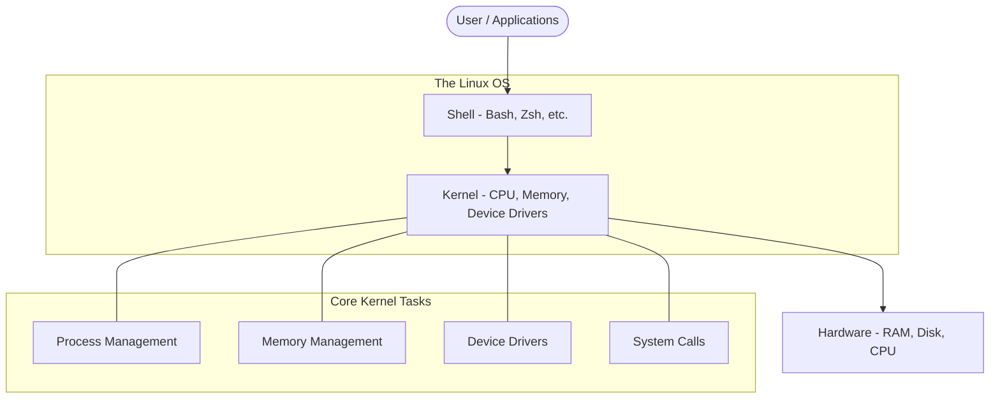

# Introduction to Linux for DevOps

Linux is the bedrock of modern DevOps. In an era of cloud-native applications, containerization, and automated infrastructure, Linux provides the essential environment where these technologies thrive.

---

## 🏗️ Linux Architecture

Understanding the Linux architecture is crucial for troubleshooting and performance tuning. The system is built in layers, moving from hardware to user applications.

### 1. The Kernel
The core of the operating system. It manages hardware resources and provides a layer of abstraction for software to interact with hardware.
- **Process Management**: Handling multiple tasks simultaneously.
- **Memory Management**: Allocating and deallocating memory for processes.
- **Device Management**: Communicating with hardware via drivers.

### 2. The Shell
The interface between the user and the kernel. It's a command interpreter that takes inputs and executes programs.
- **Standard Shells**: Bash (Bourne Again SHell), Zsh, Fish.

### 3. File System
Everything in Linux is a file (including hardware devices like disks and terminals). This philosophy simplifies the way the OS interacts with various system components.

---

## 🐧 Why Linux for DevOps?

| Feature | DevOps Benefit |
| :--- | :--- |
| **Open Source** | Full transparency, no licensing costs, and massive community support. |
| **CLI-First** | Perfect for automation and CI/CD pipelines. |
| **Performance** | Extremely lightweight and efficient with system resources. |
| **Security** | Granular permission models and robust process isolation. |
| **Portability** | Runs natively on cloud providers (AWS, Azure, GCP) and in containers. |

---

## 📑 Linux Distributions (Distros)

Distros are versions of Linux packaged with specific tools, package managers, and desktop environments.

### 🏢 Enterprise / Stable
- **Ubuntu LTS**: The most popular choice for cloud and development. Large package repository.
- **RHEL (Red Hat Enterprise Linux)**: The gold standard for enterprise security and stability.
- **Debian**: Known for being rock-solid; often used as a base for other distros.

### 🐳 Container-Optimized
- **Alpine Linux**: Extremely tiny (approx. 5MB). The standard for small, secure Docker images.
- **Wolfi**: A "new" distro designed specifically for security and SBOM (Software Bill of Materials).

---

## 🛠️ SRE Standards for Linux Management

As a Site Reliability Engineer (SRE), you should follow these standards:

1.  **Immutability**: Prefer creating new server images (AMIs) over patching running servers.
2.  **Infrastructure as Code (IaC)**: Never configure a Linux server manually. Use Ansible, Terraform, or Cloud-init.
3.  **Observability**: Ensure every server has monitoring agents (Prometheus Node Exporter, CloudWatch Agent) installed.
4.  **Security Hardening**:
    *   Disable Root login over SSH.
    *   Use SSH Key-based authentication only.
    *   Implement "Least Privilege" permissions.

---

## 🌟 Real-Life Scenario: The Zombie Process Panic

**Situation**: A production server is reporting high CPU usage, but `top` doesn't show any single process consuming excessive resources. However, you notice hundreds of processes in a `Z` state.

**The Problem**: "Zombie" processes. These are child processes that have finished executing but their parent process hasn't "reaped" them (read their exit code). While they don't consume CPU, they take up slots in the process table.

**The SRE Solution**:
1.  **Identify the Parent**: Use `ps -ef | grep defunct` to find the zombies and their Parent Process ID (PPID).
2.  **Signal the Parent**: Send a `SIGCHLD` signal to the parent to encourage it to clean up.
3.  **Restart/Kill Parent**: If the parent is unresponsive, you may need to restart the service.
4.  **Root Cause**: Fix the application code where the child processes are not being managed correctly.

---

## 🔗 Related Resources
- [Linux Command Reference](../03-Commands/README.md)
- [Filesystem Hierarchy](../02-Filesystem/README.md)
- [Linux Permissions](../04-Permissions/README.md)
- [SSH Mastery](../SSH/README.md)
