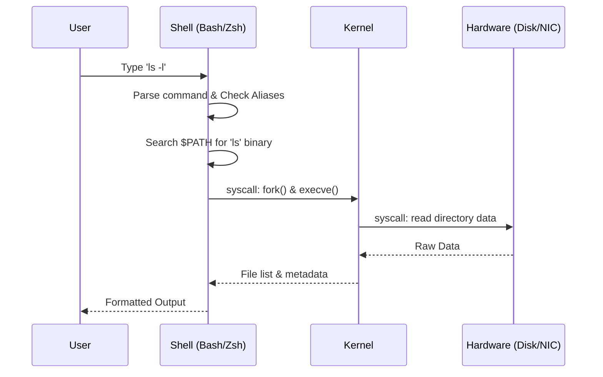

# Essential Linux Commands for DevOps

DevOps engineers live in the terminal. Mastering the command line is not about memorizing every flag, but knowing which tool to reach for when a system is failing.

---

## 🏗️ The Command Execution Flow

When you type a command in the shell, a series of events occurs before the output is displayed.

---

## 🟢 1. Beginner: Survival & Navigation
*Goal: Navigate the filesystem and manage files without fear.*

| Command | Action | Pro-Tip |
| :--- | :--- | :--- |
| **`pwd`** | Show current path. | Always `pwd` before running a destructive command. |
| **`ls -la`** | List all files with details. | `-a` shows hidden files (like `.bashrc`, `.env`). |
| **`cd -`** | Switch directory. | Use `-` to toggle back to the previous directory. |
| **`mkdir -p`** | Create directory tree. | `mkdir -p app/src/main` creates all parent folders. |
| **`cp -r`** | Copy recursively. | Use `-a` (archive) to preserve permissions and links. |
| **`rm -rf`** | Force delete. | **DANGER**: Double check your path with `ls` first. |

---

## 🟡 2. Intermediate: Troubleshooting & Text Processing
*Goal: Find information inside files and manage system resources.*

### 🔍 Search & Filtering
- **`grep -r "ERROR" /var/log/`**: Search for a string recursively in a directory.
- **`find . -name "*.yaml"`**: Find files by pattern.
- **`tail -f access.log`**: Follow a log file in real-time. Extremely useful for debugging live apps.

### ⚙️ Process Management
- **`top` / `htop`**: View CPU and Memory usage in real-time.
- **`ps aux | grep nginx`**: Find the Process ID (PID) of a specific service.
- **`kill -9 <PID>`**: Forcefully terminate a stuck process.

---

## 🔴 3. Advanced: SRE & Performance Tuning
*Goal: Analyze system bottlenecks and manipulate data streams.*

### 🚀 Data Wrangling (Sed & Awk)
- **`awk '{print $1}' access.log | sort | uniq -c`**: Parse a log file to see which IP addresses are making the most requests.
- **`sed -i 's/old-ip/new-ip/g' config.php`**: Perform a find-and-replace across a file directly.

### 📊 Performance Analysis
- **`iostat -xz 1`**: Check if your disks are saturated (high `%util`).
- **`free -h`**: Check if the system is swapping due to low memory.
- **`ss -tulpn`**: See all listening ports and which process owns them.

---

## 🌟 Real-Life SRE Scenario: The "Mystery Slowness"

**Situation**: Users are complaining that the website is slow. You SSH into the web server.

**Step 1 (Check Load)**: Run `uptime`. Load average is 15 on an 8-core machine. It's overloaded.
**Step 2 (Check CPU vs I/O)**: Run `top`. CPU usage is only 10%, but `%wa` (I/O Wait) is 70%.
**Step 3 (Find Culprit)**: Run `iotop`. You see a backup script is saturating the disk bandwidth.
**Step 4 (Resolution)**: `kill` the backup process and reschedule it for off-peak hours using `ionice` to limit its priority.

---

## 🔗 Related Resources
- [Linux Filesystem Mastery](../02-Filesystem/README.md)
- [Linux Permissions](../04-Permissions/README.md)
- [SSH Mastery](../SSH/README.md)
