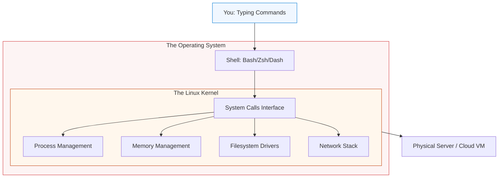

# 🐧 Linux Mastery: The Cloud Foundation

> **"Linux is the bedrock of the cloud. Almost all containers, servers, and cloud services run on a Linux kernel. If you treat Linux like Windows, you will fail; if you treat it like an engine, you will fly."**

---

## 🧠 The Mental Model: The Engine Room

**The Newbie Struggle**: "I'm staring at a black screen with a blinking cursor. I typed `ls` and nothing happened. I tried to edit a file and it said 'Permission Denied'. I feel like I'm blind and my hands are tied."

**The Engineer Solution**: You realize that Linux isn't a "Product"; it's a **Tool**. In Windows, the OS tries to hide the complexity. In Linux, the complexity is the point. You learn to talk to the kernel directly. You realize that **Everything is a File**, and once you master the commands, you have more power than any GUI could ever give you.

### 🏗️ The Linux Analogy

| Concept | Engine Room Analogy | Linux Equivalent |
|:--------|:--------------------|:-----------------|
| **The Kernel** | The Actual Engine | The core software |
| **The Shell (Bash)** | The Control Panel / Gauges | The Terminal Interface |
| **Sudo** | The Master Key / Captain's Override | Superuser Privilege |
| **Permissions** | Restricted Access Doors | `rwx` (Read, Write, Execute) |
| **Processes** | Moving Pistons | Running Applications |
| **Logs** | The Flight Recorder | `/var/log` |

---

## 📚 Why This Module Matters for Newbies

**Before this module**, you might think:
- "Commands are too hard to remember."
- "The terminal is only for hackers in movies."
- "I need a mouse to manage a server."

**After this module**, you'll understand:
- **Terminal Velocity**: Moving faster with keys than with clicks.
- **The Filesystem Hierarchy**: Knowing exactly where the secrets are kept (`/etc`).
- **Standard Streams**: Piping data between tools like Lego bricks (`grep`, `awk`, `sed`).
- **Ownership**: Managing the "Who" and "What" of system security.

**The Difference**: You move from "Fearing the terminal" to **"Living in it."**

---

## 🎯 Learning Objectives

By the end of this module, you will:

- ✅ **Navigate the Shell**: Master `cd`, `ls`, `mkdir`, and `rm` with confidence.
- ✅ **Execute with Precision**: Use `grep`, `find`, and `awk` to extract data.
- ✅ **Master Permissions**: Understand `chmod`, `chown`, and the numeric security model.
- ✅ **Secure Access**: Setup SSH keys and disable insecure passwords.
- ✅ **Inspect the System**: Using `top`, `df`, and `netstat` to monitor health.

---

## 🏗️ The Linux Architecture

Linux is built in layers. You interact with the hardware through the Shell and Kernel.

---

## 📂 Learning Paths

1.  **[01-Introduction](./01-Introduction/README.md)**: Kernel vs. Distros (RHEL, Debian, Alpine).
2.  **[02-Filesystem](./02-Filesystem/README.md)**: The FHS Standard (Where do things go?).
3.  **[03-Commands](./03-Commands/README.md)**: The SRE Essential Toolkit.
4.  **[04-Permissions](./04-Permissions/README.md)**: The Security Model (u, g, o).
5.  **[SSH Mastery](./SSH/README.md)**: Secure remote administration.

---

## 🏆 Real-World DevOps Story: The 2:00 AM Disk Full Error

**The Incident**: A production database stopped accepting connections at 2:00 AM.
**The Failure**: A Newbie admin logged in and couldn't figure out why. He tried to restart the database, but it failed to start. He was stuck.
**The Fix**: A Senior SRE used three commands: `df -h` (to check space), `du -sh /*` (to find the heavy folder), and `rm -rf /var/log/app.log.old` (to clear space).
**The Outcome**: The database was back up in 45 seconds. The Newbie realized that without knowing the "Linguistics of Linux," he was powerless in an emergency.

---

## ❓ Interview Preparation (Linux)

### 🎯 Core Concepts

1. **Q: What is 'Zero-Dependency' in Linux?**
    *   *Answer: Using built-in tools like `awk` or `sed` to process data without installing external software. This is critical for lightweight containers and secure air-gapped systems.*
2. **Q: What does '755' permission mean?**
    *   *Answer: Owner has Read/Write/Execute (7), Group has Read/Execute (5), Others have Read/Execute (5). It is the standard for directories and binaries.*
3. **Q: How do you find a process that is eating all the CPU?**
    *   *Answer: Use `top` or `htop`. Press 'P' to sort by CPU. Identify the PID and investigate.*
4. **Q: SSH Password vs SSH Key?**
    *   *Answer: Passwords can be brute-forced. Keys use public-key cryptography (RSA/ED25519) and are significantly more secure and required for automation.*

---

## 📝 Knowledge Check

1. **Which directory contains the system configuration files?**
    * [ ] a) `/var`
    * [x] b) `/etc`
    * [ ] c) `/bin`
2. **What does the pipe `|` symbol do?**
    * [ ] a) Deletes a file.
    * [x] b) Takes the output of one command and gives it to another.
    * [ ] c) Restarts the server.
3. **True or False: Linux treats everything as a file.**
    * [x] a) True
    * [ ] b) False

---

**Next Step**: Start with **[Introduction to Linux](./01-Introduction/README.md)**

---
## 🧭 Additional Modules
- [05 Distros](05-Distros/README.md)
