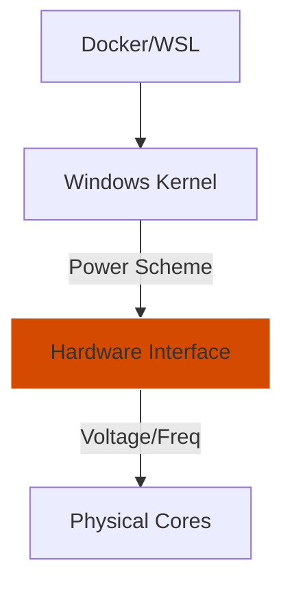

# 05: Power and Thermal Profiles

## 📊 Core Metric: `Frequency Scaling` & `Core Parking`
Targets the elimination of hardware-level latency introduced by Windows aggressive energy-saving features.

## 🚀 DevOps Impact
- **Docker Startup**: Faster container initialization by preventing core wake-up latencies.
- **WLS2 Performance**: Ensures the Linux kernel has immediate access to full physical CPU cycles.
- **Build Consistency**: Prevents CPU clock fluctuations from skewing build time measurements.

## 🗺️ Architecture

## ⚠️ Risk Assessment
- **Caution**: Using the "Ultimate Performance" profile on laptops while on battery will result in significantly reduced battery life and increased fan noise. 
- **Modern Standby**: Some laptops with "S0 Modern Standby" may hardware-lock power schemes; this script includes logic to detect and workaround these restrictions.
