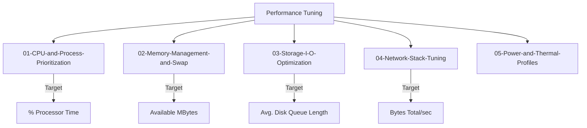

# Part 7: Radical Performance Optimization

This module covers the advanced architectural tuning of Windows to create a "High-Throughput DevOps Environment." We transition from a generic Desktop OS to a specialized Build and Development Node.

## 🛠️ Optimization Philosophy

In DevOps, we treat the local machine as a **Reproducible Infrastructure Component**. Performance tuning is about eliminating jitter, ensuring deterministic build times, and unlocking hardware potential for high-concurrency tasks.

## 🗺️ Master Performance Tree

## 📂 Specialized Modules

### [01-CPU & Process Prioritization](./01-CPU-and-Process-Prioritization)
Tuning scheduler quantum and process priority for IDEs and compilers.
- **Tools**: `Set-ProcessorPerformance.ps1`, `Optimize-SystemPerformance.ps1`

### [02-Memory & Swap](./02-Memory-Management-and-Swap)
Optimizing RAM allocation and Pagefile behavior for heavy container workloads.
- **Tools**: `Invoke-SystemAudit.ps1` (Memory Audit)

### [03-Storage & I/O](./03-Storage-I-O-Optimization)
Disabling metadata overhead and managing SSD TRIM for sustained database operations.
- **Tools**: `Invoke-SystemMaintenance.ps1` (TRIM/Cleanup)

### [04-Network Stack Tuning](./04-Network-Stack-Tuning)
Deep registry tweaks for TCP Receive Windows and DNS caching architectures.
- **Tools**: `Optimize-NetworkStack.ps1`

### [05-Power & Thermal Profiles](./05-Power-and-Thermal-Profiles)
Eliminating frequency scaling jitter.
- **Tools**: `Optimize-PowerPlan.ps1`

---

## 🧪 Labs and Challenges
Explore the [06-Labs-and-Challenges](./06-Labs-and-Challenges) directory for hands-on performance debugging scenarios.

---
*Senior Windows Systems Engineer & Technical Content Architect*

---
## 🧭 Additional Modules
- [07 WSL2 Optimization](07-WSL2-Optimization/README.md)
- [08 Server Hardening](08-Server-Hardening/README.md)
- [09 Maintenance Automation](09-Maintenance-Automation/README.md)
- [10 Health Monitoring](10-Health-Monitoring/README.md)
