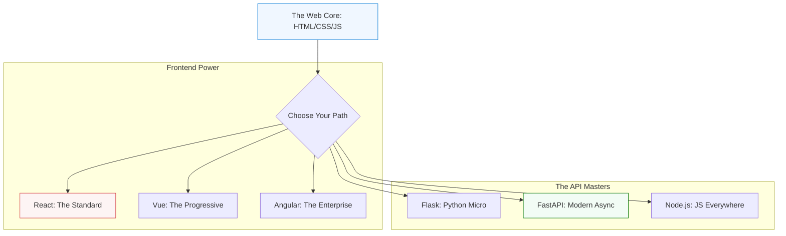

# 🎨 Web Design & Frameworks: The Digital Storefront

> **"A website is the first point of contact between your system and the world. In DevOps, we don't just 'design' pages; we engineer robust portals. If your frontend is slow, it doesn't matter how fast your database is—the user has already left."**

---

## 🧠 The Mental Model: The Digital Storefront

**The Newbie Struggle**: "I learned HTML and CSS, but my website still looks like it was built in 1995. I tried to use a 'Framework' like React, but my brain hurts from words like 'State', 'Props', and 'Re-rendering'. I feel like I'm building a house of cards where everything falls over the second I refresh the page."

**The Engineer Solution**: You realize that professional web development is about **Components**. You don't build "Pages"; you build **Reusable Blocks**. You learn that a Framework is like a **Robot Assistant** that automatically updates the visuals whenever your data changes. You stop writing thousand-line files and start building specialized, testable modules.

### 🏗️ The Web Analogy

| Concept | Storefront Analogy | Web Equivalent |
|:--------|:-------------------|:---------------|
| **HTML** | The Steel Girders / Walls | Semantic Structure |
| **CSS** | The Paint & Signage | Styling (Tailwind/Sass) |
| **JavaScript** | The Automatic Doors / Lights | Interactivity (Logic) |
| **Framework** | The Prefab Construction Kit | React / Vue / Angular |
| **Meta-Framework** | The Full Mall Management | Next.js / Nuxt |

---

## 📚 Why This Module Matters for Newbies

**Before this module**, you might think:
- "Web design is just making things look pretty."
- "I can just copy-paste CSS from the internet."
- "Frameworks make everything more complicated."

**After this module**, you'll understand:
- **Responsive Design**: Making your app look perfect on a 4K monitor and a 5-year-old phone.
- **Component Lifecycle**: How apps 'boot up' and 'clean up' in the browser.
- **State Management**: Ensuring the "Cart" total updates correctly across 10 different pages.
- **API Integration**: Bringing the "Cake" (Backend) data into the "Frosting" (Frontend).

**The Difference**: You move from "Painting pages" to **"Architecting Interfaces."**

---

---

## 🎯 Junior's Mission: The Broken Dashboard
**Scenario**: Your team's Grafana-style dashboard is showing "No Data," but you know the backend is healthy. A quick look at the browser console shows a "CORS Error."
**Your Goal**: Identify if the issue is a **Protocol Mismatch** (HTTP vs HTTPS), a **Header Misconfiguration**, or a broken **API Endpoint** and fix it so the SREs can see their metrics again.

---

## 🏗️ Operational Reality: Production Hazards
Frontend engineering in a DevOps context is about **Resilience** at the edge.
1.  **CORS Hell**: Your frontend is on `app.com` and your API is on `api.com`. If you don't configure "Cross-Origin Resource Sharing," the browser will block every request for security reasons.
2.  **The "White Screen of Death"**: A single JavaScript error in a non-critical component crashes the entire page because there are no "Error Boundaries."
3.  **Lighthouse Failure**: The app takes 10 seconds to load because you are importing a 5MB "Heavy library" to do a 5-line task.
4.  **Mobile Responsive Drift**: The dashboard looks great on your MacBook, but is completely unusable on the tablet the datacenter techs use.

---

## 🛠️ The Web Toolbelt (Essential Commands)
| Tool/Command | Why it matters |
| :--- | :--- |
| `F12` (DevTools) | The "Terminal" of the web. Inspecting network traffic and console errors. |
| `npm run build` | Compiling your human-readable code into a tiny, fast "Production Bundle." |
| `lighthouse` | Auditing your site for **Performance**, **SEO**, and **Accessibility**. |
| `curl -I <url>` | Checking the HTTP headers. Are we sending the right `Content-Type`? |
| `npx tailwindcss init` | Scaffolding the modern "Atomic CSS" utility engine. |

---

## 🎯 Learning Objectives
By the end of this module, you will:

- ✅ **Structure with Semantics**: Using HTML5 properly for SEO and Accessibility.
- ✅ **Style with Modernity**: Mastering Flexbox, Grid, and Tailwind CSS.
- ✅ **Componentize with React**: Building your first interactive UI modules.
- ✅ **Build with Full-Stack**: Creating APIs with Flask/FastAPI and connecting them.
- ✅ **Optimize Performance**: Understanding Bundle Sizes and Lazy Loading.

---

---

## 🏗️ The Framework Ecosystem

Choose your path based on the scale of the system.

---

## 📂 Framework Roadmaps

-   **[React](./React/)**: Hooks, State, and the modern UI standard.
-   **[FastAPI](./FastAPI/)**: The king of high-performance Python APIs.
-   **[Flask](./Flask/)**: Perfect for internal DevOps dashboards.
-   **[NextJS](./NextJS/)**: The world-class standard for React applications.
-   **[NodeJS](./NodeJS/)**: Driving the backend with JavaScript.
-   **[Tailwind CSS](./CSS/)**: Designing at the speed of thought.

---

## 🏆 Real-World DevOps Story: The Re-rendering Storm

**The Incident**: A dashboard showing real-time server health started lagging and eventually crashed the browser of the SREs.
**The Failure**: A Newbie developer wrote a "Global Refresh" that re-rendered the **entire** page every 500 milliseconds. As the number of servers grew, the browser couldn't keep up.
**The Fix**: Rewriting the code using a **Component-Based Framework** (React). Instead of refreshing the whole page, the app only re-rendered the **individual server card** that changed.
**The Outcome**: CPU usage dropped by 95%. The team realized that "Web Frameworks" aren't just for features; they are for **Engineered Efficiency**.

---

## ❓ Interview Preparation (Web Frameworks)

### 🎯 Core Concepts

1. **Q: What is the 'Virtual DOM' in React?**
    *   *Answer: It is a lightweight copy of the real webpage held in memory. React compares the Virtual DOM with the real one and only updates the specific parts that changed. This is what makes React so fast.*
2. **Q: CSS Flexbox vs Grid?**
    *   *Answer: Flexbox is for 1D layouts (a row or a column). Grid is for 2D layouts (a full grid of rows AND columns). Most modern layouts use a mixture of both.*
3. **Q: Why use a Meta-Framework like Next.js?**
    *   *Answer: It provides built-in routing, image optimization, and Server-Side Rendering (SSR) out of the box, saving weeks of configuration time for production-grade apps.*

---

## 📝 Knowledge Check

1. **In React, what is the primary hook used for keeping track of data?**
    * [ ] a) `useEffect`
    * [x] b) `useState`
    * [ ] c) `useRef`
2. **True or False: Tailwind CSS allows you to write CSS without leaving your HTML file.**
    * [x] a) True
    * [ ] b) False
3. **Which Python framework is known for 'Automatic Documentation' (Swagger)?**
    * [ ] a) Flask
    * [x] b) FastAPI
    * [ ] c) Django

---

**Next Step**: Start with **[Environment Setup](./Environment-Setup.md)**

---
## 🧭 Additional Modules
- [Angular](Angular/README.md)
- [Django](Django/README.md)
- [Mobile](Mobile/README.md)
- [SpringBoot](SpringBoot/README.md)
- [VueJs](VueJs/README.md)
