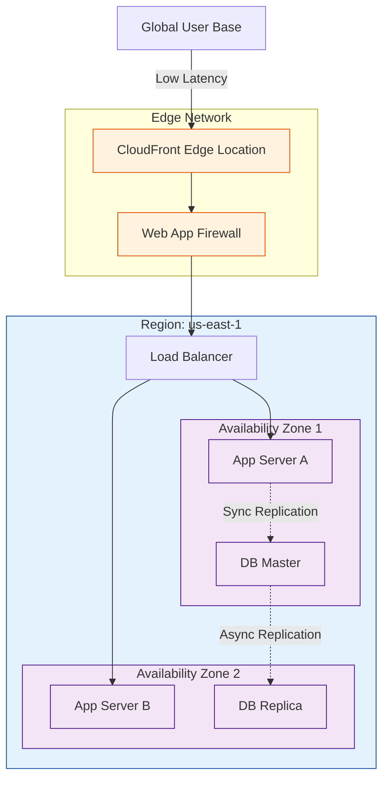

# 🌍 Global Infrastructure: The Physical Reality

> **"There is no 'Cloud', it's just someone else's computer."**
> ...Actually, it's millions of computers in massive, unrecognizable warehouses, connected by cables thick enough to conduct lightning, buried under the ocean. Understanding the *physicality* of the cloud is what separates a script-kiddie from an Architect.

---

## 🧠 The Mental Model: The Power Grid

**The Junior Perspective**: The Cloud is a single, magical entity. You upload code, and it runs "somewhere."

**The Engineer Perspective**: The Cloud is a **Global Facilities Grid**.
1.  **The Region (The City)**: A major geographic area (e.g., Northern Virginia). This is your primary fault domain foundation.
2.  **The Availability Zone (The Power Plant)**: distinct, physically isolated datacenters within that City. If one blows up, the others keep running.
3.  **The Edge Location (The Convenience Store)**: Tiny, highly distributed caches located in almost every major city on earth to serve content fast.

---

## 🆚 Junior Way vs. Engineer Way

| Feature | The Junior Way (Problematic) | The Engineer Way (Strategic) |
|:---|:---|:---|
| **Region Selection** | Uses `us-east-1` for everything because it's the default. | Selects regions based on **Latency** (User proximity), **Compliance** (GDPR/Data Residency), and **Cost** (prices vary by region). |
| **Availability** | Deploys a single EC2 instance and hopes it doesn't crash. | Deploys across **Multiple AZs** behind a Load Balancer. "Design for Failure." |
| **Latency** | "Why is my app slow for users in Japan?" (Server is in Ohio). | Uses **CloudFront (Edge locations)** and **Global Accelerator** to minimize latency. |
| **Disaster Recovery** | "we have backups" (on the same disk). | Implements **Cross-Region Replication** for S3 and DBs to survive a catastrophic regional failure. |

---

## 🎯 The Automation Why: Multi-Region Resilience

**For Juniors**: You hardcode `region = "us-east-1"` in your scripts.
**For Engineers**: Your Infrastructure as Code (IaC) is **Title Agnostic**.
-   **Dynamic Lookups**: Your Terraform code queries the AWS API to find the correct "Ubuntu 22.04" AMI ID for the specific region it's deploying to (AMIs IDs change per region).
-   **Traffic Steering**: You can script DNS (Route53) to automatically shift user traffic from NY to London if the NY region goes dark.

---

## 🏗️ The Three Tiers of Infrastructure

### 1. Regions (The Fortress)
A separate geographic area.
-   **Isolation**: Regions are completely independent (mostly). A failure in `us-east-1` does (should) not affect `eu-west-1`.
-   **Control**: You clearly control where your data lives. Data in Frankfurt stays in Frankfurt (unless you move it).

### 2. Availability Zones (The Generator)
One or more discrete data centers *within* a Region.
-   **Redundancy**: Each AZ has independent power, cooling, and networking.
-   **Connectivity**: Connected via high-bandwidth, ultra-low latency networking (fiber).
-   **Ping**: Latency between AZs is usually < 2ms.

### 3. Edge Locations (The Cache)
Endpoints for AWS used for caching content.
-   **Service**: CloudFront (CDN), Route53 (DNS), WAF.
-   **Scale**: There are 400+ Edge Locations vs ~30 Regions.

---

## 🗺️ Infrastructure Architecture

---

## Real World Scenarios

### Scenario 1: The "Backhoe" Incident
**Context:** A construction crew accidentally cuts the main fiber line powering the primary datacenter your startup uses.
**Junior Outcome:** The app is down for 8 hours. The CEO is screaming.
**Engineer Outcome:** The Load Balancer detects the health check failure in `us-east-1a` (the dead AZ) and instantly shifts all traffic to `us-east-1b`. Users notice a 2-second blip, then normal service resumes.
**Lesson:** Always deploy Multi-AZ.

### Scenario 2: The GDPR Compliance Request
**Context:** Your US-based company expands to Germany. German law requires citizen data to *physically* remain within Germany.
**Solution:**
-   Spin up a new VPC in `eu-central-1` (Frankfurt).
-   Configure the application to route German users to the Frankfurt region.
-   Ensure S3 buckets and RDS instances in Frankfurt have "Cross-Region Replication" **DISABLED** or strictly controlled so data doesn't leak back to the US.

---

## Interview Preparation

### Behavioral & Technical Questions

1.  **What is the difference between an Availability Zone and a Region?**
    -   A **Region** is a separate geographic area (e.g., Ohio). An **AZ** is an isolated location within that Region (e.g., Ohio Data Center B). Regions are designed for data sovereignty and disaster recovery; AZs are designed for High Availability within a region.

2.  **Why shouldn't you just deploy everything to the closest region?**
    -   **Cost**: `sa-east-1` (São Paulo) is significantly more expensive than `us-east-1`.
    -   **Services**: New AWS services often launch in `us-east-1` first and might not be available yet in smaller regions.
    -   **Latency**: If your users are global, one region isn't enough.

3.  **What is an Edge Location and what specific services use it?**
    -   It's a datacenter used by CloudFront (CDN) and Route53 (DNS) to cache static content closer to the user to reduce latency. It does NOT run EC2 instances (usually).

4.  **How do you achieve High Availability (HA) vs. Fault Tolerance?**
    -   **HA**: The system stays up essentially all the time (e.g., Multi-AZ). Downtime is minimal.
    -   **Fault Tolerance**: The system continues to operate without *any* interruption when a component fails (more expensive, simpler redundancy).

5.  **Explain the latency difference between AZs vs Regions.**
    -   AZ-to-AZ latency is typically single-digit milliseconds (<2ms - 10ms), effectively "local" network speeds. Region-to-Region latency depends on physics (speed of light), typically 40ms-200ms depending on distance.

### Knowledge Check

1.  **Which component represents a physical data center (or cluster of them)?**

Show Answer

Answer: Availability Zone (AZ)

2.  **To ensure your application can survive a complete natural disaster (like a hurricane destroying a city), you should deploy across:**

Show Answer

Answer: Multiple Regions

3.  **Edge Locations are primarily used for:**

Show Answer

Answer: Caching content (CDN) and DNS resolution

4.  **True or False: Data transfer between Availability Zones in the same Region is free.**

Show Answer

Answer: False (AWS typically charges for cross-AZ data transfer)

5.  **Which AWS Region is famously the oldest, largest, and sometimes most "glitchy"?**

Show Answer

Answer: us-east-1 (N. Virginia)

6.  **Local Zones allow you to:**

Show Answer

Answer: Place compute resources closer to end-users in specific cities (extensions of a Region)

7.  **What is the primary factor limiting network speed between London and Sydney regions?**

Show Answer

Answer: The Speed of Light (Physics)

8.  **If you need to comply with data residency laws, you must choose the correct:**

Show Answer

Answer: Region

