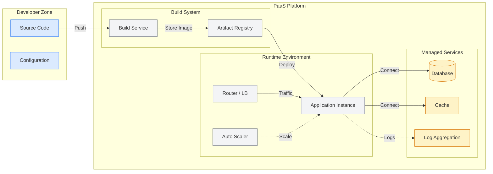
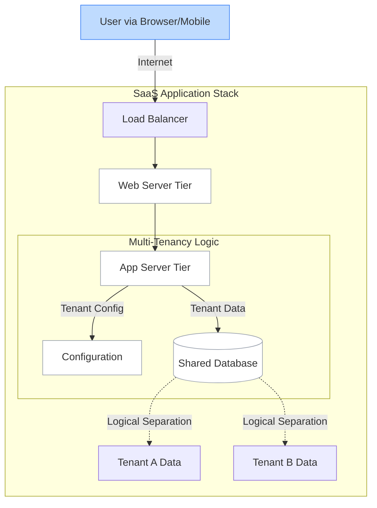
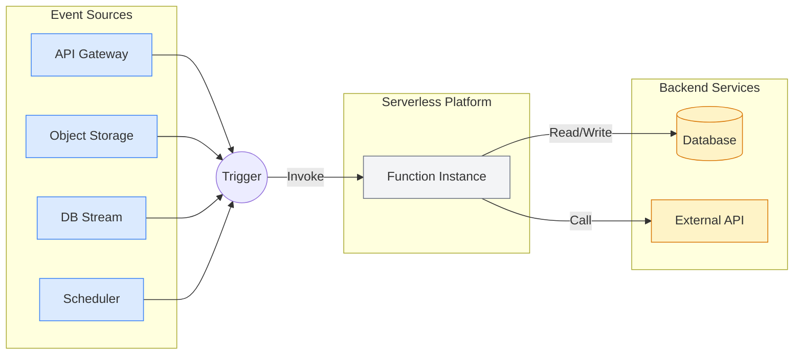
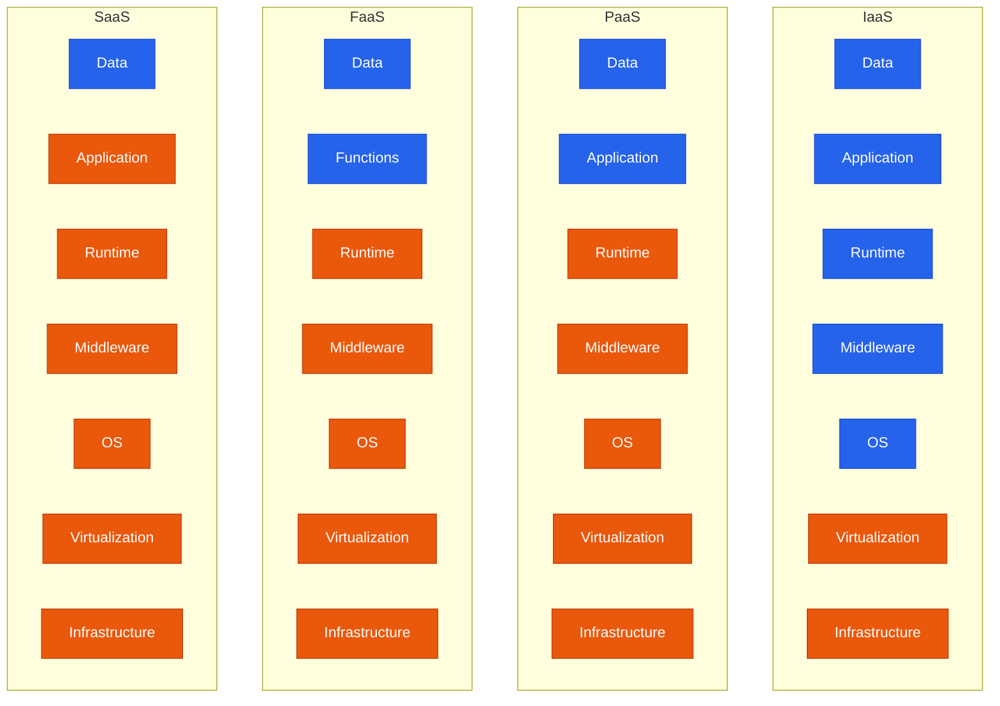

# 🏗️ Cloud Service Models: The Pizza Shop Analogy

> **"Listen up, Junior. Every cloud service model is just a different answer to the question: 'How much of this headache do I want to manage myself?' If you pick IaaS for a simple website, you're building the entire bakery just to sell one loaf of bread. If you pick SaaS for a custom enterprise app, you're trying to perform surgery through a keyhole. Choose wisely, or you'll be fixing servers at 2 AM for things you shouldn't even own."**

---

## 🧠 The Mental Model: The Cloud Pizza Shop

The best way to understand the "Shared Responsibility" in the cloud is through **Pizza as a Service**:

1.  **On-Premises (DIY Pizza)**: You buy the flour, make the dough, get the toppings, heat the oven, and set the table. You own everything—from the floor to the roof.
2.  **IaaS (Frozen Pizza - Take & Bake)**: The grocery store (Cloud Provider) provides the raw materials (Servers/Storage). You still have to bring it home, use your oven (OS/Runtime), and set your table.
3.  **PaaS (Pizza Delivery)**: You just order. They make it, cook it, and deliver it to your door. You just need to provide the "Settings" (Data/App) and the plates.
4.  **SaaS (Dining Out)**: You go to a restaurant. You don't care about the oven, the dough, or even the plates. You just consume the pizza.

---

## 🆚 Junior Way vs. Engineer Way

| Feature | The Junior Way (Naive) | The Engineer Way (Strategic) |
| :--- | :--- | :--- |
| **IaaS** | Manually SSH-ing into 50 VMs to update them. | Using **Terraform** and **Ansible** to manage fleets as code. |
| **PaaS** | Relying on the platform for everything, no backups. | Understanding the **Underlying Limits** and scaling triggers. |
| **SaaS** | Using it without checking for API limits or security. | Integrating via **OAuth/Webhooks** and monitoring usage. |
| **Decision** | "I like AWS, so I'll use EC2 for everything." | Analyzes **TCO (Total Cost of Ownership)** vs. **Agility**. |

---

## 🎯 The Automation Why: Managing Complexity

**For Juniors**: You might think these models just save you work.
**For Engineers**: These models define your **Automation Interface**.

*   **IaaS Automation**: You automate the **Infrastructure** (Disk, Network, CPU).
*   **PaaS Automation**: You automate the **Deployment** (Git push to deploy, Auto-scaling).
*   **SaaS Automation**: You automate the **Workflow** (API integrations, User provisioning).

---

## 🏗️ Deep Dive: The Models


### 1. Infrastructure as a Service (IaaS)
> *"The Raw Lumber"*

**The Gist**: You rent the hardware (CPU, RAM, Disk). You bring the OS (Windows/Linux) and everything on top of it.

**Provider Manages**: Virtualization, Servers, Storage, Networking.
**You Manage**: OS, Middleware, Runtime, Data, Applications.

#### 🔧 Implementation Footprint
```bash
# Provides virtualized computing resources over the internet
# Fundamental building blocks of cloud computing
# Maximum control and flexibility
```

### Architecture


### Key Components

#### Compute Services
```bash
# Virtual Machines
AWS EC2:
aws ec2 run-instances \
    --image-id ami-0abcdef1234567890 \
    --count 1 \
    --instance-type t3.medium \
    --key-name MyKeyPair \
    --security-group-ids sg-903004f8

Azure Virtual Machines:
az vm create \
    --resource-group myResourceGroup \
    --name myVM \
    --image UbuntuLTS \
    --admin-username azureuser \
    --generate-ssh-keys

Google Compute Engine:
gcloud compute instances create my-instance \
    --zone=us-central1-a \
    --machine-type=e2-medium \
    --image-family=ubuntu-2004-lts \
    --image-project=ubuntu-os-cloud
```

#### Storage Services
```bash
# Block Storage
AWS EBS:
aws ec2 create-volume \
    --size 100 \
    --volume-type gp3 \
    --availability-zone us-west-2a

# Object Storage
AWS S3:
aws s3 mb s3://my-iaas-bucket
aws s3 cp file.txt s3://my-iaas-bucket/

# File Storage
AWS EFS:
aws efs create-file-system \
    --creation-token myToken \
    --performance-mode generalPurpose
```

#### Networking Services
```bash
# Virtual Private Cloud
AWS VPC:
aws ec2 create-vpc --cidr-block 10.0.0.0/16

# Load Balancers
AWS ALB:
aws elbv2 create-load-balancer \
    --name my-load-balancer \
    --subnets subnet-12345678 subnet-87654321 \
    --security-groups sg-12345678

# Content Delivery Network
AWS CloudFront:
aws cloudfront create-distribution \
    --distribution-config file://distribution-config.json
```

### Advantages
```bash
# Cost Efficiency
- No upfront hardware investment
- Pay-as-you-use pricing
- Reduced operational costs
- Economies of scale

# Scalability
- Rapid resource provisioning
- Elastic scaling capabilities
- Global availability
- On-demand capacity

# Flexibility
- Choice of operating systems
- Custom configurations
- Full administrative control
- Technology stack freedom

# Reliability
- High availability infrastructure
- Disaster recovery capabilities
- Redundancy and failover
- SLA guarantees
```

### Disadvantages
```bash
# Management Overhead
- OS maintenance and patching
- Security configuration
- Backup and recovery
- Monitoring and troubleshooting

# Security Responsibility
- OS-level security
- Application security
- Data protection
- Access control management

# Complexity
- Infrastructure design
- Network configuration
- Performance optimization
- Cost management
```

### Use Cases
```bash
# Development and Testing
- Rapid environment provisioning
- Cost-effective testing
- Isolated development environments
- CI/CD infrastructure

# Web Applications
- Scalable web hosting
- Database servers
- Application servers
- Content delivery

# Big Data and Analytics
- Data processing clusters
- Machine learning workloads
- Data warehousing
- Analytics platforms

# Disaster Recovery
- Backup infrastructure
- Failover environments
- Business continuity
- Data replication
```

### Major IaaS Providers
```bash
# Amazon Web Services (AWS)
Services: EC2, S3, VPC, RDS, Lambda
Strengths: Market leader, extensive services, global presence
Use Cases: Enterprise applications, startups, government

# Microsoft Azure
Services: Virtual Machines, Blob Storage, Virtual Network
Strengths: Enterprise integration, hybrid cloud, Microsoft ecosystem
Use Cases: Enterprise Windows environments, hybrid deployments

# Google Cloud Platform (GCP)
Services: Compute Engine, Cloud Storage, VPC
Strengths: Data analytics, machine learning, container services
Use Cases: Data-driven applications, modern architectures

# IBM Cloud
Services: Virtual Servers, Object Storage, VPC
Strengths: Enterprise focus, AI/ML capabilities, hybrid cloud
Use Cases: Enterprise workloads, AI applications

# Oracle Cloud Infrastructure (OCI)
Services: Compute, Block Storage, Virtual Cloud Network
Strengths: Database workloads, high performance, enterprise features
Use Cases: Oracle database migrations, enterprise applications
```

### 2. Platform as a Service (PaaS)
> *"The Chef's Kitchen"*

**The Gist**: You provide the code. The cloud provides the OS, the Web Server, the Scaling, and the Database. You focus 100% on logic.

**Provider Manages**: Everything except your App and Data.
**You Manage**: Applications and Data.

#### 🔧 Implementation Footprint
```bash
# Provides platform and environment for developers
# Abstracts infrastructure management
# Focus on application development
```

### Architecture


### Key Components

#### Application Platforms
```bash
# AWS Elastic Beanstalk
# Deploy Java application
eb init my-app --platform java-8
eb create production-env
eb deploy

# Azure App Service
# Deploy .NET application
az webapp create \
    --resource-group myResourceGroup \
    --plan myAppServicePlan \
    --name myWebApp \
    --runtime "DOTNETCORE|3.1"

# Google App Engine
# Deploy Python application
gcloud app deploy app.yaml
gcloud app browse
```

#### Database Services
```bash
# Managed Databases
AWS RDS:
aws rds create-db-instance \
    --db-instance-identifier mydb \
    --db-instance-class db.t3.micro \
    --engine mysql \
    --master-username admin \
    --master-user-password mypassword

Azure SQL Database:
az sql db create \
    --resource-group myResourceGroup \
    --server myserver \
    --name mydatabase \
    --service-objective Basic

Google Cloud SQL:
gcloud sql instances create myinstance \
    --database-version=MYSQL_8_0 \
    --tier=db-f1-micro \
    --region=us-central1
```

#### Development Tools
```bash
# CI/CD Pipelines
AWS CodePipeline:
aws codepipeline create-pipeline \
    --cli-input-json file://pipeline.json

Azure DevOps:
az pipelines create \
    --name MyPipeline \
    --repository https://github.com/myorg/myrepo \
    --branch main

Google Cloud Build:
gcloud builds submit \
    --config cloudbuild.yaml \
    --source .
```

#### Container Platforms
```bash
# Kubernetes Services
AWS EKS:
eksctl create cluster \
    --name my-cluster \
    --region us-west-2 \
    --nodegroup-name standard-workers \
    --node-type t3.medium \
    --nodes 3

Azure AKS:
az aks create \
    --resource-group myResourceGroup \
    --name myAKSCluster \
    --node-count 1 \
    --enable-addons monitoring

Google GKE:
gcloud container clusters create my-cluster \
    --zone us-central1-a \
    --num-nodes 3
```

### Advantages
```bash
# Faster Development
- Pre-configured environments
- Built-in development tools
- Automated deployment
- Reduced setup time

# Cost Efficiency
- No infrastructure management
- Pay for platform usage
- Reduced operational overhead
- Automatic scaling

# Focus on Code
- Abstract infrastructure complexity
- Built-in services integration
- Standardized environments
- Best practices enforcement

# Scalability
- Automatic scaling
- Load balancing
- Performance optimization
- Global distribution
```

### Disadvantages
```bash
# Limited Control
- Platform constraints
- Runtime limitations
- Configuration restrictions
- Vendor lock-in

# Customization Limits
- Predefined environments
- Limited OS access
- Restricted configurations
- Standard frameworks only

# Dependency
- Platform availability
- Vendor roadmap
- Migration complexity
- Service limitations
```

### Use Cases
```bash
# Web Application Development
- Rapid prototyping
- Startup applications
- E-commerce platforms
- Content management systems

# API Development
- RESTful services
- Microservices architecture
- Integration platforms
- Mobile backends

# Data Processing
- ETL pipelines
- Real-time analytics
- Data transformation
- Batch processing

# DevOps and CI/CD
- Continuous integration
- Automated testing
- Deployment pipelines
- Release management
```

### Major PaaS Providers
```bash
# Heroku
Strengths: Developer-friendly, easy deployment, add-on ecosystem
Languages: Ruby, Node.js, Python, Java, PHP, Go, Scala, Clojure
Use Cases: Startups, rapid prototyping, simple web applications

# AWS Elastic Beanstalk
Strengths: AWS integration, multiple platforms, auto-scaling
Languages: Java, .NET, PHP, Node.js, Python, Ruby, Go
Use Cases: AWS-centric applications, enterprise deployments

# Google App Engine
Strengths: Automatic scaling, integrated services, serverless
Languages: Python, Java, Node.js, PHP, Ruby, Go, .NET
Use Cases: Scalable web applications, Google ecosystem integration

# Microsoft Azure App Service
Strengths: Enterprise integration, multiple frameworks, DevOps tools
Languages: .NET, Java, Ruby, Node.js, PHP, Python
Use Cases: Enterprise applications, Microsoft ecosystem

# Red Hat OpenShift
Strengths: Kubernetes-based, enterprise features, hybrid cloud
Languages: Multiple via containers
Use Cases: Enterprise container platforms, hybrid deployments
```

### 3. Software as a Service (SaaS)
> *"The Finished Meal"*

**The Gist**: You just log in and use it. No code, no servers, no patches. You are a consumer of the application.

**Provider Manages**: Everything.
**You Manage**: Who has access and what data you put in.

#### 🔧 Implementation Footprint
```bash
# Complete software applications delivered over the internet
# No installation or maintenance required
# Multi-tenant architecture
```

### Architecture


### Key Characteristics

#### Multi-Tenancy
```bash
# Shared Infrastructure
- Single application instance
- Multiple customers (tenants)
- Isolated data and configurations
- Shared resources and costs

# Tenant Isolation
- Data segregation
- Security boundaries
- Performance isolation
- Customization per tenant
```

#### Subscription Model
```bash
# Pricing Models
- Per user per month
- Tiered feature access
- Usage-based billing
- Freemium models

# Examples:
Office 365: $5-22/user/month
Salesforce: $25-300/user/month
Slack: $6.67-12.50/user/month
Zoom: $14.99-19.99/user/month
```

#### Automatic Updates
```bash
# Continuous Delivery
- Regular feature updates
- Security patches
- Bug fixes
- No user intervention required

# Version Management
- Single version for all users
- Backward compatibility
- Gradual rollouts
- Feature flags
```

### Categories of SaaS

#### Productivity and Collaboration
```bash
# Office Suites
Microsoft Office 365:
- Word, Excel, PowerPoint online
- Teams collaboration
- OneDrive storage
- Exchange email

Google Workspace:
- Docs, Sheets, Slides
- Gmail and Calendar
- Drive storage
- Meet video conferencing

# Project Management
Atlassian Jira:
- Issue tracking
- Agile project management
- Workflow automation
- Reporting and analytics

Asana:
- Task management
- Team collaboration
- Project tracking
- Timeline views
```

#### Customer Relationship Management (CRM)
```bash
# Salesforce
Features:
- Lead and opportunity management
- Sales forecasting
- Customer service
- Marketing automation
- Analytics and reporting

# HubSpot
Features:
- Contact management
- Email marketing
- Sales pipeline
- Customer support
- Website analytics

# Microsoft Dynamics 365
Features:
- Sales automation
- Customer service
- Field service
- Marketing
- Business intelligence
```

#### Enterprise Resource Planning (ERP)
```bash
# SAP SuccessFactors
Modules:
- Human resources
- Payroll management
- Performance management
- Learning management
- Analytics

# NetSuite
Modules:
- Financial management
- Inventory management
- Order management
- CRM
- E-commerce

# Workday
Modules:
- Human capital management
- Financial management
- Planning and analytics
- Student information system
```

#### Communication and Collaboration
```bash
# Slack
Features:
- Team messaging
- File sharing
- Video calls
- App integrations
- Workflow automation

# Zoom
Features:
- Video conferencing
- Webinars
- Phone system
- Chat messaging
- Room solutions

# Microsoft Teams
Features:
- Chat and collaboration
- Video meetings
- File sharing
- App integration
- Phone system
```

### Advantages
```bash
# Ease of Use
- No installation required
- Web browser access
- Immediate availability
- User-friendly interfaces

# Cost Effectiveness
- No upfront software costs
- Predictable subscription fees
- Reduced IT overhead
- Automatic updates included

# Accessibility
- Access from anywhere
- Multi-device support
- Mobile applications
- Offline capabilities

# Scalability
- Easy user addition/removal
- Automatic capacity scaling
- Global availability
- Performance optimization

# Maintenance-Free
- No software updates
- Automatic backups
- Security management
- Infrastructure maintenance
```

### Disadvantages
```bash
# Limited Customization
- Standardized features
- Limited configuration options
- Vendor-controlled roadmap
- One-size-fits-all approach

# Data Security Concerns
- Data stored externally
- Shared infrastructure
- Compliance challenges
- Limited control over security

# Internet Dependency
- Requires internet connection
- Performance depends on bandwidth
- Offline limitations
- Connectivity issues impact access

# Vendor Lock-in
- Data portability challenges
- Integration dependencies
- Migration complexity
- Switching costs

# Ongoing Costs
- Continuous subscription fees
- Cost accumulation over time
- Feature tier limitations
- User-based pricing scaling
```

### Use Cases
```bash
# Small and Medium Businesses
- Limited IT resources
- Cost-sensitive operations
- Standard business processes
- Rapid deployment needs

# Remote and Distributed Teams
- Global collaboration
- Mobile workforce
- Flexible access requirements
- Communication needs

# Startups
- Minimal upfront investment
- Rapid scaling requirements
- Focus on core business
- Proven solutions

# Enterprise Departments
- Specific functional needs
- Quick deployment
- Standardized processes
- Integration with existing systems
```

### Integration Patterns
```bash
# API Integration
# Salesforce REST API
curl -H "Authorization: Bearer ACCESS_TOKEN" \
     -H "Content-Type: application/json" \
     -X GET https://instance.salesforce.com/services/data/v52.0/sobjects/Account

# Webhook Integration
# Slack Webhook
curl -X POST -H 'Content-type: application/json' \
     --data '{"text":"Hello, World!"}' \
     YOUR_WEBHOOK_URL

# Single Sign-On (SSO)
# SAML Configuration
<saml:Assertion>
  <saml:Subject>
    <saml:NameID Format="urn:oasis:names:tc:SAML:1.1:nameid-format:emailAddress">
      user@company.com
    </saml:NameID>
  </saml:Subject>
</saml:Assertion>

# OAuth 2.0 Integration
# Google Workspace OAuth
curl -d "client_id=CLIENT_ID" \
     -d "client_secret=CLIENT_SECRET" \
     -d "refresh_token=REFRESH_TOKEN" \
     -d "grant_type=refresh_token" \
     https://oauth2.googleapis.com/token
```

### 4. Function as a Service (FaaS) / Serverless
> *"The Nano-Worker"*

**The Gist**: You don't even provide an "App." You just provide a single function (a bit of code). It only exists while it's running. When it's done, the server vanishes.

**Provider Manages**: Everything, including the scaling of individual code executions.
**You Manage**: The code of the function itself and the triggers.

#### 🔧 Implementation Footprint
```bash
# Event-driven compute service
# No server management required
# Pay-per-execution model
# Automatic scaling
# Stateless functions
```

### Architecture


### Key Features
```bash
# AWS Lambda Example
import json

def lambda_handler(event, context):
    # Process the event
    name = event.get('name', 'World')

return {
        'statusCode': 200,
        'body': json.dumps(f'Hello {name}!')
    }

# Azure Functions Example
import azure.functions as func

def main(req: func.HttpRequest) -> func.HttpResponse:
    name = req.params.get('name')
    if not name:
        name = 'World'

return func.HttpResponse(f"Hello {name}!")

# Google Cloud Functions Example
def hello_world(request):
    name = request.args.get('name', 'World')
    return f'Hello {name}!'
```

### Use Cases
```bash
# Event Processing
- File uploads
- Database changes
- Message queue processing
- IoT data processing

# API Backends
- RESTful APIs
- GraphQL resolvers
- Webhook handlers
- Authentication services

# Data Processing
- Image/video processing
- ETL operations
- Real-time analytics
- Log processing

# Automation
- Scheduled tasks
- Infrastructure automation
- Notification systems
- Workflow orchestration
```

## Service Model Comparison

### Responsibility Matrix


### Selection Criteria
```bash
# Choose IaaS When:
- Maximum control required
- Custom OS configurations needed
- Legacy application migration
- Specific compliance requirements
- Existing infrastructure expertise

# Choose PaaS When:
- Focus on application development
- Rapid deployment required
- Standard development frameworks
- Team lacks infrastructure expertise
- Cost-effective scaling needed

# Choose SaaS When:
- Standard business processes
- Minimal customization required
- Quick implementation needed
- Limited IT resources
- Proven solution exists

# Choose FaaS When:
- Event-driven processing
- Microservices architecture
- Variable or unpredictable workloads
- Cost optimization for sporadic usage
- Rapid prototyping and development
```

### Cost Comparison
```bash
# IaaS Costs
- Compute instances: $0.05-2.00/hour
- Storage: $0.02-0.25/GB/month
- Network: $0.01-0.12/GB transfer
- Management overhead: High

# PaaS Costs
- Application hosting: $0.10-1.00/hour
- Database services: $0.15-3.00/hour
- Additional services: Variable
- Management overhead: Medium

# SaaS Costs
- User licenses: $5-100/user/month
- Feature tiers: Variable pricing
- Storage/usage: Often included
- Management overhead: Low

# FaaS Costs
- Execution time: $0.0000002/100ms
- Requests: $0.20/1M requests
- Memory allocation: $0.0000166/GB-second
- Management overhead: Minimal
```

## Best Practices

### Service Model Selection
```bash
# Assessment Framework
1. Business Requirements
   - Time to market
   - Customization needs
   - Integration requirements
   - Compliance needs

2. Technical Considerations
   - Performance requirements
   - Scalability needs
   - Security requirements
   - Existing infrastructure

3. Organizational Factors
   - Team skills and expertise
   - Budget constraints
   - Risk tolerance
   - Strategic direction

4. Operational Requirements
   - Maintenance capabilities
   - Support needs
   - Monitoring requirements
   - Disaster recovery
```

### Implementation Strategy
```bash
# Phased Approach
Phase 1: Assessment and Planning
- Current state analysis
- Requirements gathering
- Service model evaluation
- Pilot project selection

Phase 2: Pilot Implementation
- Small-scale deployment
- Proof of concept
- Performance testing
- User feedback collection

Phase 3: Gradual Migration
- Incremental rollout
- Risk mitigation
- Training and adoption
- Process optimization

Phase 4: Full Deployment
- Complete migration
- Optimization and tuning
- Monitoring and management
- Continuous improvement
```

### Security Considerations
```bash
# Shared Responsibility Model
IaaS Security:
- Customer: OS, applications, data, network configuration
- Provider: Physical security, hypervisor, network infrastructure

PaaS Security:
- Customer: Applications, data, user access
- Provider: Platform security, runtime, middleware, OS

SaaS Security:
- Customer: User access, data classification
- Provider: Application security, infrastructure, platform

FaaS Security:
- Customer: Function code, IAM policies
- Provider: Runtime security, infrastructure, platform
```

### Monitoring and Management
```bash
# Key Metrics by Service Model
IaaS Monitoring:
- CPU, memory, disk utilization
- Network performance
- Security events
- Cost optimization

PaaS Monitoring:
- Application performance
- Database performance
- Platform health
- Development metrics

SaaS Monitoring:
- User adoption
- Feature utilization
- Performance metrics
- Support tickets

FaaS Monitoring:
- Function execution time
- Error rates
- Invocation count
- Cost per execution
```

This comprehensive guide covers all major cloud service models, helping organizations understand the differences, benefits, and appropriate use cases for each model to make informed decisions about their cloud strategy.

## 🏆 Review & Assessment: Test Your Wisdom

> **"If you can't explain why a startup should use PaaS vs IaaS, you're not ready for the architect's chair. Pick the right weapon for the right war."**

### Knowledge Check

1.  **If you need to install a custom Linux Kernel module, which model MUST you use?**
    - [ ] a) PaaS
    - [x] b) IaaS
    - [ ] c) SaaS

2.  **AWS Lambda and Azure Functions are examples of which model?**
    - [ ] a) SaaS
    - [ ] b) PaaS
    - [x] c) FaaS

3.  **In the Shared Responsibility Model, who is responsible for patching the OS in an IaaS setup?**
    - [ ] a) The Provider (e.g., AWS)
    - [x] b) The Customer (You)
    - [ ] c) It's not necessary to patch in the cloud.

4.  **Which model has the highest level of "Vendor Lock-in"?**
    - [ ] a) IaaS
    - [ ] b) PaaS
    - [x] c) SaaS

5.  **Which model is often described as "Serverless"?**
    - [ ] a) IaaS
    - [x] b) FaaS
    - [ ] c) Hybrid

---

## 🎓 Interview Prep: The "Deep Cuts"

**Q: Why would an enterprise move from PaaS back to IaaS?**
*A: Usually due to "Platform Constraints." As an app grows, you might need specific networking tweaks, larger disk IOPS, or custom security agents that the PaaS provider doesn't allow. It's the "Graduation of Complexity."*

**Q: Explain the "Shared Responsibility Model" in the context of SaaS.**
*A: In SaaS, the provider handles almost everything—hardware, OS, and the app code. However, the Customer is STILL responsible for **Identity & Access Management (who can log in)** and **Data Governance (what data is being stored and is it compliant)**.*

**Q: What is a "Cold Start" in FaaS?**
*A: Since FaaS is event-driven, the provider might spin down your function's environment when it's not in use. The "Cold Start" is the latency delay when the first request comes in and the provider has to spin up a new container to run your code.*

---

**Next Step**: Master the **[Account & Billing Strategy (IAM/FinOps) →](README.md)**

