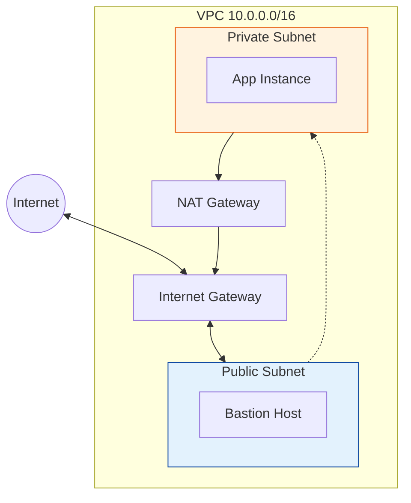

# AWS Networking (VPC)

Virtual Private Cloud (VPC) is your isolated network in the AWS cloud. This module explores specific AWS implementation details.

## AWS VPC Architecture

## Real World Scenarios
### Scenario: Secure Backend
**Context:** Your database must NOT be accessible from the internet, but needs updates from S3.
**Solution:**
- **VPC Endpoint (Gateway Type):** Create an S3 Gateway Endpoint in the VPC.
- **Route Table:** Add route to S3 Endpoint.
**Benefit:** Traffic to S3 stays within the AWS network, faster and more secure than NAT Gateway.

<b>1. A VPC is scoped to:</b>

Show Answer

Answer: A) Region</b>

<b>2. How many Internet Gateways can you attach to one VPC?</b>

Show Answer

Answer: A) 1</b>

<b>3. The default maximum VPCs per region per account is:</b>

Show Answer

Answer: B) 5</b>

<b>4. A Subnet is scoped to:</b>

Show Answer

Answer: B) Availability Zone (AZ)</b>

<b>5. Which IP address is reserved by AWS in every subnet for the Router?</b>

Show Answer

Answer: A) .1</b>

<b>6. Can a subnet span multiple AZs?</b>

Show Answer

Answer: B) No</b>

<b>7. Security Groups act at the:</b>

Show Answer

Answer: B) Instance (ENI) level</b>

<b>8. Network ACLs (NACLs) act at the:</b>

Show Answer

Answer: A) Subnet level</b>

<b>9. VPC Flow Logs captures:</b>

Show Answer

Answer: B) IP traffic metadata (source, dest, port, action)</b>

<b>10. To peer two VPCs in different regions, you use:</b>

Show Answer

Answer: A) Inter-Region VPC Peering</b>

<b>11. What is an Elastic IP (EIP)?</b>

Show Answer

Answer: A) A static public IPv4 address</b>

<b>12. Are you charged for an unattached Elastic IP?</b>

Show Answer

Answer: A) Yes (to discourage hoarding)</b>

<b>13. Which gateway allows IPv6 traffic out to the internet?</b>

Show Answer

Answer: B) Egress-Only Internet Gateway</b>

<b>14. DHCP Options Sets configure:</b>

Show Answer

Answer: A) Domain name servers, NTP servers for instances</b>

<b>15. Can you resize a VPC CIDR after creation?</b>

Show Answer

Answer: A) No, you can only add secondary CIDR blocks</b>

<b>16. Default Security Group allows:</b>

Show Answer

Answer: A) All inbound traffic from itself, all outbound traffic</b>

<b>17. Transit Gateway supports:</b>

Show Answer

Answer: A) Multicast usage (in specific regions)</b>

<b>18. "Bring Your Own IP" (BYOIP) allows you to:</b>

Show Answer

Answer: A) Move your public IP range to AWS</b>

<b>19. VPC Endpoints come in two types:</b>

Show Answer

Answer: A) Interface (PrivateLink) and Gateway (S3/DynamoDB)</b>

<b>20. PrivateLink allows:</b>

Show Answer

Answer: A) Private connectivity between VPCs/Services without traversing public internet</b>

<b>21. Before deleting a VPC, you must:</b>

Show Answer

Answer: A) Terminate all instances inside it</b>

---
## 🧭 Additional Modules
- [VPC Networking](VPC-Networking/README.md)
