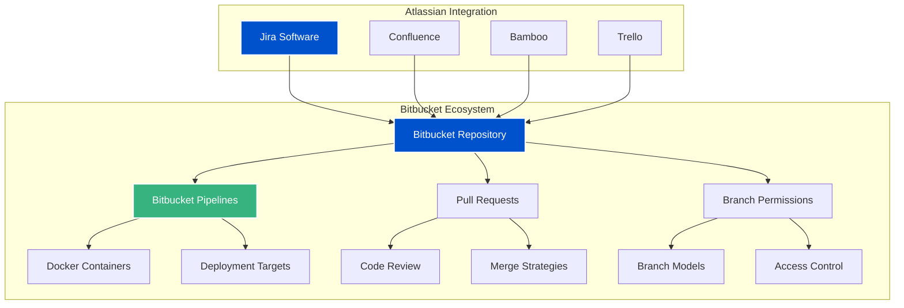
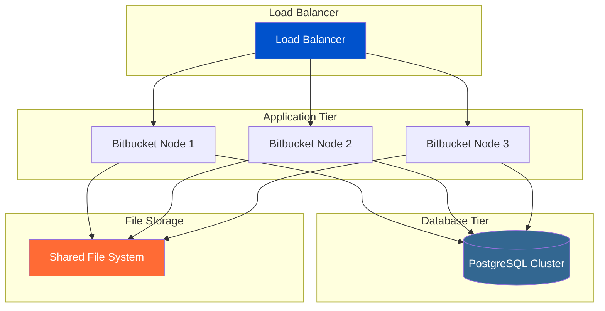

# 🪣 Bitbucket - Atlassian DevOps Repository Platform


Bitbucket is Atlassian's Git repository management solution that integrates seamlessly with the Atlassian ecosystem (Jira, Confluence, Bamboo). It provides enterprise-grade repository hosting with built-in CI/CD through Bitbucket Pipelines.

---

## 🎯 Learning Objectives

By completing this module, you will master:
- Bitbucket Cloud and Server administration
- Atlassian ecosystem integration strategies
- Bitbucket Pipelines for CI/CD automation
- Enterprise security and compliance features
- Repository management at scale
- Migration strategies from other platforms

---

## 📊 Bitbucket Architecture Overview



---

## 🏗️ Module Structure

### 📚 01-Bitbucket-Fundamentals
**Core Concepts and Setup**
- Bitbucket Cloud vs Server comparison
- Repository creation and configuration
- User and team management
- Workspace administration
- Basic Git operations in Bitbucket

### 🔗 02-Atlassian-Integration
**Ecosystem Connectivity**
- Jira integration for issue tracking
- Confluence documentation linking
- Bamboo build integration
- Trello project management
- Smart commits and automation

### 🚀 03-Bitbucket-Pipelines
**CI/CD Automation**
- Pipeline configuration (bitbucket-pipelines.yml)
- Docker-based build environments
- Deployment strategies
- Parallel and conditional builds
- Pipeline security and secrets

### 🛡️ 04-Security-and-Compliance
**Enterprise Security Features**
- Branch permissions and restrictions
- IP whitelisting and access controls
- Two-factor authentication
- Audit logs and compliance reporting
- Code scanning and security policies

### 🏢 05-Enterprise-Administration
**Large-Scale Management**
- Bitbucket Server/Data Center setup
- High availability configurations
- Performance optimization
- Backup and disaster recovery
- License management

### 🔄 06-Migration-and-Integration
**Platform Transitions**
- Migration from GitHub/GitLab
- SVN to Bitbucket migration
- Repository synchronization
- Team training and adoption
- Hybrid cloud strategies

---

## 🚀 Bitbucket Pipelines Deep Dive

### 📋 Basic Pipeline Configuration

```yaml
# bitbucket-pipelines.yml
image: node:18

pipelines:
  default:
    - step:
        name: Build and Test
        caches:
          - node
        script:
          - npm install
          - npm test
          - npm run build
        artifacts:
          - dist/**

  branches:
    main:
      - step:
          name: Deploy to Production
          deployment: production
          script:
            - echo "Deploying to production..."
            - ./deploy.sh production

  pull-requests:
    '**':
      - step:
          name: Code Quality Check
          script:
            - npm run lint
            - npm run test:coverage
```

### 🐳 Advanced Pipeline with Docker

```yaml
image: atlassian/default-image:3

pipelines:
  default:
    - step:
        name: Build Docker Image
        services:
          - docker
        caches:
          - docker
        script:
          - export IMAGE_NAME=myapp:$BITBUCKET_BUILD_NUMBER
          - docker build -t $IMAGE_NAME .
          - docker save $IMAGE_NAME --output tmp-image.docker
        artifacts:
          - tmp-image.docker

    - step:
        name: Security Scan
        script:
          - docker load --input tmp-image.docker
          - docker run --rm -v /var/run/docker.sock:/var/run/docker.sock 
            aquasec/trivy image myapp:$BITBUCKET_BUILD_NUMBER

    - step:
        name: Deploy to Staging
        deployment: staging
        script:
          - docker load --input tmp-image.docker
          - docker tag myapp:$BITBUCKET_BUILD_NUMBER registry.com/myapp:staging
          - docker push registry.com/myapp:staging

definitions:
  services:
    docker:
      memory: 3072
```

---

## 🔗 Atlassian Ecosystem Integration

### 🎫 Jira Integration Patterns


### 📝 Smart Commits Examples

```bash
# Transition Jira issue and add comment
git commit -m "PROJ-123 #resolve #comment Fixed authentication bug"

# Link to multiple Jira issues
git commit -m "PROJ-456 PROJ-789 #comment Updated user interface components"

# Time tracking integration
git commit -m "PROJ-101 #time 2h 30m #comment Implemented user registration"
```

---

## 🛡️ Enterprise Security Configuration

### 🔐 Branch Permissions Setup

```json
{
  "branch_restrictions": [
    {
      "kind": "push",
      "branch_match_kind": "glob",
      "pattern": "main",
      "users": [],
      "groups": ["administrators"],
      "value": null
    },
    {
      "kind": "require_approvals_to_merge",
      "branch_match_kind": "glob", 
      "pattern": "main",
      "value": 2
    },
    {
      "kind": "require_passing_builds_to_merge",
      "branch_match_kind": "glob",
      "pattern": "main",
      "value": null
    }
  ]
}
```

### 🔍 Code Scanning Integration

```yaml
# Security scanning pipeline
pipelines:
  default:
    - step:
        name: Security Scan
        script:
          # SAST Scanning
          - npm audit
          - npx snyk test
          
          # Dependency Check
          - dependency-check --project myapp --scan .
          
          # Code Quality
          - sonar-scanner -Dsonar.projectKey=myapp
        after-script:
          - curl -X POST $WEBHOOK_URL -d "Security scan completed"
```

---

## 📊 Bitbucket vs Competitors Comparison

| Feature | Bitbucket | GitHub | GitLab | Azure DevOps |
|---------|-----------|--------|--------|--------------|
| **Atlassian Integration** | ✅ Native | ❌ Third-party | ❌ Third-party | ❌ Third-party |
| **Built-in CI/CD** | ✅ Pipelines | ✅ Actions | ✅ CI/CD | ✅ Pipelines |
| **Free Private Repos** | ✅ 5 users | ✅ Unlimited | ✅ Unlimited | ✅ 5 users |
| **Self-hosted Option** | ✅ Server/DC | ✅ Enterprise | ✅ Self-managed | ✅ Server |
| **Docker Registry** | ❌ | ✅ | ✅ | ✅ |
| **Issue Tracking** | 🔗 Jira | ✅ Native | ✅ Native | ✅ Work Items |

---

## 🏢 Enterprise Deployment Strategies

### 🌐 Bitbucket Data Center Architecture



### 📈 Performance Optimization

```bash
# Bitbucket Server JVM Tuning
export JVM_MINIMUM_MEMORY="4096m"
export JVM_MAXIMUM_MEMORY="8192m"
export JVM_SUPPORT_RECOMMENDED_ARGS="-XX:+UseG1GC -XX:+ExplicitGCInvokesConcurrent"

# Git Configuration for Large Repositories
git config core.preloadindex true
git config core.fscache true
git config gc.auto 256

# Database Connection Pool Optimization
bitbucket.db.pool.max.size=60
bitbucket.db.pool.min.size=10
```

---

## 🔄 Migration Strategies

### 📦 GitHub to Bitbucket Migration

```bash
#!/bin/bash
# GitHub to Bitbucket Migration Script

GITHUB_REPO="https://github.com/user/repo.git"
BITBUCKET_REPO="https://bitbucket.org/user/repo.git"

# Clone with full history
git clone --mirror $GITHUB_REPO temp-repo
cd temp-repo

# Add Bitbucket remote
git remote add bitbucket $BITBUCKET_REPO

# Push all branches and tags
git push bitbucket --all
git push bitbucket --tags

# Cleanup
cd ..
rm -rf temp-repo

echo "Migration completed successfully!"
```

### 🔧 Repository Synchronization

```python
#!/usr/bin/env python3
"""
Bitbucket Repository Sync Tool
Keeps repositories synchronized between platforms
"""

import requests
import subprocess
import json
from datetime import datetime

class BitbucketSync:
    def __init__(self, username, app_password):
        self.username = username
        self.app_password = app_password
        self.base_url = "https://api.bitbucket.org/2.0"
    
    def get_repositories(self, workspace):
        """Get all repositories in workspace"""
        url = f"{self.base_url}/repositories/{workspace}"
        response = requests.get(url, auth=(self.username, self.app_password))
        return response.json()
    
    def sync_repository(self, source_url, target_url):
        """Sync repository from source to target"""
        try:
            # Clone source
            subprocess.run(['git', 'clone', '--mirror', source_url, 'temp-repo'], check=True)
            
            # Push to target
            subprocess.run(['git', '-C', 'temp-repo', 'remote', 'add', 'target', target_url], check=True)
            subprocess.run(['git', '-C', 'temp-repo', 'push', 'target', '--all'], check=True)
            subprocess.run(['git', '-C', 'temp-repo', 'push', 'target', '--tags'], check=True)
            
            # Cleanup
            subprocess.run(['rm', '-rf', 'temp-repo'], check=True)
            
            print(f"✅ Synced: {source_url} -> {target_url}")
            return True
            
        except subprocess.CalledProcessError as e:
            print(f"❌ Error syncing {source_url}: {e}")
            return False

# Usage example
if __name__ == "__main__":
    sync = BitbucketSync("username", "app_password")
    repos = sync.get_repositories("my-workspace")
    
    for repo in repos.get('values', []):
        print(f"Repository: {repo['name']}")
        print(f"Clone URL: {repo['links']['clone'][0]['href']}")
```

---

## 🧪 Hands-On Labs

### Lab 1: Atlassian Integration Setup
**Objective**: Connect Bitbucket with Jira and Confluence
**Duration**: 45 minutes
**Skills**: Integration configuration, smart commits, automation

### Lab 2: Advanced Pipeline Configuration
**Objective**: Build multi-stage pipeline with security scanning
**Duration**: 60 minutes
**Skills**: YAML configuration, Docker integration, security tools

### Lab 3: Enterprise Security Hardening
**Objective**: Implement comprehensive security policies
**Duration**: 90 minutes
**Skills**: Branch permissions, access controls, audit configuration

### Lab 4: Repository Migration Project
**Objective**: Migrate repository from GitHub to Bitbucket
**Duration**: 120 minutes
**Skills**: Migration tools, history preservation, team coordination

---

## 📋 Interview Questions & Quiz (20+ Questions)

### 🎯 Technical Questions

1. **What are the key differences between Bitbucket Cloud and Bitbucket Server?**
   - A) Cloud is free, Server is paid
   - B) Cloud uses Git, Server uses Mercurial
   - C) Cloud is hosted by Atlassian, Server is self-hosted
   - D) No significant differences

2. **Which file configures Bitbucket Pipelines?**
   - A) .bitbucket-ci.yml
   - B) bitbucket-pipelines.yml
   - C) pipeline.yml
   - D) .pipeline.yml

3. **What is the maximum number of free users in Bitbucket Cloud?**
   - A) 3 users
   - B) 5 users
   - C) 10 users
   - D) Unlimited

### 🏢 Enterprise Scenarios

4. **Your organization uses Jira for project management. How would you configure automatic issue transitions when code is merged?**

5. **Design a branching strategy for a team of 50 developers using Bitbucket with strict compliance requirements.**

6. **How would you implement a multi-environment deployment pipeline using Bitbucket Pipelines?**

### 🔧 Troubleshooting

7. **A Bitbucket Pipeline is failing with "Permission denied" errors. What are the possible causes and solutions?**

8. **How would you optimize Bitbucket Server performance for a repository with 100GB+ size?**

---

## 🎯 Real-Life Scenarios

### Scenario 1: Enterprise Migration
**Context**: Large enterprise migrating from SVN to Bitbucket
**Challenge**: Preserve 10 years of history, train 200+ developers
**Solution**: Phased migration with parallel systems and comprehensive training

### Scenario 2: Compliance Implementation
**Context**: Financial services company requiring SOX compliance
**Challenge**: Implement audit trails and access controls
**Solution**: Branch permissions, audit logging, and automated compliance reporting

### Scenario 3: Multi-Cloud Strategy
**Context**: Global company with regional data requirements
**Challenge**: Repository distribution across multiple regions
**Solution**: Bitbucket Data Center with geo-distributed nodes

### Scenario 4: DevOps Transformation
**Context**: Traditional development team adopting DevOps
**Challenge**: Integrate Bitbucket with existing Atlassian tools
**Solution**: Smart commits, automated workflows, and pipeline integration

---

## 📚 Additional Resources

### 📖 Official Documentation
- [Bitbucket Cloud Documentation](https://support.atlassian.com/bitbucket-cloud/)
- [Bitbucket Server Documentation](https://confluence.atlassian.com/bitbucketserver/)
- [Bitbucket Pipelines Guide](https://support.atlassian.com/bitbucket-cloud/docs/get-started-with-bitbucket-pipelines/)

### 🎥 Video Tutorials
- [Bitbucket Pipelines Tutorial](https://www.youtube.com/watch?v=7p4HyGhDPNg)
- [Atlassian Integration Masterclass](https://www.youtube.com/watch?v=xrCQvP-xGGM)

### 🛠️ Tools & Extensions
- [Bitbucket CLI](https://developer.atlassian.com/bitbucket/api/2/reference/) - Command line interface
- [SourceTree](https://www.sourcetreeapp.com/) - Git GUI with Bitbucket integration
- [Atlassian Marketplace](https://marketplace.atlassian.com/) - Third-party integrations

---

## ✅ Completion Checklist

- [ ] Set up Bitbucket workspace and repositories
- [ ] Configure Jira integration with smart commits
- [ ] Create and deploy Bitbucket Pipelines
- [ ] Implement branch permissions and security policies
- [ ] Complete repository migration challenge
- [ ] Configure enterprise authentication (SSO/LDAP)
- [ ] Set up monitoring and audit logging
- [ ] Pass the comprehensive quiz (80%+ score)

---

**"Bitbucket isn't just a repository - it's the central nervous system of the Atlassian ecosystem."**

*Master Bitbucket to unlock the full potential of integrated DevOps workflows.*