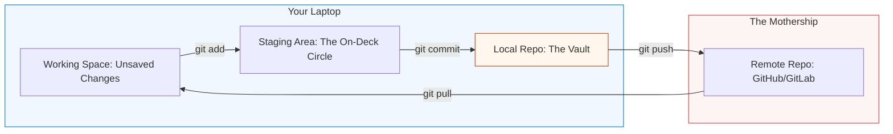

# 📚 Repository Management: The Architectural Time Machine

> **"Code without version control is just a rumor. In DevOps, your repository is the single source of truth. If it isn't in Git, it doesn't exist. If it's in Git but you can't find it, it's useless."**

---

## 🧠 The Mental Model: The Architectural Time Machine

**The Newbie Struggle**: "I typed `git push` and the computer screamed 'CONFLICT!' in red letters. I'm terrified I just deleted my team's work. I have 15 different versions of my script named `final_v2_REAL_v3.py`. I feel like I'm walking through a minefield of commands like `rebase` and `merge`. I just want to save my work!"

**The Engineer Solution**: You realize that Git isn't a "Cloud Folder"; it's an **Architectural Time Machine**. You don't "Save" files; you **Commit Snapshots**. You learn that a Merge Conflict is just the computer asking you to make a decision. You stop naming files with version numbers and start using **Branches**. You realize that the repository is the "Memory" of the entire engineering team.

### 🏗️ The Repository Analogy

| Concept | The Time Machine Analogy | Git Equivalent |
|:--------|:-------------------------|:---------------|
| **Repository** | The Library of Time | The Project Folder (`.git`) |
| **Commit** | A Locked Snapshot of History | `git commit -m "..."` |
| **Branch** | A Parallel Universe (What if?) | `git branch <name>` |
| **Merge** | Combining Two Realities | `git merge <name>` |
| **Push/Pull** | Teleporting Work to the Mothership | `git push` / `git pull` |
| **Conflict** | A Paradox (Two things in one spot) | Merge Conflict |

---

## 📚 Why This Module Matters for Newbies

**Before this module**, you might think:
- "Git is just a way to backup files."
- "I can just email my code to my coworkers."
- "GitHub is just for open-source projects."

**After this module**, you'll understand:
- **Collaborative Engineering**: How 100 people can work on the same file without crashing.
- **Trunk-Based Development**: The secret to deploying code 10 times a day.
- **Pull Requests (PRs)**: The "Gatekeeper" of production quality.
- **GitOps**: Using repositories to manage actual cloud hardware.

**The Difference**: You move from "Saving files" to **"Orchestrating History."**

---

---

## 🎯 Junior's Mission: The Corrupted History
**Scenario**: You just merged a feature branch, and suddenly the "Main" build is failing. You realize your merge accidentally brought in a bug from an old experiment.
**Your Goal**: Use `git log` to find the breaking commit and safely **Revert** the changes without losing your team's work.

---

## 🏗️ Operational Reality: Production Hazards
In a professional DevOps team, Git is the **Source of Truth** for the entire cloud.
1.  **Merge Hell**: Waiting too long (weeks) to merge your code, leading to hundreds of conflicts that are impossible to solve safely.
2.  **Detached HEAD**: Getting lost in the "Time Machine" and making changes that aren't attached to any branch—leading to lost work.
3.  **Secret Leakage**: Accidentally committing an AWS Access Key. Even if you "delete" it in a new commit, it's still in the history for hackers to find.
4.  **Force Push Destruction**: Using `git push --force` and accidentally overwriting a coworker's work on the shared remote server.

---

## 🛠️ The Git Toolbelt (Essential Commands)
| Command | Why it matters |
| :--- | :--- |
| `git status` | Situational awareness. Where am I and what is unsaved? |
| `git log --oneline --graph` | A visual map of the project's history. |
| `git diff` | See exactly what characters were changed before you commit. |
| `git checkout -b <name>` | Safe isolation. Never work directly on `main`. |
| `git stash` | Temporarily "pausing" your work to switch to an urgent bug fix. |

---

## 🎯 Learning Objectives
By the end of this module, you will:

- ✅ **Master the Flow**: Understand `add`, `commit`, `push`, and `pull`.
- ✅ **Branch with Confidence**: Creating isolated environments for your features.
- ✅ **Resolve Conflicts**: Surgically fixing overlapping changes.
- ✅ **Audit History**: Using `git log` and `git blame` to find bugs.
- ✅ **Automate with Webhooks**: Triggering robots when code is pushed.

---

---

## 🏗️ The Git Lifecycle Architecture

Work moves through stages of "Certainty."

---

## 📂 Repository Technologies

1.  **[01-Git-GitHub](./01-Git-GitHub/README.md)**: The global standard for version control.
2.  **[02-GitLab](./02-GitLab/README.md)**: The all-in-one DevOps platform.
3.  **[03-Bitbucket](./03-Bitbucket/README.md)**: Enterprise integration with Jira/Confluence.
4.  **[04-Azure-DevOps-Repos](./04-Azure-DevOps-Repos/README.md)**: Microsoft's cloud-native repository system.

---

## 🏆 Real-World DevOps Story: The Million Dollar Delete

**The Incident**: A junior developer wanted to "clean up" the repository. They ran a command to force-delete several branches that looked "old."
**The Failure**: Those "old" branches were actually the long-term support (LTS) versions of their enterprise software. The production build system crashed instantly.
**The Fix**: Because the team used **Branch Protection Rules** (a core part of Repository Management), the junior's command was blocked by the server. 
**The Outcome**: Nothing was deleted. The Newbie learned that "Permissions" in a repository aren't there to stop him from working—they are there to protect the company's most valuable asset: its history.

---

## ❓ Interview Preparation (Git)

### 🎯 Core Concepts

1. **Q: What is the difference between `git fetch` and `git pull`?**
    *   *Answer: `git fetch` only downloads the latest data from the remote server but doesn't change your code. `git pull` does a 'fetch' AND then immediately tries to 'merge' those changes into your current file.*
2. **Q: What is a 'Rebase' vs a 'Merge'?**
    *   *Answer: Merge creates a new 'combine' commit (preserving history as it happened). Rebase 're-writes' your history to make it look like you started your work from the very latest version of the code (creating a cleaner, linear line).*
3. **Q: Why use `.gitignore`?**
    *   *Answer: To prevent 'junk' files (like passwords, temporary logs, or node_modules) from ever entering the repository. This keeps the repo small and secure.*

---

## 📝 Knowledge Check

1. **Which command moves changes from the Staging Area to the Local Vault?**
    * [ ] a) `git add`
    * [x] b) `git commit`
    * [ ] c) `git push`
2. **True or False: A Merge Conflict happens when two people edit the same line of the same file.**
    * [x] a) True
    * [ ] b) False
3. **What is the 'Remote' repo typically called by default?**
    * [ ] a) mothership
    * [x] b) origin
    * [ ] c) master

---

**Next Step**: Start with **[Git & GitHub Fundamentals](./01-Git-GitHub/README.md)**

---
## 🧭 Additional Modules
- [05 Mercurial](05-Mercurial/README.md)
- [06 Subversion SVN](06-Subversion-SVN/README.md)
