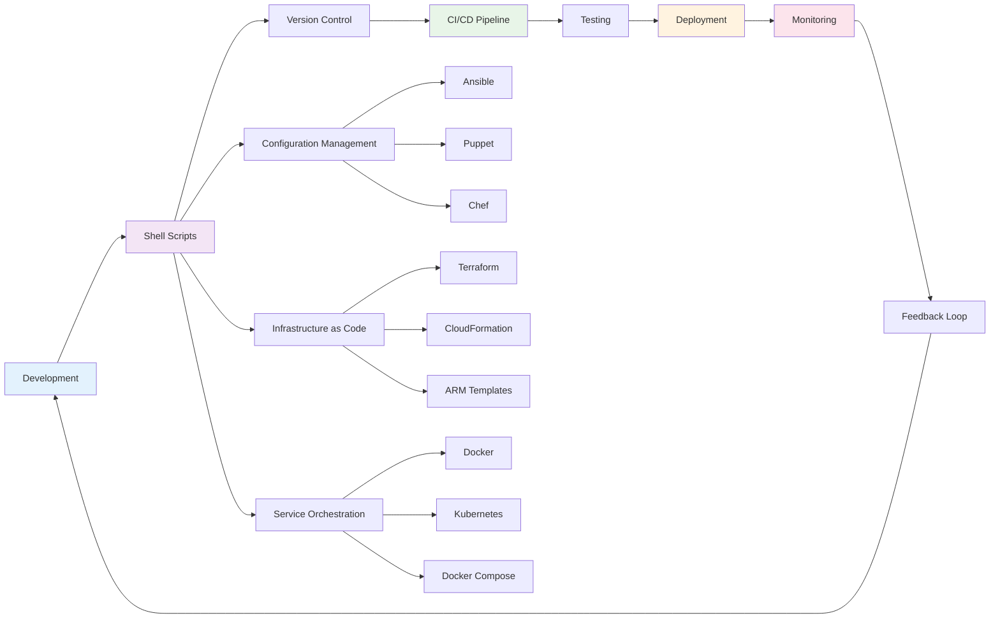

# DevOps Automation Workflow

```mermaid
graph LR
    A[Development] --> B[Shell Scripts]
    B --> C[Version Control]
    C --> D[CI/CD Pipeline]
    D --> E[Testing]
    E --> F[Deployment]
    F --> G[Monitoring]
    G --> H[Feedback Loop]
    H --> A
    
    B --> I[Configuration Management]
    B --> J[Infrastructure as Code]
    B --> K[Service Orchestration]
    
    I --> L[Ansible]
    I --> M[Puppet]
    I --> N[Chef]
    
    J --> O[Terraform]
    J --> P[CloudFormation]
    J --> Q[ARM Templates]
    
    K --> R[Docker]
    K --> S[Kubernetes]
    K --> T[Docker Compose]
    
    style A fill:#e3f2fd
    style B fill:#f3e5f5
    style D fill:#e8f5e8
    style F fill:#fff3e0
    style G fill:#fce4ec
```

This workflow shows how shell scripting integrates into the broader DevOps automation ecosystem, connecting development to production deployment and monitoring.