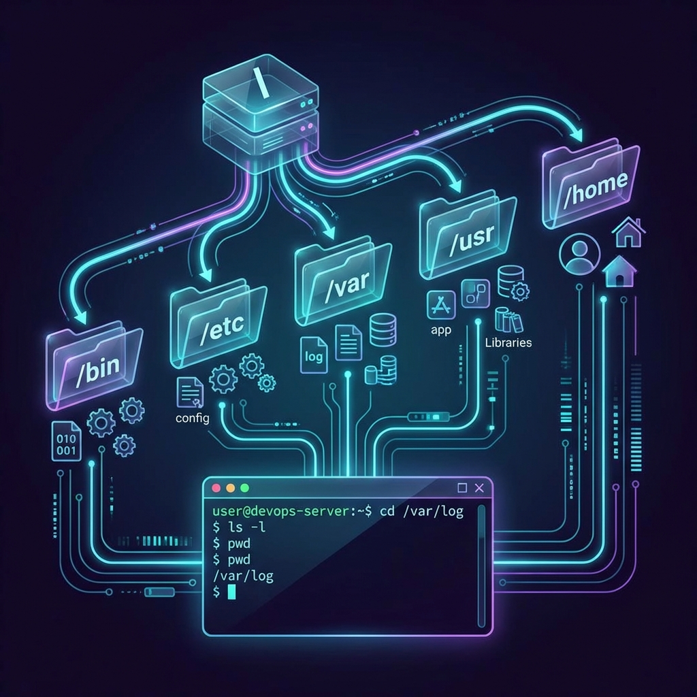

# 📍 Terminal Navigation: The DevOps GPS

> **"You can't automate where you haven't been. Mastering navigation is the first step to controlling the machine."**



## 📚 Overview

The terminal is your headquarters. Unlike the mouse-driven "Finder" or "File Explorer," the terminal is a precise, text-based interface for the Unix filesystem. In DevOps, you don't navigate by clicking folders; you navigate by understanding the **Filesystem Hierarchy Standard (FHS)**.

This module covers the essential "GPS" commands and architectural concepts required to move safely and efficiently across local clusters and remote production servers.

---

## 💼 The Automation Why: Your Production Server Has No Mouse

**The Beginner's Question**: "Why learn terminal commands when I can just drag and drop files?"

**The Answer**: **Because your mouse doesn't work over SSH.**

### The SSH Reality

When you connect to a production server in AWS, you see this:

```bash
$ ssh ubuntu@prod-server-01.aws.company.com
Welcome to Ubuntu 22.04.3 LTS (GNU/Linux 5.15.0-89-generic x86_64)

ubuntu@prod-server-01:~$ _
```

**What you DON'T see**:
- ❌ No desktop
- ❌ No file browser
- ❌ No drag-and-drop
- ❌ No "back" button

**What you DO have**:
- ✅ `cd` (change directory)
- ✅ `ls` (list files)
- ✅ `pwd` (where am I?)

### Real-World Scenario: The Midnight Log Check

**3 AM Alert**: "Application down! Check the error logs!"

```bash
# Your laptop (comfortable GUI)
You: 😴 Half asleep, grab laptop

# SSH into production
ssh prod-web-03

# Navigate to logs (NO MOUSE)
cd /var/log/nginx     # Go to nginx logs
pwd                   # Verify: /var/log/nginx ✓
ls -lt | head -5      # Show 5 newest files
tail -f error.log     # Watch errors in real-time

# Find the problem
grep "500 Internal" error.log | tail -20
# Found it! Database connection timeout

# Fix and verify
cd /etc/nginx
vim nginx.conf        # Edit config
systemctl reload nginx
# App restored! 🎉
```

**Time spent**: 90 seconds with CLI skills  
**Time without CLI**: Still trying to find a GUI tool that works over SSH

---

### The City Map Analogy: Understanding Filesystem Navigation

Think of your Linux filesystem like **a city with neighborhoods**:

```
┌─────────────────────────────────────────────────────┐
│                  THE CITY: /                        │
│              (Root - City Center)                   │
├─────────────────────────────────────────────────────┤
│                                                     │
│  /home               /etc              /var         │
│  (Residential)       (City Hall)       (Warehouse)  │
│  ├─ /home/you        ├─ nginx.conf    ├─ /var/log  │
│  │  (Your house)     │  (Laws/Rules)  │  (Records)  │
│  └─ /home/bob        └─ hosts         └─ /var/www  │
│     (Bob's house)       (Phonebook)       (Stores)  │
│                                                     │
│  /bin                /tmp              /opt         │
│  (Toolshed)          (Parking Lot)     (Mall)       │
│  ├─ ls               ├─ Downloads      ├─ Custom    │
│  ├─ cd               │  (Temp stuff)   │   Apps     │
│  └─ pwd              └─ (Gets cleared) └─           │
│                                                     │
└─────────────────────────────────────────────────────┘
```

**Navigation Commands = GPS**:
- `pwd` = "Where am I?" (Current location)
- `cd /var/log` = "Take me to the Warehouse Records building"
- `ls` = "What's in this building?"
- `cd ..` = "Go to parent neighborhood"
- `cd ~` = "Go home"

**Key Insight for Beginners**:
- `/` (Root) = City center - everything starts here
- `~` (Tilde) = Your house - your personal space
- Absolute path = Full address ("123 Main St, Cityville")
- Relative path = Directions from where you are ("Two blocks north")

---

## 🎓 Learning Objectives

By the end of this module, you will:
- ✅ Understand the **Filesystem Hierarchy Standard (FHS)** and where files "live."
- ✅ Master the **Primary Navigation Trio**: `cd`, `ls`, and `pwd`.
- ✅ Navigate using **Absolute** vs. **Relative** paths with zero errors.
- ✅ Implement **Stack-based Navigation** using `pushd` and `popd`.
- ✅ Utilize **Terminal Speed Hacks** (Tab completion, history, and shortcuts).

---

## 🏗️ The Filesystem Hierarchy Standard (FHS)

The FHS is a set of guidelines for where files and directories should be placed under Unix-like operating systems. Maintained by the Linux Foundation, it ensures that software and users can predict the location of installed files and libraries across different distributions.

### The DevOps Map: Central Directories

| Directory | Purpose | DevOps Context |
| :--- | :--- | :--- |
| **`/`** | **Root** | The starting point. Every file and directory on the system is under this. |
| **`/bin`** | Essential User Binaries | Basic commands like `ls`, `cp`, and `cat`. Required for single-user mode. |
| **`/sbin`** | System Binaries | Administrative tools (`iptables`, `fdisk`). Used by the root user. |
| **`/etc`** | **System Configuration** | Where you manage your `nginx.conf`, `/etc/hosts`, and service settings. |
| **`/var`** | **Variable Data** | Files that change frequently. Includes logs (`/var/log`) and mail. |
| **`/tmp`** | Temporary Files | Files deleted on reboot. Great for transient operational data in scripts. |
| **`/usr`** | User Applications | The largest part of the system. Contains binaries (`/usr/bin`) and libraries. |
| **`/home`** | User Home Folders | Personal storage. In production, usually holds app users like `/home/ubuntu`. |
| **`/root`** | Root Home | The personal home directory for the superuser (root). |
| **`/opt`** | Optional Software | Manually installed third-party packages (e.g., `/opt/google/cloud-sdk`). |
| **`/proc`** | **Process Info** | A virtual filesystem. `cat /proc/cpuinfo` tells you about the hardware. |
| **`/dev`** | Device Files | Every hardware component (disk, keyboard) is represented here as a file. |
| **`/mnt` / `/media`** | Mount Points | Where you temporarily attach external storage or network drives. |

---

### FHS Logical Classification

Professional DevOps engineers categorize data into four quadrants. This logic determines how we backup, secure, and scale our infrastructure:

- **Shareable vs. Unshareable**:
  - **Shareable**: Data that can be shared across multiple hosts (e.g., `/usr`, `/opt`).
  - **Unshareable**: Data specific to a single host (e.g., `/etc`, `/boot`).

- **Static vs. Variable**:
  - **Static**: Files that only change via system administration (e.g., binaries in `/bin`).
  - **Variable**: Files changed by users or processes (e.g., logs in `/var/log`).

| | **Shareable** | **Unshareable** |
| :--- | :--- | :--- |
| **Static** | `/usr`, `/opt` | `/etc`, `/boot` |
| **Variable** | `/var/mail`, `/home` | `/var/run`, `/var/lock` |

---

## 🚀 Professional Patterns for Automation

Navigation in a terminal is the foundation of script execution. Professional automation handles navigation with **idempotency** and **fail-fast** logic.

### Pattern A: Absolute vs. Relative Mastery

In production scripts, pathing choice is a security and stability decision.

- **Absolute (`/`)**: Starts from the Root. Essential for system-level scripts (Cron jobs, Systemd units) where the working directory is unpredictable.
  - *Rule*: Use for system binaries and global config paths (e.g., `/etc/nginx/`).
- **Relative (`./` or `../`)**: Relative to the Current Working Directory (CWD).
  - *Rule*: Use for project-specific files. **Always** prefix with `./` to avoid Bash searching your `$PATH` for a file that is supposed to be local.

### Pattern B: Atomic Navigation (`&&`)

Never run a command that depends on a directory change on a separate line. If the `cd` fails, the command executes in the **wrong place**.

```bash
# ❌ Dangerous Pattern
cd /var/www/html/app
rm -rf ./*  # If cd fails, this deletes files in your current folder!

# ✅ Production-Ready (Atomic)
cd /var/www/html/app && rm -rf ./*
# The 'rm' ONLY runs if the 'cd' succeeds.
```

### Pattern C: Stack-Based Context Management (`pushd` / `popd`)

When writing modular scripts (functions), you often need to "visit" a directory, perform an action, and return. Standard `cd` loses your original location.

```bash
#!/usr/bin/env bash

backup_logs() {
    # pushd silences output with > /dev/null
    pushd /var/log/nginx > /dev/null
    tar -czf "$HOME/nginx_backup.tar.gz" ./*.log
    popd > /dev/null # Returns to exact original CWD
}
```

### Pattern D: The Directory Guard

Automation should verify a path exists before attempting to use it. Reference variables for paths to avoid "Magic Strings" (hardcoded text).

```bash
TARGET_DIR="/mnt/data_drive/backups"

if [[ ! -d "$TARGET_DIR" ]]; then
    echo "🚨 ERROR: Target directory $TARGET_DIR does not exist!" >&2
    exit 1
fi

cd "$TARGET_DIR" || exit 1
```

### Pattern E: Fast Navigation Shortcut (`-`)

DevOps engineers often toggle between a project directory and a log directory. Use `cd -` to switch between the current and the previous directory stored in `$OLDPWD`.

```bash
cd /Users/dev/project_alpha
cd /var/log/nginx
cd -  # Jumps back to project_alpha
cd -  # Jumps back to nginx
```

---

## 🏆 Real-World DevOps Story: The Lost Root Deletion

**The Scenario**: An engineer meant to delete a `tmp` folder inside their local project to clean up build artifacts. They typed `rm -rf /tmp/`.
**The Discovery**: Because they started the path with a `/`, they told the system to delete the **Global System Root /tmp** folder instead of the one in their local project. This caused several running services to crash as their temporary sockets and lock files vanished.
**The Lesson**: Always use relative paths starting with `./` (e.g., `rm -rf ./tmp/`) for local project work to prevent accidental system-wide damage.

---

## ❓ Interview Preparation (Navigation)

1. **Q: What is the difference between `/` and `~`?**
   *A: `/` represents the System Root (the very top of the hierarchy). `~` represents the current user's Home directory (e.g., `/home/ubuntu` or `/Users/Ganil`).*

2. **Q: How do you jump back to the previous directory you were in?**
   *A: Use the `cd -` command. It toggles your working directory to the value stored in the `$OLDPWD` environment variable.*

3. **Q: Why is it safer to use absolute paths in automation scripts?**
   *A: Automation scripts (like Cron jobs or CI/CD runners) may execute from unpredictable locations. Absolute paths ensure the script targets the exact intended file every time.*

4. **Q: What does the command `pwd -P` do?**
   *A: It prints the physical directory. If you are in a directory that is actually a **Symbolic Link**, `pwd -P` will resolve the link and show the real physical path on the disk.*

5. **Q: How do you see all files, including hidden ones, in a long-list format?**
   *A: Use `ls -al`. The `-a` flag shows all (including dots) and `-l` provides the long-list detail (permissions, size, owner).*

---

## 📝 Knowledge Check

1. **Which directory usually contains the system-wide configuration files?**
   - [ ] a) `/var`
   - [x] b) `/etc`
   - [ ] c) `/bin`

2. **What happens if you type `cd` with no arguments?**
   - [ ] a) It prints an error
   - [ ] b) It goes to the Root (`/`)
   - [x] c) It returns you to your Home directory (`~`)

3. **How do you move up TWO levels in the filesystem?**
   - [ ] a) `cd ...`
   - [x] b) `cd ../..`
   - [ ] c) `cd --`

4. **True or False: `pushd` and `popd` allow you to manage a history of visited directories.**
   - [x] a) True
   - [ ] b) False

5. **Which keyboard shortcut instantly clears your terminal screen?**
   - [ ] a) `Ctrl + C`
   - [x] b) `Ctrl + L`
   - [ ] c) `Ctrl + Z`

---

## 🔗 Next Steps

Now that you can move through the system, let's learn how to manipulate the files you find!

Proceed to: **[Basic File Manipulation](README.md)** →
