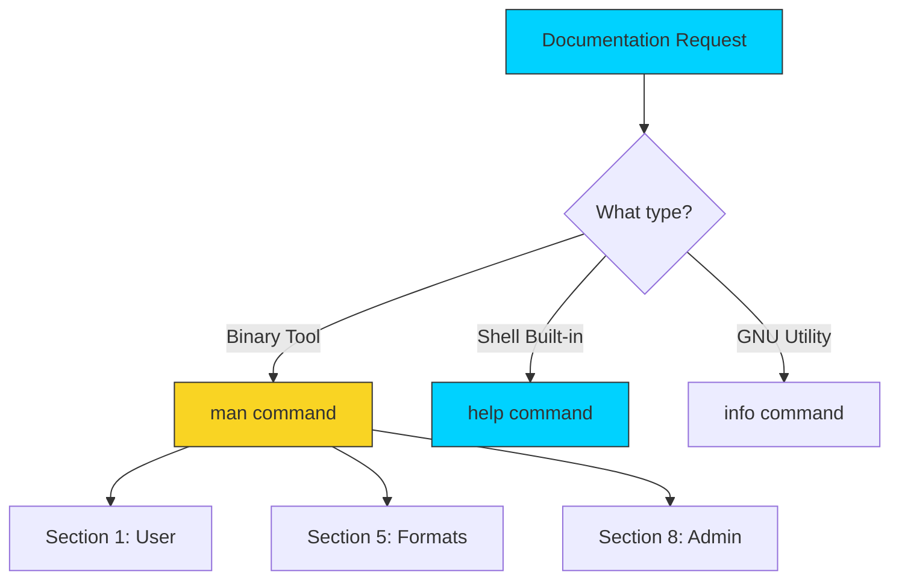

# 📖 Man Pages: The Definitive System Source

> **"Give a person a fish, you feed them for a day. Teach them to use `man`, and they solve their own infrastructure problems forever."**



## 📚 Overview

The name is short for **Manual**. Before Google and Stack Overflow, there were Man pages. They are the definitive, offline documentation for every command on your system.

Unlike online tutorials which might be outdated or tailored to a specific OS version, `man` pages exactly match the version of the software installed on **your** machine. For a DevOps engineer, the local manual is the "Source of Truth" when shell scripts behave differently across Ubuntu, RHEL, or macOS.

---

## 💼 The Automation Why: Stack Overflow Lied to You

**The Beginner's Question**: "Why use old-fashioned man pages when I can Google everything?"

**The Answer**: **Because Google shows the LATEST version. Your production server might be running a version from 3 years ago.**

### Real-World Production Incident: The --format Flag That Didn't Exist

**Date**: Friday deployment, E-commerce company  
**Task**: Format JSON output from `curl` using `jq` tool

**The Mistake**:
```bash
# Engineer copies from Stack Overflow (2025 tutorial):
curl https://api.example.com/orders | jq --format json .

# Output on production server:
jq: error: Unknown option --format
```

**What Went Wrong**:
1. Stack Overflow tutorial used `jq` version 1.7 (latest, 2025)
2. Production server had `jq` version 1.5 (from 2018, still stable)
3. The `--format` flag didn't exist in 1.5
4. Deployment failed, had to rollback

**The Professional Fix**:
```bash
# SSH into production server
ssh prod-web-01

# Check ACTUAL version on THIS server
jq --version
# jq-1.5

# Read the ACTUAL manual for THIS version
man jq
# Search for: /format

# Discovery: In version 1.5, use -r (raw output) instead
# Correct command for THIS environment:
curl https://api.example.com/orders | jq -r .

# Deployment successful! ✅
```

**Lesson**: `man` pages are **version-specific**. They document exactly what's installed on YOUR system, not what's "best practice" on the internet.

---

### The Library Analogy: Man Pages as Your Personal Reference Library

Think of man pages like **a library built into your computer**:

```
┌──────────────────────────────────────────────────────┐
│           THE UNIX DOCUMENTATION LIBRARY             │
├──────────────────────────────────────────────────────┤
│                                                      │
│  SECTION 1: User Commands (Main Reading Room)       │
│  📚 Books: ls, grep, ssh, curl, docker              │
│      "How do I use this tool?"                       │
│                                                      │
│  SECTION 5: File Formats (Reference Section)        │
│  📋 Books: crontab, fstab, hosts, nginx.conf        │
│      "How do I write this config file?"              │
│                                                      │
│  SECTION 8: Admin Tools (Restricted Area)           │
│  🔐 Books: iptables, systemctl, mount, useradd      │
│      "How do I manage the system as root?"           │
│                                                      │
└──────────────────────────────────────────────────────┘
```

**Using the Library**:
- `man ls` → "Give me the book about `ls`" (Section 1)
- `man 5 crontab` → "Give me the book about crontab FILE FORMAT" (Section 5)
- `whatis ssh` → "Just tell me in one sentence what `ssh` is"
- `apropos network` → "Show me all books related to 'network'"

**Key Insight for Newbies**:
- **man** = Full book (complete reference)
- **whatis** = One-sentence summary (quick lookup)
- **apropos** = Library search (find tools by keyword)
- **help** = Built-in commands (cd, alias, export)

---

### Production Workflow: Finding the Right Flag

**Mission**: Find how to make `tar` preserve file permissions

```bash
# Step 1: Open the manual
man tar

# Step 2: Search for "permission"
# (press / then type)
/permission

# Step 3: Press 'n' to cycle through matches
# Found: -p, --preserve-permissions

# Step 4: Verify the example
tar -czpf backup.tar.gz /var/www/app/

# Step 5: Exit manual
# (press q)

# Time: 15 seconds
```

**Without man pages**: 
- Google "tar preserve permissions"
- Find 10 different tutorials
- Half are for macOS (BSD tar, different flags!)
- Which one matches YOUR server version?
- Time: 5 minutes of confusion

---

## 🎓 Learning Objectives

By the end of this module, you will:

- ✅ **Decode the SYNOPSIS**: Understand optional vs. required flag notation.
- ✅ Master the **Sectional Hierarchy** (1, 5, and 8).
- ✅ Conduct **Heuristic Searches** using `apropos` and `whatis`.
- ✅ Differentiate between **`man`**, **`info`**, and **`help`**.
- ✅ Navigate the manual using **Vim-style shortcuts**.

---

## 🏗️ Manual Architecture: The Documentation Engine

The Linux Manual is an offline, version-stable database. Unlike the web, which often reflects the newest, bleeding-edge versions, `man` pages are **Environment-Aware**—they describe exactly how the binary currently on your disk functions.

### 1. The 8 Core Sections: Navigating by Intent

Unix organizes information into sections to prevent namespace collision and define the user's role.

| Section | Domain | DevOps Relevance |
| :--- | :--- | :--- |
| **Section 1** | **General Commands** | Standard tools (e.g., `ssh`, `curl`, `awk`). |
| **Section 2** | System Calls | Kernel-level interactions (e.g., `fork`, `open`, `write`). |
| **Section 3** | Library Functions | Programming APIs (primarily C library). |
| **Section 5** | **File Formats** | **Critical for Configuration**. Describes `/etc/hosts`, `crontab`, etc. |
| **Section 7** | Miscellaneous | Concepts like `utf8`, `regex`, or the `ip` address family. |
| **Section 8** | **System Admin** | Privileged binaries (`iptables`, `systemctl`, `mount`). |

### 2. SYNOPSIS Grammar: Decoding the Rules of Engagement

The `SYNOPSIS` section is a mathematical definition of how to invoke a command. Professional automation engineers read this like a blueprint:

- **Bold Text**: Type exactly as shown.
- ***Italic/Underlined***: Substitute with your own values (e.g., filenames).
- **`[ ]` (Brackets)**: **Optional**. The command will run successfully without these.
- **`{ }` (Braces)**: **Required Choice**. You must choose one of the options inside.
- **`|` (Pipe)**: **OR**. Indicates mutually exclusive options.
- **`...` (Ellipsis)**: **Recursion/Count**. Indicates you can provide multiple arguments (e.g., `rm [file...]`).

---

## 🚀 Professional Patterns for Automation

Production troubleshooting requires fast pattern matching inside the documentation itself.

### Pattern A: The One-Line Scout (`whatis`)

When you encounter a legacy command in a 10-year-old script, use `whatis` to get an instant, one-line summary without leaving the shell prompt.

```bash
# Get context for an unknown tool
whatis xargs
# xargs (1) - build and execute command lines from standard input
```

### Pattern B: Heuristic Discovery (`apropos`)

If you know **what** you want to do, but not **which tool** to use, use `apropos` (or `man -k`) to search the one-line description database.

```bash
# Find all tools related to 'certificate' management
apropos certificate
```

### Pattern C: The Section Jump

A common DevOps failure is reading `man crontab` when you actually need to know how to *write* a crontab file. 
- `man crontab` (Section 1) describes how to use the *tool*.
- `man 5 crontab` (Section 5) describes the *syntax* of the file.

### Pattern D: Pager Search Mastery

Inside a man page (which uses `less`), use the **Forensic Search** flow:
1. Type `/` followed by your keyword (e.g., `/--timeout`).
2. Press `n` (next) to cycle through every flag related to timeout.
3. Press `q` once you've found the exact flag required for your script.

---

## 🏆 Real-World DevOps Story: The Flag Version Trap

**The Scenario**: A junior engineer was trying to use a tool called `yq`. All online tutorials showed a `--indent` flag for formatting output. However, whenever they ran the script on the production server, they received: `Error: unknown flag: --indent`.
**The Investigation**: They ran `man yq` on the server and searched for the string `indent`. They discovered the version installed on the server was two years old and used the flag `-i` instead of the long-form `--indent`.
**The Lesson**: Documentation on the web reflects the *latest* version. The `man` page reflects the *current* version. Always trust the local manual for environment-specific consistency.

---

## ❓ Interview Preparation (Manuals)

1. **Q: How do you search for a specific keyword in all man pages?**
   - *A: Use the `apropos` command or `man -k`. This searches the short descriptions of all man pages for the specified keyword.*

2. **Q: Why are there multiple sections in the Linux manual?**
   - *A: To handle name collisions. For example, `crontab(1)` describes the command to edit your schedule, while `crontab(5)` describes the layout and syntax of the crontab file itself.*

3. **Q: How do you access the manual for a file format instead of a command?**
   - *A: Specify the section number. For example, `man 5 crontab` or `man 5 exports`.*

4. **Q: What is the difference between `man` and `help`?**
   - *A: `man` is used for external binary programs located in `/bin` or `/usr/bin`. `help` is used for shell "built-ins" which are part of the bash binary itself (like `cd`, `alias`, and `echo`).*

5. **Q: How do you find where a man page's underlying file is located on the disk?**
   - *A: Use the `-w` flag. Example: `man -w ls` will return the path to the compressed manual file.*

---

## 📝 Knowledge Check

1. **Which command provides help for shell built-ins like `cd` or `alias`?**
   - [ ] a) `man`
   - [x] b) `help`
   - [ ] c) `info`

2. **What does the SYNOPSIS notation `[ -f ]` tell you about the flag?**
   - [x] a) It is optional
   - [ ] b) It is required
   - [ ] c) It must be used with a file

3. **Which section of the manual contains System Administration tools (root level)?**
   - [ ] a) Section 1
   - [ ] b) Section 5
   - [x] c) Section 8

4. **True or False: The `whatis` command provides a full multi-page tutorial of a command.**
   - [ ] a) True
   - [x] b) False (It provides only a one-line summary)

5. **How do you search for a text string while inside a man page?**
   - [ ] a) `Ctrl + F`
   - [ ] b) `f`
   - [x] c) `/`

---

## 🔗 Next Steps

Now that you can find the manual for any tool, let's learn how to manage the lifecycle of those tools!

Proceed to: **[Programs and Commands](../08-Programs-and-Commands/README.md)** →
