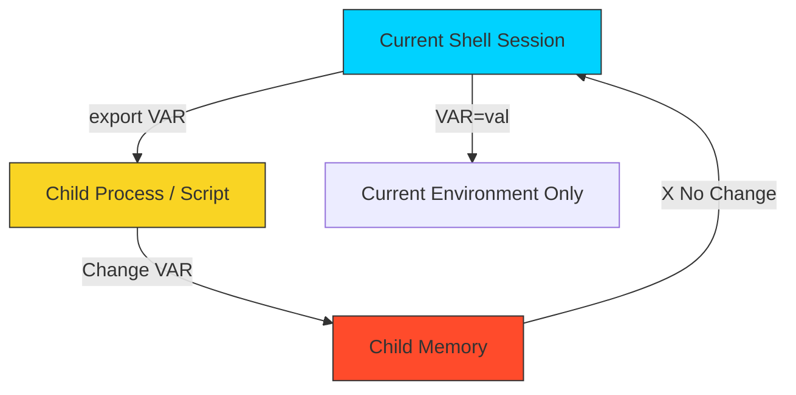

# 📦 Basic Variables: State & Abstraction

> **"Hardcoding is a technical debt you pay every day. Variables are the currency of automation."**



## 📚 Overview

Variables are the foundation of dynamic infrastructure. In DevOps, we use them to store API keys, target server IPs, deployment tags, and temporary compute results. Without variables, every script would be a static, fragile set of commands that breaks the moment the environment changes.

This module covers the essential mechanics of shell state management, from simple assignments to advanced **Parameter Expansion** logic.

## 🎓 Learning Objectives

By the end of this module, you will:

- ✅ Master **Assignment Syntax** (and why spaces break your logic).
- ✅ Understand **Inheritance** and the `export` mechanism.
- ✅ Decode **Quoting Rules**: Single (`'`), Double (`"`), and Command (`$( )`).
- ✅ Capture Input via **Positional Parameters** (`$1`, `$#`, `$@`).
- ✅ Monitor Script Health using **Special Variables** (`$?`, `$$`).
- ✅ Leverage **Parameter Expansion** for smart defaults and error handling.
- ✅ Implement **String Manipulation** directly within variables.

---

## 💼 The Automation Why: Preventing Hardcoded Hell

**The Beginner's Question**: "Why type `$FILENAME` when I can just type `data.txt`?"

**The Answer**: **Because `data.txt` might change to `data_v2.txt`. If you hardcoded it in 50 places, you now have 50 bugs. If you used a variable, you change it once.**

### Real-World Disaster: The Staging-to-Production Accident

**Date**: Monday Morning  
**Incident**: Developer tries to test a cleanup script on Staging.  
**The Script**:
```bash
# BAD CODE (Hardcoded)
rm -rf /var/www/production/cache/*  # <--- Oops, hardcoded path!
```
**The Result**: Even though they were logged into the Staging server, the script deleted Production cache because the path was hardcoded.

**The Fix (Variables)**:
```bash
# GOOD CODE (Dynamic)
# ENV_ROOT comes from the environment settings
TARGET_DIR="$ENV_ROOT/cache"

echo "Cleaning $TARGET_DIR..."
rm -rf "${TARGET_DIR:?No directory set}/*"
```
**Outcome**: On Staging, `$ENV_ROOT` is `/var/www/staging`. On Production, it is `/var/www/production`. The same script works safely everywhere.

---

### The Container Label Analogy

Think of Variables like **Shipping Labels on a Container**:

```
┌──────────────────────────────────────────────────┐
│              CONTAINER: app-v1.2.tar.gz          │
├──────────────────────────────────────────────────┤
│                                                  │
│  [ VARIABLE ]       [ VALUE (The Label) ]        │
│                                                  │
│  $DESTINATION   →   "192.168.1.50"               │
│  $CONTENTS      →   "Web Server Config"          │
│  $PRIORITY      →   "High"                       │
│  $HANDLE_WITH   →   "sudo"                       │
│                                                  │
└──────────────────────────────────────────────────┘
```

**How Scripts Read Labels**:
- A script is like a **Robot Arm**.
- It doesn't know *"Move the blue box."*
- It knows *`move "$BOX_COLOR" box to "$DESTINATION"`*.
- By changing the label (`BOX_COLOR="red"`), the robot changes behavior without being reprogrammed.

**Key DevOps Concept**: **"Infrastructure as Code"** essentially means **"Infrastructure defined by Variables."**
---

## 🏗️ The Rules of Engagement

The shell's approach to variables is "String-First." Unlike higher-level languages (Python/JS), everything in the shell is a string unless explicitly interpreted as something else.

### 1. Assignment Mechanics (The Syntax Trap)

In Bash, spaces are **Command Delimiters**. Adding a space around `=` changes the meaning of the entire line.

- **`PORT=80`**: ✅ **Assignment**. The shell performs a symbol-table lookup and stores '80' inside the memory address for 'PORT'.
- **`PORT = 80`**: ❌ **Execution Error**. The shell treats `PORT` as a binary to execute, with `=` and `80` as its arguments.

### 2. Quoting Hierarchy (The Engine's Perspective)

The choice of quotes tells the shell's parser how much work it needs to do.

- **Single Quotes (`'`)**: **Literal Engine**. The shell does zero processing. Use for API keys with special characters (like `&` or `*`) to prevent the shell from trying to execute them.
- **Double Quotes (`"`)**: **Interpolation Engine**. The shell scans the string for `$` or `` ` `` and replaces them with live data. **Pro Tip**: Always wrap variables in double quotes (e.g., `"$VAR"`) to prevent "Word Splitting" if the variable contains spaces.
- **Command Substitution (`$( )`)**: **Execution Engine**. Spawns a subshell, runs the enclosed command, and returns the `stdout` as a string.

### 3. Brace Isolation: `${VAR}`

Curly braces are the "Glue" of the shell. They explicitly define the boundary of the variable name.

- **Broken**: `$ENV_NAME_v1` (Shell tries to find a variable literally named `ENV_NAME_v1`).
- **Fixed**: `${ENV_NAME}_v1` (Shell finds `ENV_NAME` and appends `_v1`).

---

## 🎮 Input Variables: Positional Parameters

When you run a script like `./deploy.sh web-server 80`, you are passing information into the script's memory. The shell automatically captures these in **Positional Parameters**.

```mermaid
graph LR
    Command[./deploy.sh prod v1.2]
    Command --- S0[$0: ./deploy.sh]
    Command --- S1[$1: prod]
    Command --- S2[$2: v1.2]
    
    subgraph Special Counters
    Count[$#: 2 arguments]
    All[$@: prod, v1.2]
    end

    style S0 fill:#f9f9f9,stroke:#333
    style S1 fill:#d1e7dd,stroke:#333
    style S2 fill:#d1e7dd,stroke:#333
```

### 🧠 The Core Input Toolkit

1. **`$0`**: The name of the script itself. Useful for usage messages.
2. **`$1`, `$2`...`$9`**: The first, second, third, etc. arguments.
3. **`${10}`**: Use braces for double-digit arguments.
4. **`$#`**: The total **count** of arguments passed. Use this to verify if the user provided enough info.
5. **`$@`**: "All of them." Best for looping. If you run `for arg in "$@"; do`, it treats each argument exactly as it was passed (handling spaces correctly).
6. **`$*`**: All arguments as a single string. Rarely preferred over `$@`.

### 🛡️ The DevOps "Health" Variables

These aren't passed by the user; they are updated by the OS as the script runs.

- **`$?`**: **The Exit Status**. `0` means success, anything else (1-255) means an error occurred.
- **`$$`**: The **Process ID (PID)** of the script. Useful for creating unique temporary files (e.g., `/tmp/log.$$`).

---

## 🚀 Professional Patterns for Automation

Production scripting relies on "Defensive State Management" to prevent infrastructure drift.

### Pattern A: The Default Value Fallback

Ensure your script has an "Opinionated Configuration" by providing defaults for non-critical settings.

```bash
# Workflow: Deployment target defaults to 'stg' (staging) unless overridden
DEPLOY_ENV=${TARGET_ENV:-"stg"}
```

### Pattern B: The Mandatory Guard (Safety-First)

For critical identifiers (Cluster IDs, API Secrets), use the `?` expander. If the variable is missing, Bash will print your error and **refuse to execute any further lines**.

```bash
# Prevents running commands against an undefined cluster
CLUSTER_ID=${C_ID:? "FATAL: You must provide a Cluster ID (C_ID)!"}
```

### Pattern C: Static Variables (`readonly`)

In long scripts, protect your constants (like timeout values or base URLs) from being accidentally overwritten by later functions.

```bash
readonly TIMEOUT_SECONDS=30
# Attempting 'TIMEOUT_SECONDS=60' later will trigger a shell error
```

### Pattern D: String Surgery (Native Expansion)

Avoid the "Process Overhead" of calling `sed` or `basename` for simple string edits. Bash can do it natively in the CPU buffer.

```bash
FILE_PATH="/var/log/nginx/access.log"

# #  : Remove the SMALLEST prefix matching the pattern
# ## : Remove the LARGEST prefix matching the pattern
FILENAME=${FILE_PATH##*/}  # Result: access.log

# %  : Remove the SMALLEST suffix
# %% : Remove the LARGEST suffix
BASE_DIR=${FILE_PATH%/*}   # Result: /var/log/nginx
```

---

## 🌍 Variable Scope & Process Inheritance

The shell follows a "Restricted Downward" inheritance model.

1.  **Local Scope**: Variables defined as `NAME=val` are visible only within the current shell script.
2.  **Environment Scope (`export`)**: Defines a variable in the **Environment Block**. This allows any child process (scripts, binaries like `curl` or `terraform`) to inherit the value.
3.  **The Subshell Trap**: Running a script as `./script.sh` creates a new process. Any variable changes in that script disappear when it finishes.
4.  **Sourcing (`source` or `.` )**: Executes a script inside the **current** shell process. This allows you to "import" variables from a `.env` file into your active session.

---

## 🏆 Real-World DevOps Story: The Empty Variable Catastrophe

**The Scenario**: A junior engineer wrote a cleanup script: `rm -rf $TMP_DIR/*`. One day, due to a network error, the script ran in an environment where `$TMP_DIR` was never set.
**The Discovery**: Because `$TMP_DIR` was empty/null, the shell expanded the command to: `rm -rf /*`. The system immediately began deleting the entire root filesystem.
**The Fix**: Use **Defensive Parameter Expansion**.
`rm -rf ${TMP_DIR:? "Error: TMP_DIR is not set!"}/*`
Now, if the variable is empty, the shell triggers an immediate failure and exits with a clear error message instead of executing a destructive command.

---

## ❓ Interview Preparation (Variables)

1. **Q: What is the difference between `MY_VAR=val` and `export MY_VAR=val`?**
   - *A: `MY_VAR=val` sets a local variable available only to the current shell. `export` makes the variable an environment variable, which is inherited by any child processes or sub-shells started from that session.*

2. **Q: How do you capture the output of a command into a variable?**
   - *A: Use command substitution with the `$()` syntax. For example: `USER_COUNT=$(who | wc -l)`.*

3. **Q: What does `${VAR:-"dev"}` do?**
   - *A: It returns the value of `$VAR` if it is set and not null. If `$VAR` is empty or unset, it returns the string "dev" as a fallback.*

4. **Q: Why should you wrap variables in curly braces like `${VAR}`?**
   - *A: It protects the variable name from being misinterpreted when it is immediately followed by other characters. Example: `${IMAGE_NAME}_v2` prevents the shell from searching for a variable named `IMAGE_NAME_v2`.*

5. **Q: Can a child script change the value of a variable in the parent script?**
   - *A: No. In Unix systems, child processes inherit a **copy** of the environment. Any changes made to variables in the child process stay within that child's memory and are lost when the child exits.*

6. **Q: What is the difference between `$@` and `$*`?**
   - *A: Both represent all arguments. However, when wrapped in double quotes, `"$@"` treats each argument as a separate word (honoring spaces within arguments), while `"$*"` clumps everything into one single string separated by the first character of the `IFS` variable (usually a space).*

7. **Q: Why is `echo $?` the most important command in a CI/CD pipeline?**
   - *A: Because it returns the exit code of the previous command. CI/CD runners (like GitHub Actions or Jenkins) use this value to decide if a build step passed (0) or failed (non-zero).*

---

## 📝 Knowledge Check

1. **Which character is used to reference the value of a variable?**
   - [ ] a) `%`
   - [ ] b) `&`
   - [x] c) `$`

2. **What is the result of `VAR="Hello" && echo '$VAR'`?**
   - [ ] a) Hello
   - [x] b) $VAR
   - [ ] c) An empty line

3. **Which command creates a variable that cannot be changed later?**
   - [ ] a) `export`
   - [x] b) `readonly`
   - [ ] c) `set`

4. **What happens if you use `VAR = value` (with spaces)?**
   - [ ] a) The variable is set normally
   - [x] b) The shell tries to run a command named 'VAR'
   - [ ] c) The shell crashes

5. **Which parameter expansion terminates the script if the variable is missing?**
   - [ ] a) `${VAR:-error}`
   - [x] b) `${VAR:?error}`
   - [ ] c) `${VAR#error}`

6. **Which special variable returns the number of arguments passed to a script?**
   - [ ] a) `$@`
   - [x] b) `$#`
   - [ ] c) `$$`

7. **What does an exit code of `0` typically represent?**
   - [x] a) Success
   - [ ] b) General Error
   - [ ] c) Command not found

8. **Inside a script, what does `$0` represent?**
   - [ ] a) The first argument
   - [x] b) The script name
   - [ ] c) The last return code

---

## 🔗 Next Steps

Now that you've mastered state management, let's look at the "Admin Console" of the terminal!

Proceed to: **[Arithmetic & Metrics](README.md)** →
