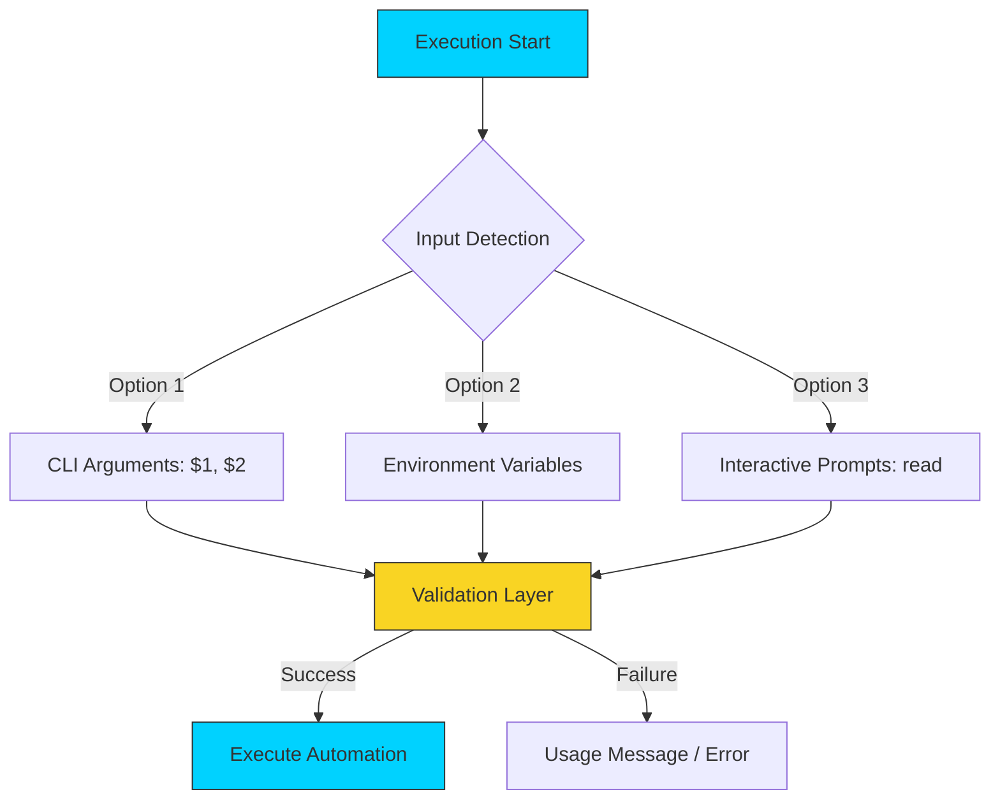

# ⌨️ User Input Mastery: Interactive & Parameterized Scripts

> **"A script that talks to itself is fine. A script that talks to you is powerful. A script that listens to you is professional."**



## 📚 Overview

User input is the bridge between static commands and dynamic, context-aware automation. In enterprise DevOps, scripts must handle diverse scenarios: from **Non-Interactive** CI/CD pipelines to **Interactive** manual troubleshooting.

This module covers the architecture of input handling, ensuring your scripts can adapt to different environments while maintaining strict security and data validation standards.

## 🎓 Learning Objectives

By the end of this module, you will:

- ✅ Master **Positional Parameters** (`$1`, `$2`, `$@`).
- ✅ Understand the **Quoting Trap**: Difference between `$*` and `$@`.
- ✅ Implement **Interactive Prompts** using the `read` command.
- ✅ Utilize **Shift Logic** to process variable-length argument lists.
- ✅ Build **Robust Input Validation** using patterns and regex.
- ✅ Securely handle **Silent Inputs** for passwords and secrets.

---

## 💼 The Automation Why: Critical Interaction vs. Automated Flags

**The Beginner's Question**: "Why use complicated flags? I'll just ask the user with `read`."

**The Answer**: **Because robots don't have keyboards.**
If your script pauses to ask "Are you sure?", your CI/CD pipeline will hang for 6 hours until it times out.

### The Cockpit Analogy

Think of your script as an **Airplane Cockpit**:

1.  **Arguments (`$1`, `$2`) = Flight Plan**
    - usage: `./fly.sh JFK LHR`
    - *Purpose*: Defined destination before takeoff. The automated standard.

2.  **Environment Variables (`$FUEL`) = Dashboard Config**
    - usage: `export FUEL=full; ./fly.sh`
    - *Purpose*: Context awareness. Does not require active input.

3.  **Interactive Prompts (`read`) = Emergency Manual Override**
    - usage: "WARNING: Landing gear stuck. Force deployment? [y/N]"
    - *Purpose*: Last resort. Only for humans.

**DevOps Rule of Thumb**:
- **99%** of execution should be via Arguments or Env Vars (Automated).
- **1%** should be Prompts (Manual troubleshooting).

---

## 🏗️ The Input Hierarchy: CLI vs. Interactive

Professional automation prioritizes **Non-Interactive** inputs (CLI/Env) for predictability, using Interactivity only as a secondary fallback.

### 1. Positional Parameters (The CI/CD Standard)

When running a script like `./deploy.sh production v2.1`, the shell assigns these values to special memory locations.

- **`$0`**: The name of the script. Used for usage messages: `Usage: $0 [env]`.
- **`$1`, `$2`...**: The individual arguments passed through the shell buffer.
- **`$#`**: The **count** of arguments. Used to verify that the CI runner passed the correct number of flags.
- **`$@`**: **The Internal Array**. Treats each argument as a separate quoted string. This is the **Gold Standard** for passing arguments to other internal commands like `docker` or `ssh`.
- **`$*`**: **The Token String**. Flattens all arguments into a single unquoted string. Avoid this in production as it breaks on filenames with spaces.

### 2. The `read` Command (The Human Interface)

Used for manual configuration or troubleshooting prompts.

- **`-p` (Prompt)**: `read -p "Target Cluster: " cluster`
- **`-s` (Silent)**: Disables terminal echoing. Use for passwords or API keys to prevent them from remaining visible in the terminal scrollback.
- **`-t` (Timeout)**: `read -t 10`. Essential for cron jobs; ensure the script doesn't hang indefinitely if a human isn't present.

### 3. TTY Detection: The `-t` Operator

Professional scripts detect if they are running in a **TTY (Terminal)** before attempting to interactive with a user.

```bash
# Check if Standard Input (0) is a terminal
if [[ -t 0 ]]; then
    read -p "Human detected. Enter input: " user_data
else
    echo "Running in automation mode. Skipping prompts."
fi
```

---

## 🚀 Professional Patterns for Automation

### Pattern A: The Usage Guard

Never let a script run with missing parameters. Always validate at the start.

```bash
if [[ $# -lt 2 ]]; then
    echo "Usage: $0 <environment> <version>"
    exit 1
fi
```

### Pattern B: The "Shift" Loop

When you have a long list of files or flags to process, use `shift` to "pop" the first argument off the stack and move the rest forward.

```bash
while [[ $# -gt 0 ]]; do
    echo "Processing target: $1"
    # ... logic ...
    shift # Move $2 into $1, $3 into $2, etc.
done
```

### Pattern C: Intelligent Fallback Chains

Combining arguments, environment variables, and defaults ensures a script works in both Local Dev and Jenkins/GitHub Actions.

```bash
# Hierarchy: 1. Passed as $1 | 2. Env Var $DEPLOY_TARGET | 3. Default "stg"
TARGET=${1:-${DEPLOY_TARGET:-"stg"}}
```

### Pattern D: Data Validation Patterns

Never trust user input. Use Bash pattern matching to sanitize inputs before execution.

```bash
read -p "Enter Port [8000-9000]: " port

# Ensure input is strictly numeric
if [[ ! $port =~ ^[0-9]+$ ]]; then
    echo "❌ Error: Port must be a number." >&2
    exit 1
fi
```

---

## 🏆 Real-World DevOps Story: The Interactive Hang-up

**The Scenario**: An engineer wrote a backup script that prompted `Are you sure? [y/N]` using a basic `read` command. They scheduled it to run at 2 AM as a cron job.

**The Discovery**: Because the script was running in a non-interactive environment (no human to type 'y'), the script sat waiting for input for 48 hours, locking the database file and preventing other jobs from running.

**The Fix**: Professional engineers use the `-t` (timeout) flag or check `[[ -t 0 ]]` to see if the script is running in a real terminal before prompting a human.

---

## ❓ Interview Preparation (Input)

1. **Q: What is the difference between `$*` and `$@`?**
   - *A: Both represent all arguments. However, when wrapped in double quotes, `"$*"` expands to a single string ("arg1 arg2"), whereas `"$@"` expands to separate strings ("arg1" "arg2"). In DevOps, `"$@"` is almost always preferred to prevent spaces in filenames from breaking the script.*

2. **Q: How can you check if any arguments were passed to a script?**
   - *A: Use the `$#` variable, which stores the count of arguments. Example: `if [[ $# -eq 0 ]]; then ...`.*

3. **Q: How do you collect a password from a user without showing it on the screen?**
   - *A: Use the `read -s` command. The `-s` stands for silent, which disables terminal echoing for that specific input.*

4. **Q: What does the `shift` command do?**
   - *A: It shifts all positional parameters to the left. `$2` becomes `$1`, `$3` becomes `$2`, and so on. This is useful for processing arguments one by one in a loop.*

5. **Q: How do you provide a default value for a parameter if $1 is empty?**
   - *A: Use parameter expansion: `VALUE=${1:-"default_value"}`.*

---

## 📝 Knowledge Check

1. **Which variable represents the total number of arguments passed?**
   - [ ] a) `$@`
   - [x] b) `$#`
   - [ ] c) `$?`

2. **Which flag makes the `read` command wait for only a specific amount of time?**
   - [ ] a) `-s`
   - [ ] b) `-p`
   - [x] c) `-t`

3. **What is the result of running `./script.sh a b c` if the script executes `shift`?**
   - [ ] a) `$1` becomes "a"
   - [x] b) `$1` becomes "b"
   - [ ] c) The script exits

4. **True or False: User input should always be validated before being used in destructive commands.**
   - [x] a) True
   - [ ] b) False

5. **Which variable refers to the name of the script being executed?**
   - [x] a) `$0`
   - [ ] b) `$1`
   - [ ] c) `$$`

---

## 🔗 Next Steps

Now that your scripts can listen to you, let's learn how to make them think!

Proceed to: **[Conditionals](../03-Conditionals/README.md)** →
