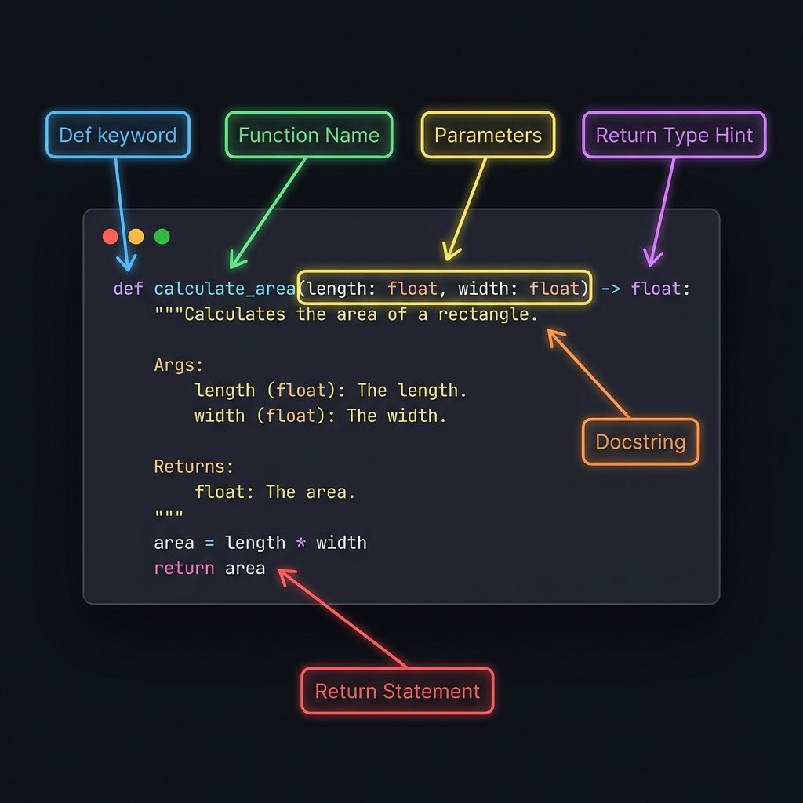
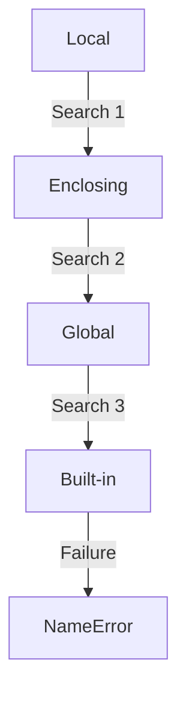
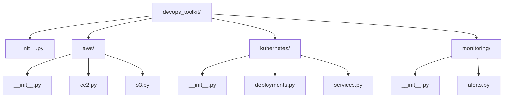

# 🧩 Functions and Modules: The Automation Toolbox

> **"Don't Repeat Yourself (DRY). If you write the same automation logic twice, you've inherited a maintenance nightmare. If you turn it into a function, you've built a reusable asset."**



---

## 🧠 The Mental Model: Functions as Tools in a Toolbox

**The Junior Struggle**: "Why not just copy-paste code when I need it again?"

**The Engineer Solution**: Functions are **reusable tools**. Just like a mechanic doesn't buy a new wrench for every car, you don't rewrite code for every automation task.

### 🏗️ The Infrastructure Analogy

Think of functions and modules like a **mechanic's toolbox**:

| Concept | Toolbox Analogy | Python Equivalent |
|:--------|:----------------|:------------------|
| **Function** | A single tool (wrench, screwdriver) | Reusable block of code |
| **Module** | Tool drawer (all wrenches together) | Python file with related functions |
| **Package** | Complete toolbox (multiple drawers) | Directory with multiple modules |
| **Import** | Taking a tool out of the box | Loading functions into your script |
| **Docstring** | Tool manual | Function documentation |
| **Parameters** | Tool settings (adjustable wrench) | Function inputs |

**The Key Insight**: Just like a mechanic organizes tools by purpose, you organize code into functions and modules for reusability and maintainability.

---

## 📚 Why This Module Matters for Juniors

**Before this module**, you might think:
- "I'll just copy-paste code when I need it"
- "One big script is simpler than multiple files"
- "Functions are just for programmers, not DevOps"

**After this module**, you'll understand:
- **Functions eliminate duplication** (DRY principle)
- **Modules organize related functionality**
- **Packages create reusable libraries**
- **Type hints and docstrings** make code self-documenting
- **First-class functions** enable powerful patterns

**The Difference**: Your automation will be maintainable, testable, and reusable across projects.

---

## 🆚 Junior Way vs. Engineer Way

| Feature | The Junior Way (Problematic) | The Engineer Way (Production-ready) |
|:---|:---|:---|
| **Code Reuse** | Copy-pasting code blocks | Creating reusable functions & modules |
| **Documentation** | No comments or docstrings | Full Google-style docstrings |
| **Type Safety** | No type hints (hope for the best) | Explicit type hints for all params/returns |
| **Scope** | Heavy use of `global` variables | Data passed via parameters |
| **Configuration** | Hardcoded values in main script | Centralized `config.py` module |
| **Logic** | Deeply nested `if/else` | Guard clauses for early exit |

---

---

## 🎯 Learning Objectives

By the end of this module, you will:

- ✅ **Write Professional Functions**: Type hints, docstrings, default parameters
- ✅ **Master Function Scope**: LEGB rule, avoid global variables
- ✅ **Use Advanced Arguments**: *args, **kwargs for flexible functions
- ✅ **Understand First-Class Functions**: Functions as data
- ✅ **Build Modules**: Organize code into importable files
- ✅ **Create Packages**: Multi-file libraries with __init__.py
- ✅ **Apply DRY Principle**: Don't Repeat Yourself

---

## 🏗️ Part 1: The Anatomy of a Professional Function

### 🧠 The Mental Model: The Contract

**The Concept**: A function is a **contract** that specifies inputs, outputs, and behavior.

### 🔧 Basic Function Structure

```python
def function_name(parameters):
    """Docstring explaining what the function does."""
    # Function body
    return result
```

### 🚀 Professional Pattern: Complete Function Anatomy

```python
from typing import List, Dict, Optional

def check_server_health(
    server_name: str,
    port: int = 443,
    timeout: int = 5,
    retries: int = 3
) -> Dict[str, bool]:
    """
    Check the health of a server endpoint.
    
    This function attempts to connect to a server and verify it's responding.
    It implements retry logic with exponential backoff for transient failures.
    
    Args:
        server_name: Hostname or IP address of the server
        port: Port number to check (default: 443 for HTTPS)
        timeout: Maximum seconds to wait for response (default: 5)
        retries: Number of retry attempts (default: 3)
    
    Returns:
        Dictionary with health check results:
        {
            "healthy": bool,
            "response_time_ms": float,
            "error": Optional[str]
        }
    
    Raises:
        ValueError: If server_name is empty
        ConnectionError: If all retry attempts fail
    
    Example:
        >>> result = check_server_health("api.example.com")
        >>> if result["healthy"]:
        ...     print(f"Server is up! Response time: {result['response_time_ms']}ms")
    """
    # Guard clause: validate input
    if not server_name:
        raise ValueError("server_name cannot be empty")
    
    # Function logic here
    result = {
        "healthy": True,
        "response_time_ms": 45.2,
        "error": None
    }
    
    return result
```

### 📊 Function Component Breakdown

| Component | Purpose | Example |
|:----------|:--------|:--------|
| **Type Hints** | Document expected types | `server_name: str` |
| **Default Parameters** | Provide sensible defaults | `timeout: int = 5` |
| **Docstring** | Explain what function does | `"""Check server health..."""` |
| **Args Section** | Document each parameter | `server_name: Hostname...` |
| **Returns Section** | Document return value | `Dictionary with...` |
| **Raises Section** | Document exceptions | `ValueError: If...` |
| **Example Section** | Show usage | `>>> check_server_health(...)` |

**💡 Pro Tip**: Use docstrings in Google or NumPy format. IDEs use them for autocomplete and help.

---

## 🔍 Part 2: Function Scope (LEGB Rule)

### 🧠 The Mental Model: The Search Path

**The Concept**: Python searches for variables in a specific order: Local → Enclosing → Global → Built-in.

### 🎨 Visual: The LEGB Search Path



### 🔧 LEGB Demonstration

```python
# ━━━━━━━━━━━━━━━━━━━━━━━━━━━━━━━━━━━━━━━━━━━━━━━━━━━━━━
# B - Built-in (Python's built-in names)
# ━━━━━━━━━━━━━━━━━━━━━━━━━━━━━━━━━━━━━━━━━━━━━━━━━━━━━━
# len, str, int, etc. are built-in

# ━━━━━━━━━━━━━━━━━━━━━━━━━━━━━━━━━━━━━━━━━━━━━━━━━━━━━━
# G - Global (module level)
# ━━━━━━━━━━━━━━━━━━━━━━━━━━━━━━━━━━━━━━━━━━━━━━━━━━━━━━
DEFAULT_REGION = "us-east-1"

def deploy_to_region(app_name: str) -> None:
    """Deploy application to default region."""
    # ━━━━━━━━━━━━━━━━━━━━━━━━━━━━━━━━━━━━━━━━━━━━━━━━━━━━━━
    # L - Local (function level)
    # ━━━━━━━━━━━━━━━━━━━━━━━━━━━━━━━━━━━━━━━━━━━━━━━━━━━━━━
    region = DEFAULT_REGION  # Uses global DEFAULT_REGION
    
    print(f"Deploying {app_name} to {region}")
    
    # ━━━━━━━━━━━━━━━━━━━━━━━━━━━━━━━━━━━━━━━━━━━━━━━━━━━━━━
    # E - Enclosing (nested function)
    # ━━━━━━━━━━━━━━━━━━━━━━━━━━━━━━━━━━━━━━━━━━━━━━━━━━━━━━
    def log_deployment():
        """Nested function can access enclosing scope."""
        # Can access 'region' from enclosing function
        print(f"Logged deployment to {region}")
    
    log_deployment()

deploy_to_region("myapp")
```

### ⚠️ The Global Variable Trap

```python
# ❌ BAD: Using global variables
deployment_count = 0

def deploy_app():
    global deployment_count  # Modifies global state
    deployment_count += 1
    print(f"Deployment #{deployment_count}")

# Problem: Hard to test, hidden dependencies, race conditions

# ✅ GOOD: Pass state as parameters
def deploy_app(deployment_count: int) -> int:
    """Deploy app and return updated count."""
    deployment_count += 1
    print(f"Deployment #{deployment_count}")
    return deployment_count

# Usage
count = 0
count = deploy_app(count)
count = deploy_app(count)
```

**💡 Pro Tip**: Avoid `global` keyword. Pass data as parameters and return results instead.

---

## 🎯 Part 3: Default Parameters and Mutable Traps

### 🧠 The Mental Model: The Default Factory

**The Use Case**: Provide sensible defaults while allowing customization.

### 🔧 Safe Default Parameters

```python
from typing import Optional, List

# ✅ SAFE: Immutable defaults
def create_server(
    name: str,
    region: str = "us-east-1",
    instance_type: str = "t3.micro",
    port: int = 443
) -> Dict[str, str]:
    """Create a server with default configuration."""
    return {
        "name": name,
        "region": region,
        "instance_type": instance_type,
        "port": str(port)
    }

# Usage
server1 = create_server("web-01")  # Uses all defaults
server2 = create_server("db-01", region="us-west-2", instance_type="t3.large")
```

### ⚠️ The Mutable Default Argument Trap

```python
# ❌ DANGEROUS: Mutable default argument
def add_server(server: str, server_list: List[str] = []) -> List[str]:
    """Add server to list (BUGGY!)."""
    server_list.append(server)
    return server_list

# Problem: The list is created ONCE at function definition
list1 = add_server("web-01")  # ["web-01"]
list2 = add_server("web-02")  # ["web-01", "web-02"] - SHARED LIST!

print(list1)  # ["web-01", "web-02"] - Unexpected!
print(list2)  # ["web-01", "web-02"]

# ✅ CORRECT: Use None as default
def add_server(server: str, server_list: Optional[List[str]] = None) -> List[str]:
    """Add server to list (CORRECT)."""
    if server_list is None:
        server_list = []  # Create new list each time
    
    server_list.append(server)
    return server_list

# Now each call gets its own list
list1 = add_server("web-01")  # ["web-01"]
list2 = add_server("web-02")  # ["web-02"] - Separate list!
```

**💡 Pro Tip**: **NEVER** use mutable objects (list, dict, set) as default arguments. Use `None` instead.

---

## 🔀 Part 4: Advanced Arguments (*args and **kwargs)

### 🧠 The Mental Model: The Flexible Interface

**The Use Case**: Accept variable number of arguments for flexible functions.

### 🔧 *args - Variable Positional Arguments

```python
from typing import List

def deploy_to_servers(*server_names: str) -> None:
    """
    Deploy application to multiple servers.
    
    Args:
        *server_names: Variable number of server names
    
    Example:
        >>> deploy_to_servers("web-01", "web-02", "web-03")
    """
    print(f"Deploying to {len(server_names)} servers:")
    for server in server_names:
        print(f"  - {server}")

# Usage: Can pass any number of arguments
deploy_to_servers("web-01")
deploy_to_servers("web-01", "web-02", "web-03")
deploy_to_servers("web-01", "web-02", "web-03", "db-01", "cache-01")
```

### 🔧 **kwargs - Variable Keyword Arguments

```python
from typing import Dict, Any

def create_resource(resource_type: str, **config: Any) -> Dict[str, Any]:
    """
    Create a cloud resource with flexible configuration.
    
    Args:
        resource_type: Type of resource to create
        **config: Variable keyword arguments for configuration
    
    Example:
        >>> create_resource("vm", region="us-east-1", size="large", disk=100)
    """
    print(f"Creating {resource_type} with config:")
    for key, value in config.items():
        print(f"  {key}: {value}")
    
    return {"type": resource_type, **config}

# Usage: Can pass any keyword arguments
create_resource("vm", region="us-east-1", size="large")
create_resource("database", region="us-west-2", engine="postgres", version="14")
```

### 🚀 Professional Pattern: Wrapper Function

```python
import subprocess
from typing import List, Any

def run_command(command: List[str], **subprocess_kwargs: Any) -> subprocess.CompletedProcess:
    """
    Run a shell command with flexible subprocess options.
    
    Args:
        command: Command to run as list
        **subprocess_kwargs: Any valid subprocess.run() arguments
    
    Example:
        >>> run_command(["ls", "-la"], capture_output=True, text=True, timeout=5)
    """
    # Set defaults
    defaults = {
        "capture_output": True,
        "text": True,
        "check": True
    }
    
    # Merge defaults with user-provided kwargs
    options = {**defaults, **subprocess_kwargs}
    
    return subprocess.run(command, **options)

# Usage: Flexible configuration
result = run_command(["git", "status"])
result = run_command(["docker", "ps"], timeout=10, check=False)
```

**💡 Pro Tip**: Use `**kwargs` to create flexible wrapper functions that forward arguments to other functions.

---

## 🎭 Part 5: First-Class Functions

### 🧠 The Mental Model: Functions as Data

**The Concept**: In Python, functions are objects. You can store them in variables, pass them as arguments, and return them from other functions.

### 🔧 Functions as Variables

```python
def check_disk_space() -> bool:
    """Check if disk space is sufficient."""
    return True

def check_memory() -> bool:
    """Check if memory is sufficient."""
    return True

def check_cpu() -> bool:
    """Check if CPU usage is acceptable."""
    return False

# Store functions in a dictionary
health_checks = {
    "disk": check_disk_space,
    "memory": check_memory,
    "cpu": check_cpu
}

# Run checks dynamically
for check_name, check_func in health_checks.items():
    result = check_func()
    status = "✅ PASS" if result else "❌ FAIL"
    print(f"{check_name}: {status}")
```

### 🚀 Professional Pattern: Strategy Pattern

```python
from typing import Callable, Dict

def deploy_blue_green(app_name: str) -> None:
    """Deploy using blue-green strategy."""
    print(f"Blue-green deployment of {app_name}")

def deploy_canary(app_name: str) -> None:
    """Deploy using canary strategy."""
    print(f"Canary deployment of {app_name}")

def deploy_rolling(app_name: str) -> None:
    """Deploy using rolling update strategy."""
    print(f"Rolling deployment of {app_name}")

# Deployment strategy registry
DEPLOYMENT_STRATEGIES: Dict[str, Callable[[str], None]] = {
    "blue-green": deploy_blue_green,
    "canary": deploy_canary,
    "rolling": deploy_rolling
}

def deploy(app_name: str, strategy: str = "rolling") -> None:
    """
    Deploy application using specified strategy.
    
    Args:
        app_name: Name of application to deploy
        strategy: Deployment strategy (blue-green, canary, rolling)
    """
    if strategy not in DEPLOYMENT_STRATEGIES:
        raise ValueError(f"Unknown strategy: {strategy}")
    
    # Get the deployment function and call it
    deploy_func = DEPLOYMENT_STRATEGIES[strategy]
    deploy_func(app_name)

# Usage
deploy("myapp", "blue-green")
deploy("myapp", "canary")
deploy("myapp")  # Uses default "rolling"
```

**💡 Pro Tip**: Use dictionaries of functions to implement strategy patterns and plugin systems.

---

## 📦 Part 6: Modules - Organizing Code

### 🧠 The Mental Model: The File Cabinet

**The Concept**: A module is a Python file containing related functions, classes, and variables.

### 🔧 Creating a Module

```python
# File: aws_helpers.py
"""AWS utility functions for common operations."""

from typing import List, Dict
import boto3

def list_ec2_instances(region: str = "us-east-1") -> List[Dict[str, str]]:
    """
    List all EC2 instances in a region.
    
    Args:
        region: AWS region
    
    Returns:
        List of instance dictionaries
    """
    ec2 = boto3.client('ec2', region_name=region)
    response = ec2.describe_instances()
    
    instances = []
    for reservation in response['Reservations']:
        for instance in reservation['Instances']:
            instances.append({
                "id": instance['InstanceId'],
                "type": instance['InstanceType'],
                "state": instance['State']['Name']
            })
    
    return instances

def get_instance_tags(instance_id: str, region: str = "us-east-1") -> Dict[str, str]:
    """Get tags for an EC2 instance."""
    ec2 = boto3.client('ec2', region_name=region)
    response = ec2.describe_tags(
        Filters=[{'Name': 'resource-id', 'Values': [instance_id]}]
    )
    
    return {tag['Key']: tag['Value'] for tag in response['Tags']}
```

### 🔧 Using a Module

```python
# File: deploy.py
"""Main deployment script."""

import aws_helpers

# Use functions from the module
instances = aws_helpers.list_ec2_instances("us-west-2")
for instance in instances:
    print(f"Instance {instance['id']}: {instance['state']}")
    
    tags = aws_helpers.get_instance_tags(instance['id'], "us-west-2")
    print(f"  Tags: {tags}")
```

### 🚀 Professional Pattern: if __name__ == "__main__"

```python
# File: server_health.py
"""Server health checking utilities."""

from typing import List

def check_servers(servers: List[str]) -> None:
    """Check health of multiple servers."""
    for server in servers:
        print(f"Checking {server}...")

# This only runs when file is executed directly
if __name__ == "__main__":
    # Test code or CLI interface
    test_servers = ["web-01", "web-02", "db-01"]
    check_servers(test_servers)
```

**Usage**:
```bash
# Run as script
python server_health.py
# Output: Checks test servers

# Import as module
# from server_health import check_servers
# No output (test code doesn't run)
```

**💡 Pro Tip**: Use `if __name__ == "__main__":` to make files both importable and executable.

---

## 📚 Part 7: Packages - Multi-File Libraries

### 🧠 The Mental Model: The Toolbox with Drawers

**The Concept**: A package is a directory containing multiple modules, organized by functionality.

### 🎨 Visual: Package Architecture



### 🔧 Package Structure

```
devops_toolkit/
├── __init__.py          # Makes directory a package
├── aws/
│   ├── __init__.py
│   ├── ec2.py          # EC2 utilities
│   └── s3.py           # S3 utilities
├── kubernetes/
│   ├── __init__.py
│   ├── deployments.py  # Deployment utilities
│   └── services.py     # Service utilities
└── monitoring/
    ├── __init__.py
    └── alerts.py       # Alert utilities
```

### 🔧 The __init__.py File

```python
# devops_toolkit/__init__.py
"""DevOps automation toolkit."""

__version__ = "1.0.0"

# Import commonly used functions to top level
from .aws.ec2 import list_instances
from .kubernetes.deployments import deploy_app
from .monitoring.alerts import send_alert

# Define what's exported when someone does "from devops_toolkit import *"
__all__ = [
    "list_instances",
    "deploy_app",
    "send_alert"
]
```

### 🔧 Using a Package

```python
# Method 1: Import specific functions
from devops_toolkit import list_instances, deploy_app

instances = list_instances("us-east-1")
deploy_app("myapp", "production")

# Method 2: Import entire package
import devops_toolkit

instances = devops_toolkit.list_instances("us-east-1")

# Method 3: Import submodules
from devops_toolkit.aws import ec2
from devops_toolkit.kubernetes import deployments

instances = ec2.list_instances("us-east-1")
deployments.deploy_app("myapp", "production")
```

### 🚀 Professional Pattern: Centralized Configuration

```python
# devops_toolkit/config.py
"""Centralized configuration for the toolkit."""

import os

# Read from environment variables with defaults
AWS_REGION = os.getenv("AWS_REGION", "us-east-1")
K8S_NAMESPACE = os.getenv("K8S_NAMESPACE", "default")
LOG_LEVEL = os.getenv("LOG_LEVEL", "INFO")

# Constants
MAX_RETRIES = 3
TIMEOUT_SECONDS = 30
```

```python
# devops_toolkit/aws/ec2.py
"""EC2 utilities."""

from .. import config  # Import from parent package

def list_instances():
    """List instances using configured region."""
    region = config.AWS_REGION
    # ... implementation
```

**💡 Pro Tip**: Use a `config.py` module for centralized configuration across your package.

---

## 🏆 Part 8: Real-World DevOps Story

### 📖 The Utility Library

**The Scenario**: A fintech company had 12 teams writing their own AWS connection logic. Every time security updated IAM policies or AWS rotated certificates, all 12 teams had to manually update 80+ scripts.

**The Discovery**: A code audit showed 70% of every script was boilerplate (auth, logging, error handling) rather than actual logic.

**The Solution**: The Platform Team created a central package called `fintech_core`:

```python
# fintech_core/__init__.py
"""Centralized DevOps utilities for fintech company."""

from .aws import get_client, list_resources
from .logging import setup_logger
from .errors import handle_errors

__version__ = "2.0.0"
```

```python
# fintech_core/aws.py
"""AWS connection utilities with company security standards."""

import boto3
from typing import Any

def get_client(service: str, region: str = None) -> Any:
    """
    Get AWS client with company security configuration.
    
    Automatically handles:
    - IAM role assumption
    - MFA if required
    - Certificate validation
    - Retry logic
    """
    # Centralized security logic here
    return boto3.client(service, region_name=region)
```

**Usage in team scripts**:
```python
# Before: 50 lines of boilerplate
# After: 3 lines
from fintech_core import get_client, setup_logger

logger = setup_logger(__name__)
ec2 = get_client('ec2', 'us-east-1')

# Actual business logic here
```

**The Outcome**:
- When the company moved to multi-region failover, only `fintech_core` needed updating
- All 80+ scripts inherited new features instantly
- Saved 400+ man-hours
- Eliminated security patching fire-drills

**The Lesson**: Centralize common functionality in a shared package.

---

## ❓ Interview Preparation

### 🎯 Core Concepts

1. **Q: What is the "Mutable Default Argument" trap?**
   - **A**: If you use `def func(data=[])`, the list is created once at definition time. Subsequent calls share and modify the same list. Fix: Use `def func(data=None):` and set `data = []` inside the function.

2. **Q: Explain the LEGB rule.**
   - **A**: Python searches for variables in this order: Local (function), Enclosing (nested function), Global (module), Built-in (Python internals). This determines which variable is used when names conflict.

3. **Q: What is the purpose of `if __name__ == "__main__":`?**
   - **A**: It ensures code only runs when the file is executed directly, not when imported as a module. This allows a file to serve as both a library and a standalone script.

4. **Q: What's the difference between `import X` and `from X import y`?**
   - **A**: `import X` imports the module and requires `X.y` to access items (better namespace clarity). `from X import y` imports `y` directly (shorter but risks naming collisions).

5. **Q: What does `*args` do?**
   - **A**: It collects variable positional arguments into a tuple. Allows functions to accept any number of positional arguments.

### 🚀 Advanced Questions

6. **Q: What does `**kwargs` do?**
   - **A**: It collects variable keyword arguments into a dictionary. Allows functions to accept any number of named arguments.

7. **Q: What is a first-class function?**
   - **A**: A function that can be stored in variables, passed as arguments, and returned from other functions. Enables strategy patterns and callbacks.

8. **Q: What is the purpose of `__init__.py`?**
   - **A**: It marks a directory as a Python package and can define the package's public API by importing commonly used functions to the top level.

9. **Q: How do you reload a module without restarting Python?**
   - **A**: Use `importlib.reload(module)`. Essential for long-running daemons or interactive debugging.

10. **Q: Why avoid global variables?**
    - **A**: They create hidden dependencies, make testing difficult, and can cause race conditions in concurrent code. Pass data as parameters instead.

---

## 📝 Knowledge Check

### 🧠 Beginner Level

1. **Which mechanism handles variable number of positional arguments?**
   - [x] a) `*args`
   - [ ] b) `**kwargs`
   - [ ] c) `*vars`
   - [ ] d) `args[]`

2. **In the LEGB rule, what does 'E' stand for?**
   - [ ] a) Global
   - [x] b) Enclosing
   - [ ] c) External
   - [ ] d) Environment

3. **True or False: Python functions are first-class objects.**
   - [x] a) True
   - [ ] b) False

4. **Which file is required to make a directory a Python package?**
   - [ ] a) `main.py`
   - [x] b) `__init__.py`
   - [ ] c) `.pkg`
   - [ ] d) `package.json`

### 🚀 Intermediate Level

5. **What is the best type to return for multiple values?**
   - [ ] a) List
   - [x] b) Tuple (immutable and standard for unpacking)
   - [ ] c) Set
   - [ ] d) Dictionary

6. **What's wrong with `def func(data=[])`?**
   - [ ] a) Syntax error
   - [x] b) Mutable default argument trap
   - [ ] c) Nothing wrong
   - [ ] d) Type hint missing

7. **What does `if __name__ == "__main__":` check?**
   - [ ] a) If the file is the main module
   - [x] b) If the file is being run directly (not imported)
   - [ ] c) If the main function exists
   - [ ] d) If the file is executable

8. **How do you import everything from a module?**
   - [ ] a) `import *`
   - [x] b) `from module import *`
   - [ ] c) `import module.*`
   - [ ] d) `from * import module`

### 🏆 Advanced Level

9. **What does `**config` do in a function parameter?**
   - [ ] a) Multiplies config by 2
   - [x] b) Collects keyword arguments into a dictionary
   - [ ] c) Unpacks a dictionary
   - [ ] d) Creates a pointer

10. **What's the purpose of `__all__` in `__init__.py`?**
    - [ ] a) Imports all modules
    - [x] b) Defines what's exported with `from package import *`
    - [ ] c) Lists all functions
    - [ ] d) Enables debugging

---

## 🎯 Key Takeaways for Juniors

### 🧠 Mental Models Over Syntax

1. **Functions = Tools**: Reusable blocks of code
2. **Modules = Tool Drawers**: Organize related functions
3. **Packages = Toolboxes**: Multi-file libraries
4. **LEGB = Search Path**: How Python finds variables

### 🛡️ Safety Patterns

1. **Use type hints** for all function parameters
2. **Write docstrings** for all functions
3. **Avoid global variables** - pass data as parameters
4. **Never use mutable defaults** - use `None` instead
5. **Use `if __name__ == "__main__":`** for dual-purpose files

### 🚀 Production Rules

1. **Follow DRY principle** - don't repeat code
2. **One function, one purpose** - single responsibility
3. **Use `__init__.py`** to define package API
4. **Centralize configuration** in a config module
5. **Document with examples** in docstrings

---

## 🔗 Next Steps

Now that you can build modular, reusable code, you're ready to learn how to interact with the filesystem.

**Proceed to**: [Cloud Automation (Boto3) →](../08-Cloud-Automation-Boto3/README.md)

---

## 📚 Additional Resources

- [Python Functions Documentation](https://docs.python.org/3/tutorial/controlflow.html#defining-functions)
- [Python Modules Documentation](https://docs.python.org/3/tutorial/modules.html)
- [PEP 257: Docstring Conventions](https://www.python.org/dev/peps/pep-0257/)
- [Google Python Style Guide](https://google.github.io/styleguide/pyguide.html)
- [Real Python: Defining Functions](https://realpython.com/defining-your-own-python-function/)

---

**🎓 Remember**: A newbie copies code. An engineer builds reusable functions and modules. Master functions and modules, and you master maintainable automation.
