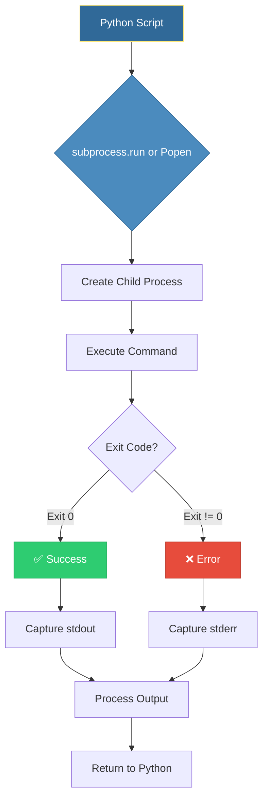
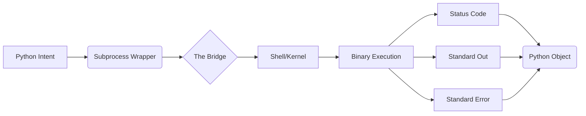

# 🐚 Subprocess Execution: The Python-to-Bash Bridge

> **"Python is the brain, but the Shell is the muscles. The subprocess module is the nervous system that connects the two, allowing your code to orchestrate everything from Docker to Terraform."**


---

## 🧠 The Mental Model: Subprocess as the Foreman

**The Junior Struggle**: "Why not just write a Bash script? Or use `os.system()`? It's just one line of code!"

**The Engineer Solution**: `os.system()` is a **"fire and forget"** missile—you have no control once it's launched. Subprocess is a **Foreman**. The Foreman doesn't swing the hammer, but they manage the workers, read their reports (stdout), handle their complaints (stderr), and ensure they don't run forever (timeouts). 

### 🏗️ The Infrastructure Analogy: The Construction Site

Think of your Python script as the **Construction Site Manager**.

| Concept | Construction Analogy | Subprocess Equivalent |
|:--------|:---------------------|:----------------------|
| **Foreman** | Coordinates workers | `subprocess.run()` / `Popen` |
| **Worker** | Performs physical tasks | Shell Commands (`ls`, `docker`, `terraform`) |
| **Blueprints** | Detailed instructions | Command arguments (List format) |
| **Safety Gear** | PPE / Harnesses | Input Validation & No `shell=True` |
| **Walkie-Talkie** | Real-time communication | Pipe Streams (`stdout`, `stderr`) |
| **Job Timeout** | Shift ends at 5 PM | `timeout=N` |

**The Key Insight**: A good manager doesn't just hire workers and walk away; they monitor their progress, catch their mistakes, and ensure the site remains safe.

---

## 📚 Why This Module Matters for Juniors

**Before this module**, you might think:
- "I'll just use `os.system()` for everything"
- "Shell scripts are good enough"
- "I don't need to capture command output"

**After this module**, you'll understand:
- **subprocess.run()** is the modern, safe way to run commands
- **Capturing output** enables intelligent automation
- **Exit codes** tell you if commands succeeded
- **shell=True is dangerous** and should be avoided
- **Timeouts prevent** hung processes

**The Difference**: Your scripts will handle command failures gracefully, process output intelligently, and avoid security vulnerabilities.

---

## 🎯 Learning Objectives

By the end of this module, you will:

- ✅ **Master subprocess.run()**: The modern way to execute commands
- ✅ **Capture stdout/stderr**: Process command output in Python
- ✅ **Handle Exit Codes**: Detect and respond to command failures
- ✅ **Implement Timeouts**: Prevent hung processes
- ✅ **Avoid Shell Injection**: Use list-based arguments safely
- ✅ **Stream Real-Time Output**: Use Popen for long-running commands
- ✅ **Pass Input to Commands**: Send data via stdin
- ✅ **Set Working Directory**: Run commands in specific paths

---

## 🏗️ Part 1: The Subprocess Architecture

### 🧠 The Mental Model: Parent and Child Processes

**The Concept**: When Python runs a command, it creates a **child process** that executes independently.

### 🎨 Visual: Process Lifecycle



### 🎨 Visual: The Data Pipeline



**💡 Pro Tip**: Always check exit codes. In a script, an exit code of `1` is a silent scream for help. Use `check=True` to make that scream audible.

### 📊 Exit Code Convention

| Exit Code | Meaning | Example |
|:----------|:--------|:--------|
| **0** | Success | Command completed without errors |
| **1** | General error | File not found, permission denied |
| **2** | Misuse of command | Invalid arguments |
| **126** | Command cannot execute | Permission problem |
| **127** | Command not found | Binary doesn't exist |
| **130** | Terminated by Ctrl+C | User interrupted |
| **137** | Killed (SIGKILL) | Out of memory, timeout |

---

## 🚀 Part 2: subprocess.run() - The Modern Standard

### 🧠 The Mental Model: The One-Shot Executor

**The Use Case**: Run a command, wait for it to finish, get the result.

**The Solution**: `subprocess.run()` is the recommended way for simple command execution.

### 🔧 Basic Usage

```python
import subprocess

# ━━━━━━━━━━━━━━━━━━━━━━━━━━━━━━━━━━━━━━━━━━━━━━━━━━━━━━
# Simple command execution
# ━━━━━━━━━━━━━━━━━━━━━━━━━━━━━━━━━━━━━━━━━━━━━━━━━━━━━━

# ✅ List-based arguments (SAFE)
result = subprocess.run(["ls", "-la", "/tmp"])

# Check if command succeeded
if result.returncode == 0:
    print("✅ Command succeeded")
else:
    print(f"❌ Command failed with exit code {result.returncode}")

# ━━━━━━━━━━━━━━━━━━━━━━━━━━━━━━━━━━━━━━━━━━━━━━━━━━━━━━
# Capturing output
# ━━━━━━━━━━━━━━━━━━━━━━━━━━━━━━━━━━━━━━━━━━━━━━━━━━━━━━

result = subprocess.run(
    ["git", "status", "--short"],
    capture_output=True,  # Capture stdout and stderr
    text=True            # Return strings instead of bytes
)

print("Git status:")
print(result.stdout)

# ━━━━━━━━━━━━━━━━━━━━━━━━━━━━━━━━━━━━━━━━━━━━━━━━━━━━━━
# Automatic error handling
# ━━━━━━━━━━━━━━━━━━━━━━━━━━━━━━━━━━━━━━━━━━━━━━━━━━━━━━

try:
    result = subprocess.run(
        ["git", "push", "origin", "main"],
        capture_output=True,
        text=True,
        check=True  # Raises CalledProcessError if exit code != 0
    )
    print("✅ Push succeeded")
except subprocess.CalledProcessError as e:
    print(f"❌ Push failed with exit code {e.returncode}")
    print(f"Error output: {e.stderr}")
```

### 🚀 Professional Pattern: System Health Checker

```python
import subprocess
from typing import Dict, Optional

def check_disk_space(path: str = "/") -> Optional[Dict[str, str]]:
    """
    Check disk space for a given path.
    
    Args:
        path: Path to check (default: root)
    
    Returns:
        Dictionary with disk usage info, or None if command failed
    
    Example:
        >>> info = check_disk_space("/")
        >>> print(f"Used: {info['used']}, Available: {info['available']}")
    """
    try:
        result = subprocess.run(
            ["df", "-h", path],
            capture_output=True,
            text=True,
            check=True,
            timeout=5  # Prevent hanging
        )
        
        # Parse output (skip header line)
        lines = result.stdout.strip().split('\n')
        if len(lines) < 2:
            return None
        
        # Split the data line
        parts = lines[1].split()
        
        return {
            "filesystem": parts[0],
            "size": parts[1],
            "used": parts[2],
            "available": parts[3],
            "use_percent": parts[4],
            "mounted_on": parts[5]
        }
    
    except subprocess.CalledProcessError as e:
        print(f"❌ df command failed: {e.stderr}")
        return None
    
    except subprocess.TimeoutExpired:
        print("❌ df command timed out")
        return None


# 🎯 Usage
disk_info = check_disk_space("/")
if disk_info:
    print(f"Disk usage: {disk_info['use_percent']}")
    
    # Alert if usage is high
    usage = int(disk_info['use_percent'].rstrip('%'))
    if usage > 80:
        print("⚠️ Disk usage is above 80%!")
```

**💡 Pro Tip**: Always use `timeout` to prevent commands from hanging indefinitely.

---

## 🛡️ Part 3: Security - Avoiding Shell Injection

### 🧠 The Mental Model: The Security Checkpoint

**The Danger**: `shell=True` allows command injection attacks.

**The Solution**: Always use list-based arguments.

### 🔧 The Vulnerability

```python
# ━━━━━━━━━━━━━━━━━━━━━━━━━━━━━━━━━━━━━━━━━━━━━━━━━━━━━━
# ❌ DANGEROUS: Shell Injection Vulnerability
# ━━━━━━━━━━━━━━━━━━━━━━━━━━━━━━━━━━━━━━━━━━━━━━━━━━━━━━

user_input = "file.txt; rm -rf /"  # Malicious input

# ❌ This will execute BOTH commands!
subprocess.run(f"cat {user_input}", shell=True)
# Result: Displays file.txt, then DELETES EVERYTHING

# ━━━━━━━━━━━━━━━━━━━━━━━━━━━━━━━━━━━━━━━━━━━━━━━━━━━━━━
# ✅ SAFE: List-based arguments
# ━━━━━━━━━━━━━━━━━━━━━━━━━━━━━━━━━━━━━━━━━━━━━━━━━━━━━━

# ✅ This treats the entire string as a filename
subprocess.run(["cat", user_input])
# Result: Error "file not found: file.txt; rm -rf /"
# The semicolon is treated as part of the filename, not a command separator
```

### 🚀 Professional Pattern: Safe Command Builder

```python
from typing import List
import shlex

def build_safe_command(base_cmd: str, args: List[str]) -> List[str]:
    """
    Build a safe command with validated arguments.
    
    Args:
        base_cmd: The command to run (e.g., "git", "docker")
        args: List of arguments
    
    Returns:
        List of command parts ready for subprocess.run()
    
    Example:
        >>> cmd = build_safe_command("git", ["commit", "-m", "User input: ; rm -rf /"])
        >>> subprocess.run(cmd)
    """
    # Validate base command (no spaces, no special chars)
    if not base_cmd.replace("-", "").replace("_", "").isalnum():
        raise ValueError(f"Invalid command: {base_cmd}")
    
    # Build command list
    command = [base_cmd] + args
    
    return command


def run_git_command(args: List[str]) -> Optional[str]:
    """
    Safely run a git command.
    
    Args:
        args: Git command arguments
    
    Returns:
        Command output or None if failed
    """
    try:
        command = build_safe_command("git", args)
        
        result = subprocess.run(
            command,
            capture_output=True,
            text=True,
            check=True,
            timeout=30
        )
        
        return result.stdout
    
    except ValueError as e:
        print(f"❌ Invalid command: {e}")
        return None
    
    except subprocess.CalledProcessError as e:
        print(f"❌ Git command failed: {e.stderr}")
        return None


# 🎯 Usage
output = run_git_command(["status", "--short"])
if output:
    print(output)
```

**💡 Pro Tip**: **NEVER** use `shell=True` with user input. If you must use it, validate and sanitize all inputs.

---

## 📊 Part 4: Capturing and Processing Output

### 🧠 The Mental Model: The Data Collector

**The Use Case**: Parse command output to make decisions in Python.

### 🔧 stdout vs stderr

```python
import subprocess

# ━━━━━━━━━━━━━━━━━━━━━━━━━━━━━━━━━━━━━━━━━━━━━━━━━━━━━━
# Capturing both stdout and stderr
# ━━━━━━━━━━━━━━━━━━━━━━━━━━━━━━━━━━━━━━━━━━━━━━━━━━━━━━

result = subprocess.run(
    ["ls", "/nonexistent"],
    capture_output=True,
    text=True
)

print(f"stdout: {result.stdout}")  # Empty (no output)
print(f"stderr: {result.stderr}")  # "ls: cannot access '/nonexistent': No such file or directory"
print(f"Exit code: {result.returncode}")  # 2 (error)

# ━━━━━━━━━━━━━━━━━━━━━━━━━━━━━━━━━━━━━━━━━━━━━━━━━━━━━━
# Redirecting stderr to stdout
# ━━━━━━━━━━━━━━━━━━━━━━━━━━━━━━━━━━━━━━━━━━━━━━━━━━━━━━

result = subprocess.run(
    ["ls", "/nonexistent"],
    stdout=subprocess.PIPE,
    stderr=subprocess.STDOUT,  # Merge stderr into stdout
    text=True
)

print(f"Combined output: {result.stdout}")
```

### 🚀 Professional Pattern: Docker Container Status Checker

```python
import subprocess
import json
from typing import List, Dict, Optional

def get_running_containers() -> Optional[List[Dict[str, str]]]:
    """
    Get list of running Docker containers.
    
    Returns:
        List of container info dictionaries, or None if failed
    
    Example:
        >>> containers = get_running_containers()
        >>> for container in containers:
        ...     print(f"{container['name']}: {container['status']}")
    """
    try:
        result = subprocess.run(
            [
                "docker", "ps",
                "--format", "{{json .}}"
            ],
            capture_output=True,
            text=True,
            check=True,
            timeout=10
        )
        
        # Parse JSON output (one JSON object per line)
        containers = []
        for line in result.stdout.strip().split('\n'):
            if line:
                container = json.loads(line)
                containers.append({
                    "id": container.get("ID", ""),
                    "name": container.get("Names", ""),
                    "image": container.get("Image", ""),
                    "status": container.get("Status", ""),
                    "ports": container.get("Ports", "")
                })
        
        return containers
    
    except subprocess.CalledProcessError as e:
        print(f"❌ Docker command failed: {e.stderr}")
        return None
    
    except json.JSONDecodeError as e:
        print(f"❌ Failed to parse Docker output: {e}")
        return None


# 🎯 Usage
containers = get_running_containers()
if containers:
    print(f"Found {len(containers)} running containers:")
    for container in containers:
        print(f"  - {container['name']} ({container['image']}): {container['status']}")
else:
    print("No containers running or Docker not available")
```

**💡 Pro Tip**: Use `--format` flags (like Docker's `{{json .}}`) to get machine-readable output.

---

## ⏱️ Part 5: Timeouts and Error Handling

### 🧠 The Mental Model: The Watchdog Timer

**The Problem**: Commands can hang indefinitely (network issues, infinite loops).

**The Solution**: Always set timeouts for production code.

### 🔧 Timeout Handling

```python
import subprocess
import time

def ping_server(hostname: str, timeout: int = 5) -> bool:
    """
    Ping a server to check if it's reachable.
    
    Args:
        hostname: Server hostname or IP
        timeout: Maximum time to wait (seconds)
    
    Returns:
        True if server is reachable, False otherwise
    """
    try:
        result = subprocess.run(
            ["ping", "-c", "1", "-W", "1", hostname],
            capture_output=True,
            text=True,
            timeout=timeout  # Kill if it takes longer than this
        )
        
        return result.returncode == 0
    
    except subprocess.TimeoutExpired:
        print(f"⏱️ Ping to {hostname} timed out after {timeout}s")
        return False
    
    except subprocess.CalledProcessError:
        return False


# 🎯 Usage
servers = ["google.com", "nonexistent.example.com", "localhost"]

for server in servers:
    if ping_server(server):
        print(f"✅ {server} is reachable")
    else:
        print(f"❌ {server} is not reachable")
```

### 🚀 Professional Pattern: Retry with Exponential Backoff

```python
import subprocess
import time
from typing import Optional

def run_with_retry(
    command: List[str],
    max_attempts: int = 3,
    base_delay: float = 1.0
) -> Optional[subprocess.CompletedProcess]:
    """
    Run a command with exponential backoff retry.
    
    Args:
        command: Command to run (list format)
        max_attempts: Maximum number of attempts
        base_delay: Base delay in seconds (doubles each retry)
    
    Returns:
        CompletedProcess object if successful, None if all attempts failed
    """
    for attempt in range(1, max_attempts + 1):
        try:
            result = subprocess.run(
                command,
                capture_output=True,
                text=True,
                check=True,
                timeout=30
            )
            
            print(f"✅ Command succeeded on attempt {attempt}")
            return result
        
        except subprocess.CalledProcessError as e:
            print(f"❌ Attempt {attempt} failed with exit code {e.returncode}")
            print(f"   Error: {e.stderr}")
        
        except subprocess.TimeoutExpired:
            print(f"⏱️ Attempt {attempt} timed out")
        
        # Don't sleep after the last attempt
        if attempt < max_attempts:
            delay = base_delay * (2 ** (attempt - 1))
            print(f"⏳ Waiting {delay}s before retry...")
            time.sleep(delay)
    
    print(f"❌ All {max_attempts} attempts failed")
    return None


# 🎯 Usage
result = run_with_retry(["curl", "-f", "https://api.example.com/health"])
if result:
    print("API is healthy")
else:
    print("API is down after multiple retries")
```

**💡 Pro Tip**: Use exponential backoff for transient failures (network issues, rate limits).

---

## 🌊 Part 6: Real-Time Streaming with Popen

### 🧠 The Mental Model: The Live Feed

**The Use Case**: Long-running commands (builds, deployments) need real-time output.

**The Solution**: `Popen` allows streaming output line-by-line.

### 🔧 Basic Streaming

```python
import subprocess

def stream_command_output(command: List[str]) -> int:
    """
    Run a command and stream its output in real-time.
    
    Args:
        command: Command to run (list format)
    
    Returns:
        Exit code of the command
    """
    process = subprocess.Popen(
        command,
        stdout=subprocess.PIPE,
        stderr=subprocess.STDOUT,  # Merge stderr into stdout
        text=True,
        bufsize=1  # Line-buffered
    )
    
    # Stream output line by line
    for line in process.stdout:
        print(f"[OUTPUT] {line.rstrip()}")
    
    # Wait for process to complete
    process.wait()
    
    return process.returncode


# 🎯 Usage
print("Building Docker image...")
exit_code = stream_command_output([
    "docker", "build",
    "-t", "myapp:latest",
    "."
])

if exit_code == 0:
    print("✅ Build succeeded")
else:
    print(f"❌ Build failed with exit code {exit_code}")
```

### 🚀 Professional Pattern: Deployment Logger

```python
import subprocess
import datetime
from typing import List

def run_deployment_with_logging(
    command: List[str],
    log_file: str = "deployment.log"
) -> bool:
    """
    Run a deployment command with real-time logging.
    
    Args:
        command: Deployment command to run
        log_file: Path to log file
    
    Returns:
        True if deployment succeeded, False otherwise
    """
    start_time = datetime.datetime.now()
    
    print(f"🚀 Starting deployment at {start_time.isoformat()}")
    print(f"📝 Logging to {log_file}")
    
    with open(log_file, 'a') as log:
        # Write header
        log.write(f"\n{'='*60}\n")
        log.write(f"Deployment started: {start_time.isoformat()}\n")
        log.write(f"Command: {' '.join(command)}\n")
        log.write(f"{'='*60}\n\n")
        
        # Start process
        process = subprocess.Popen(
            command,
            stdout=subprocess.PIPE,
            stderr=subprocess.STDOUT,
            text=True,
            bufsize=1
        )
        
        # Stream and log output
        for line in process.stdout:
            line = line.rstrip()
            
            # Print to console
            print(f"[DEPLOY] {line}")
            
            # Write to log file
            timestamp = datetime.datetime.now().strftime("%H:%M:%S")
            log.write(f"[{timestamp}] {line}\n")
            log.flush()  # Ensure it's written immediately
        
        # Wait for completion
        process.wait()
        
        # Write footer
        end_time = datetime.datetime.now()
        duration = (end_time - start_time).total_seconds()
        
        log.write(f"\n{'='*60}\n")
        log.write(f"Deployment ended: {end_time.isoformat()}\n")
        log.write(f"Duration: {duration:.2f}s\n")
        log.write(f"Exit code: {process.returncode}\n")
        log.write(f"{'='*60}\n")
    
    if process.returncode == 0:
        print(f"✅ Deployment succeeded in {duration:.2f}s")
        return True
    else:
        print(f"❌ Deployment failed with exit code {process.returncode}")
        return False


# 🎯 Usage
success = run_deployment_with_logging([
    "kubectl", "apply",
    "-f", "deployment.yaml"
])

if not success:
    print("Check deployment.log for details")
```

**💡 Pro Tip**: Always log deployment output. It's invaluable for debugging failures.

---

## 📥 Part 7: Sending Input to Commands

### 🧠 The Mental Model: The Data Feeder

**The Use Case**: Some commands need input via stdin (kubectl apply -f -, passwords, etc.).

**The Solution**: Use the `input` parameter.

### 🔧 Passing Data via stdin

```python
import subprocess

# ━━━━━━━━━━━━━━━━━━━━━━━━━━━━━━━━━━━━━━━━━━━━━━━━━━━━━━
# Kubernetes manifest from string
# ━━━━━━━━━━━━━━━━━━━━━━━━━━━━━━━━━━━━━━━━━━━━━━━━━━━━━━

yaml_manifest = """
apiVersion: v1
kind: Namespace
metadata:
  name: dynamic-env
"""

result = subprocess.run(
    ["kubectl", "apply", "-f", "-"],  # "-" means read from stdin
    input=yaml_manifest,
    capture_output=True,
    text=True
)

print(result.stdout)

# ━━━━━━━━━━━━━━━━━━━━━━━━━━━━━━━━━━━━━━━━━━━━━━━━━━━━━━
# Piping data through a command
# ━━━━━━━━━━━━━━━━━━━━━━━━━━━━━━━━━━━━━━━━━━━━━━━━━━━━━━

log_data = """
ERROR: Database connection failed
INFO: Retrying connection
ERROR: Timeout after 30s
"""

# Count error lines
result = subprocess.run(
    ["grep", "-c", "ERROR"],
    input=log_data,
    capture_output=True,
    text=True
)

error_count = int(result.stdout.strip())
print(f"Found {error_count} errors in logs")
```

**💡 Pro Tip**: Use stdin for sensitive data (passwords, keys) to avoid exposing them in command-line arguments.

---

## 🏆 Part 8: Real-World DevOps Stories

### 📖 Story 1: The Terraform Wrapper

**The Scenario**: A self-service portal allowed developers to provision AWS VPCs by clicking a button. Python called `terraform apply` under the hood.

**The Problem**: The first version used `os.system()`, which didn't capture errors. If Terraform failed, the portal thought it succeeded, but the developer got nothing.

**The Code**:
```python
# ❌ The problem
import os
os.system("terraform apply -auto-approve")
# No way to know if it succeeded!
```

**The Solution**:
```python
# ✅ The fix
import subprocess

try:
    result = subprocess.run(
        ["terraform", "apply", "-auto-approve"],
        capture_output=True,
        text=True,
        check=True,
        timeout=300
    )
    
    print("✅ Infrastructure provisioned successfully")
    
except subprocess.CalledProcessError as e:
    # Parse Terraform error message
    if "already exists" in e.stderr:
        print("❌ VPC CIDR 10.0.0.0/16 already exists")
    else:
        print(f"❌ Terraform failed: {e.stderr}")
```

**The Outcome**: "Ghost Provisioning" tickets dropped by 90%. The portal could now explain exactly why provisioning failed.

---

### 📖 Story 2: The Hung Deployment

**The Scenario**: A deployment script ran `kubectl apply` but occasionally hung for hours.

**The Discovery**: The Kubernetes API server was slow to respond, and the script had no timeout.

**The Solution**:
```python
# ✅ Always use timeouts
try:
    result = subprocess.run(
        ["kubectl", "apply", "-f", "deployment.yaml"],
        capture_output=True,
        text=True,
        check=True,
        timeout=60  # Kill after 1 minute
    )
except subprocess.TimeoutExpired:
    print("❌ Deployment timed out - API server may be slow")
    # Alert ops team
```

**The Lesson**: Always set timeouts for production automation.

---

## ❓ Interview Preparation

### 🎯 Core Concepts

1. **Q: What is the difference between `subprocess.run()` and `subprocess.Popen()`?**
   - **A**: `run()` is synchronous (blocking) and waits for the command to finish. `Popen()` is asynchronous (non-blocking), returning immediately while the command runs in the background. Use `Popen()` for streaming logs or parallel processes.

2. **Q: Why is `shell=True` considered dangerous?**
   - **A**: It allows shell injection attacks. If user input is passed to the command, an attacker can inject additional commands using `;`, `&&`, or `|`. Always use list-based arguments instead.

3. **Q: How do you capture the exit code of a command?**
   - **A**: Access the `.returncode` attribute of the `CompletedProcess` object. In Unix/Linux, `0` means success, and non-zero indicates an error.

4. **Q: What does `text=True` do?**
   - **A**: By default, subprocess returns raw `bytes`. Setting `text=True` tells Python to decode bytes into strings using the system's default encoding (usually UTF-8).

5. **Q: How do you prevent a command from hanging indefinitely?**
   - **A**: Use the `timeout` parameter in `run()`. If the command exceeds the limit, Python raises `subprocess.TimeoutExpired`, allowing you to kill the process and handle the error.

### 🚀 Advanced Questions

6. **Q: How do you run a command in a different directory?**
   - **A**: Use the `cwd` (Current Working Directory) parameter: `subprocess.run(["ls"], cwd="/etc/nginx")`.

7. **Q: What's the difference between `capture_output=True` and `stdout=subprocess.PIPE`?**
   - **A**: `capture_output=True` is a shorthand that sets both `stdout=PIPE` and `stderr=PIPE`. They're equivalent for most use cases.

8. **Q: How do you merge stderr into stdout?**
   - **A**: Set `stderr=subprocess.STDOUT`. This is useful when you want all output in one stream.

9. **Q: When should you use `check=True`?**
   - **A**: When you want the script to crash immediately if the command fails. It raises `CalledProcessError` for non-zero exit codes, making error handling explicit.

10. **Q: How do you pass data to a command's stdin?**
    - **A**: Use the `input` parameter with a string: `subprocess.run(["command"], input="data", text=True)`.

---

## 📝 Knowledge Check

### 🧠 Beginner Level

1. **Which method is recommended for simple, one-shot commands?**
   - [ ] a) `os.system()`
   - [ ] b) `subprocess.Popen()`
   - [x] c) `subprocess.run()`
   - [ ] d) `exec()`

2. **True or False: Using `shell=True` is generally considered a security risk.**
   - [x] a) True
   - [ ] b) False

3. **How do you force your script to crash if a subprocess fails?**
   - [ ] a) `strict=True`
   - [ ] b) `abort=True`
   - [x] c) `check=True`
   - [ ] d) `fail_fast=True`

4. **Which attribute contains the exit code of a command?**
   - [ ] a) `status`
   - [x] b) `returncode`
   - [ ] c) `exit_code`
   - [ ] d) `result`

### 🚀 Intermediate Level

5. **What does `capture_output=True` do?**
   - [x] a) Saves stdout and stderr into the result object
   - [ ] b) Prints output twice
   - [ ] c) Saves output to a file
   - [ ] d) Disables output

6. **What exit code indicates success?**
   - [x] a) 0
   - [ ] b) 1
   - [ ] c) 200
   - [ ] d) -1

7. **How do you set a timeout for a command?**
   - [ ] a) `max_time=30`
   - [x] b) `timeout=30`
   - [ ] c) `wait=30`
   - [ ] d) `deadline=30`

8. **What does `text=True` do?**
   - [ ] a) Enables text mode
   - [x] b) Decodes bytes to strings
   - [ ] c) Saves output as text file
   - [ ] d) Enables UTF-8 encoding only

### 🏆 Advanced Level

9. **How do you stream output line-by-line?**
   - [ ] a) Use `subprocess.run()` with `stream=True`
   - [x] b) Use `subprocess.Popen()` and iterate over `stdout`
   - [ ] c) Use `subprocess.stream()`
   - [ ] d) Use `capture_output=False`

10. **What's the safest way to run a command with user input?**
    - [ ] a) `subprocess.run(f"command {user_input}", shell=True)`
    - [x] b) `subprocess.run(["command", user_input])`
    - [ ] c) `os.system(f"command {user_input}")`
    - [ ] d) `exec(f"command {user_input}")`

---

## 🎯 Key Takeaways for Juniors

### 🧠 Mental Models Over Syntax

1. **Subprocess = Foreman**: Coordinates workers (shell commands)
2. **Exit Code = Success Certificate**: 0 = success, non-zero = failure
3. **Timeout = Watchdog Timer**: Prevents hung processes
4. **List Arguments = Safety Protocol**: Prevents injection attacks

### 🛡️ Safety Patterns

1. **Never use `shell=True`** with user input
2. **Always set timeouts** for production code
3. **Use `check=True`** to fail fast on errors
4. **Capture output** to make intelligent decisions
5. **Use list-based arguments** for security

### 🚀 Production Rules

1. **Use `subprocess.run()`** for simple commands
2. **Use `subprocess.Popen()`** for streaming output
3. **Always check exit codes** (`.returncode`)
4. **Set timeouts** to prevent hanging (default: 30-60s)
5. **Log all command output** for debugging

---

## 🔗 Next Steps

Now that you can interact with the operating system, you're ready to learn modern file path handling.

**Proceed to**: [Pathlib Basics →](README.md)

---

## 📚 Additional Resources

- [Python subprocess Documentation](https://docs.python.org/3/library/subprocess.html)
- [Subprocess Security Best Practices](https://docs.python.org/3/library/subprocess.html#security-considerations)
- [Exit Codes Convention](https://tldp.org/LDP/abs/html/exitcodes.html)
- [Command Injection Prevention](https://owasp.org/www-community/attacks/Command_Injection)

---

**🎓 Remember**: A newbie uses `os.system()` and hopes for the best. An engineer uses `subprocess.run()` with timeouts, error handling, and security best practices. Master subprocess, and you master infrastructure orchestration.
