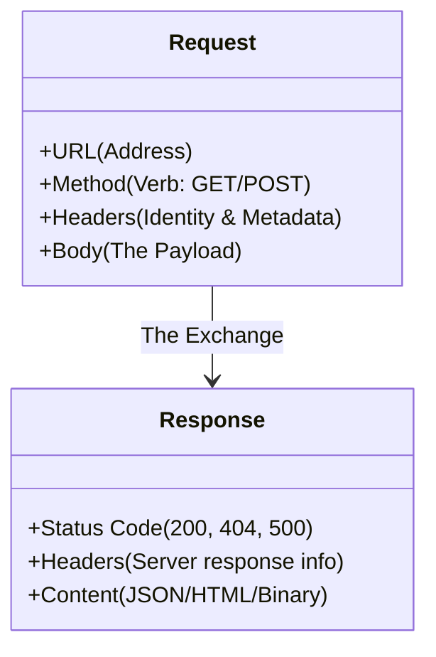

# 🌐 Working with the Web: APIs and HTTP

> **"If a system is connected, it has an interface. Whether it's a sleek REST API or a messy HTML status page, Python is the universal key that unlocks and automates those interactions."**


---

## 🧠 The Mental Model: The Universal Remote

**The Junior Struggle**: "I'll click the button on the dashboard 500 times."

**The Engineer Solution**: Almost every button on the web sends an HTTP request. If you can replicate that request in Python, you can automate the action without opening a browser.

### 🏗️ The Infrastructure Analogy

Think of HTTP like **Postal Mail**:

| Concept | Mail Analogy | HTTP Equivalent |
|:--------|:-------------|:----------------|
| **URL** | Address on Envelope | `https://api.github.com/user` |
| **Method** | Type of Service | `GET` (Read), `POST` (Create/Write), `PATCH` (Update) |
| **Headers** | Stamps / Priority | `Authorization: Bearer <token>`, `Content-Type: json` |
| **Payload** | Package Contents | JSON Data (`{"name": "production"}`) |
| **Status Code** | Delivery Receipt | `200 OK`, `404 Not Found`, `500 Server Error` |

**The Key Insight**: APIs are just function calls over a network.

---

**The Difference**: You stop being a user of tools and start being an orchestrator of tools.

---

## 🆚 Junior Way vs. Engineer Way

| Feature | The Junior Way (Problematic) | The Engineer Way (Production-ready) |
|:---|:---|:---|
| **Interaction** | Manual GUI clicks / browser | `requests` library (API first) |
| **Error Handling** | Assuming "if no crash, it worked" | `response.raise_for_status()` |
| **Secrets** | Hardcoded tokens in URL/Body | Secure Bearer tokens in Headers |
| **Network Safety** | Infinite timeouts (Script hangs) | Mandatory `timeout=10` on every call |
| **Efficiency** | New connection for every line | `requests.Session()` for pooling |
| **Parsing** | Looking for strings in raw text | `response.json()` into dictionary |

---

### 🎨 Visual: HTTP Request Anatomy



**The Exchange**: Every time you automation script talks to the web, it's a binary exchange. You send a structured package, and the server replies with another structured package. Your job is to be the **Translator** who understands the reply.

---

---

## 🎯 Learning Objectives

By the end of this module, you will:

- ✅ **Master `requests`**: GET, POST, DELETE
- ✅ **Handle Errors**: Using `raise_for_status()` and Try/Except
- ✅ **Authenticate**: Bearer Tokens and Headers
- ✅ **Parse JSON**: Convert API responses to Python Dictionaries
- ✅ **Scrape HTML**: Use BeautifulSoup for non-API sites

---

## 🏗️ Part 1: The Request Lifecycle

### 🧠 The Mental Model: Ask and Receive

**The Workflow**: Request → Wait → Response → Check Status → Parse Data.

### 🔧 The `requests` Pattern

```python
import requests

# 1. The Setup (URL & Headers)
url = "https://api.github.com/zen"
headers = {"User-Agent": "DevOps-Script/1.0"}

try:
    # 2. The Request (GET) with Timeout
    # Always invoke a timeout! (Default is infinity -> hangs script forever)
    response = requests.get(url, headers=headers, timeout=5)
    
    # 3. The Validation (Check for 200 OK)
    # Raises an exception for 4xx or 5xx codes
    response.raise_for_status()
    
    # 4. The Data
    print(f"GitHub Zen: {response.text}")

except requests.exceptions.Timeout:
    print("❌ Request timed out. Network slow?")
except requests.exceptions.HTTPError as e:
    print(f"❌ HTTP Error: {e}")
```

**Why it matters**: `raise_for_status()` is the difference between a silent failure (script continues with empty data) and a proper error.

---

## 🔐 Part 2: Working with APIs (JSON & Auth)

### 🧠 The Mental Model: Speaking the Language

**The Concept**: Modern APIs speak **JSON**. You send Python dictionaries, `requests` converts them to JSON text. The server replies with JSON text, you convert it back to Dictionaries.

### 🔧 Creating Resources (POST)

```python
import requests
import os

token = os.getenv("GITHUB_TOKEN")
url = "https://api.github.com/user/repos"

payload = {
    "name": "devops-auto-repo",
    "private": True,
    "description": "Created by Python automation"
}

headers = {
    "Authorization": f"Bearer {token}", # Authentication
    "Accept": "application/vnd.github.v3+json"
}

# POST request (Create)
response = requests.post(url, json=payload, headers=headers)

if response.status_code == 201:
    data = response.json() # Parse JSON response
    print(f"✅ Created Repo: {data['html_url']}")
else:
    print(f"❌ Failed: {response.status_code}")
```

**Pro Tip**: Using `json=payload` automatically adds the `Content-Type: application/json` header.

---

## 🕸️ Part 3: Web Scraping (The Backup Plan)

### 🧠 The Mental Model: The HTML Miner

**The Use Case**: You need to check the status of a legacy firewall 5 years past EOL. It has no API. It only has a webpage "Status: OK".

**The Tool**: **BeautifulSoup** parses HTML soup into a structured tree.

### 🔧 Basic Scraper

```python
import requests
from bs4 import BeautifulSoup

# The legacy portal
page = requests.get("https://example.com/status")

# Parse HTML
soup = BeautifulSoup(page.text, "html.parser")

# Find the specific element
# <div id="server-status" class="green">Operational</div>
status_div = soup.find("div", id="server-status")

if status_div:
    current_status = status_div.text.strip()
    print(f"System Status: {current_status}")
```

**Warning**: Scraping is "brittle". If the website deletes the `id="server-status"`, your script breaks. Use APIs whenever possible.

---

## 🏆 Real-World DevOps Story: The Phantom Usage

**The Scenario**: A startup was using a 3rd party email service. The service API had a limit of 10,000 emails/day.

**The Problem**: The dashboard didn't send alerts when they were near the limit. They found out when emails simply stopped sending at 2 PM on a Tuesday.

**The Solution**: A Junior DevOps engineer wrote a Python script using `requests`.
1. Every 10 minutes, it queried `GET /usage`.
2. Parsed the JSON: `{"usage": 9800, "limit": 10000}`.
3. If usage > 90%, it sent a Slack message using a webhook (another `POST` request).

**The Outcome**: The next time usage spiked, the team got an alert at 9:15 AM and upgraded the plan before emails failed.

---

## ❓ Interview Preparation (Web APIs)

### 🎯 Core Concepts

1. **Q: What is the difference between GET and POST?**
   - *A: GET retrieves data and should not change server state. POST submits data to be processed (e.g., creating a resource).*

2. **Q: What does a 401 vs 403 status code mean?**
   - *A: 401 is "Unauthorized" (Who are you? - Missing/Bad Token). 403 is "Forbidden" (I know who you are, but you can't do this - Permissions).*

3. **Q: How do you handle a 429 status code?**
   - *A: "Too Many Requests". You must implement a retry strategy with **Exponential Backoff** (wait longer between retries) to respect rate limits.*

4. **Q: Why use `timeout` in requests?**
   - *A: Without a timeout, a request to a hanging server will block your script indefinitely, freezing your CI/CD pipeline.*

5. **Q: What is a "Payload"?**
   - *A: The data sent in the body of a POST/PUT request (usually JSON).*

### 🚀 Advanced Questions

6. **Q: How do you debug a request?**
   - *A: Print `response.request.headers` and `response.request.body` to see exactly what Python sent, or use an HTTP proxy like Charles/Burp.*

7. **Q: What is Idempotency?**
   - *A: The property that an operation can be applied multiple times without changing the result beyond the initial application. GET, PUT, DELETE are idempotent. POST is usually NOT.*

8. **Q: How do you upload a file with requests?**
   - *A: Use the `files` parameter: `requests.post(url, files={'file': open('report.csv', 'rb')})`.*

9. **Q: What is a Session object in requests?**
   - *A: `s = requests.Session()`. It persists parameters (cookies, headers) across requests and reuses TCP connections (Connection Pooling), which significantly improves performance.*

10. **Q: How do you mock an API response for testing?**
    - *A: Use the `requests-mock` library or `unittest.mock` to intercept the call and return a fake 200 OK JSON object.*

---

## 📝 Knowledge Check

### 🧠 Beginner Level

1. **Which status code means "Success"?**
   - [ ] a) 404
   - [x] b) 200
   - [ ] c) 500

2. **What library is standard for HTTP in Python?**
   - [ ] a) http.client
   - [ ] b) urllib3
   - [x] c) requests

3. **How do you send JSON data?**
   - [x] a) `requests.post(url, json=data)`
   - [ ] b) `requests.post(url, data=data)`
   - [ ] c) `requests.post(url, text=data)`

### 🚀 Intermediate Level

4. **What happens if you don't call `raise_for_status()`?**
   - [x] a) The script continues even if the API returned 500 Error
   - [ ] b) The script crashes automatically
   - [ ] c) Retries happen automatically

5. **What header is used for Token Auth?**
   - [ ] a) `Authentication`
   - [x] b) `Authorization`
   - [ ] c) `Secret-Key`

6. **What does a 502 Bad Gateway mean?**
   - [ ] a) Your code is wrong
   - [x] b) The upstream server is down or invalid
   - [ ] c) You are rate limited

### 🏆 Advanced Level

7. **Why use `requests.Session()`?**
   - [ ] a) To save cookies only
   - [x] b) To reuse TCP connections (Performance)
   - [ ] c) To encrypt data

8. **Is POST idempotent?**
   - [ ] a) Yes
   - [x] b) No (Asking twice creates two resources)

---

## 🎯 Key Takeaways for Juniors

### 🧠 Mental Models Over Syntax

1. **Request = Function Call**: Arguments are URL/Headers/Body.
2. **Status Code = Return Value**: Check it immediately.
3. **Timeout = Deadman Switch**: Never block forever.

### 🛡️ Safety Patterns

1. **Never commit tokens** (Use Env Vars).
2. **Always raise_for_status()**.
3. **Use Backoff** for 429/500 errors.

### 🚀 Production Rules

1. **Use Sessions** for high-volume requests.
2. **Handle Exceptions** aggressively.
3. **Log responses** (but mask secrets!).

---

## 🔗 Next Steps

Fetching specific endpoints is great. But sometimes you need to drive a real browser to click buttons.

**Proceed to**: [Web Automation (Selenium) →](../06-Web-Automation/README.md)

---

## 📚 Additional Resources

- [Requests Documentation](https://docs.python-requests.org/en/latest/)
- [HTTP Status Dogs](https://httpstatusdogs.com/) (Fun reference)
- [BeautifulSoup Docs](https://www.crummy.com/software/BeautifulSoup/bs4/doc/)

---

**🎓 Remember**: A newbie clicks buttons. An engineer sends requests. A senior engineer handles the failures when the requests don't come back.
