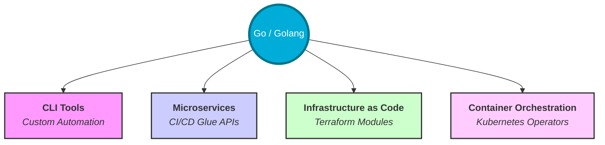

# Go Fundamentals for DevOps

> **"Go's simplicity is its strength. In the world of complex infrastructure, Go provides the reliable, high-performance foundation required for modern automation."**

Welcome to the core of your Go journey. This module bridges the gap between basic syntax and real-world DevOps application.


## Visualizing Go in the DevOps Ecosystem



## Table of Contents

* [Introduction to Go in DevOps](#introduction-to-go-in-devops)
* [Setting Up Your Go Environment for DevOps](#setting-up-your-go-environment-for-devops)
* [Writing Your First DevOps Script in Go](#writing-your-first-devops-script-in-go)
* [Advanced Topics in Go for DevOps](#advanced-topics-in-go-for-devops)
* [Tools and Frameworks for Go in DevOps](#tools-and-frameworks-for-go-in-devops)
* [Real-World Use Cases](#real-world-use-cases)
* [Knowledge Vault (Scenarios, Interview, Quiz)](#knowledge-vault)

---

## Introduction to Go in DevOps

### Why Go?

Go has become the **lingua franca** of cloud-native infrastructure. Unlike interpreted languages like Python or Ruby, Go compiles into a **single, statically linked binary**. This means you can build your automation on a Mac and deploy it to a minimal Linux container without worrying about installing a runtime or managing complex virtual environments.

### Key Advantages for Engineers

* **Performance**: Near-C speeds with the readability of Python.
* **Concurrency**: Goroutines allow you to handle thousands of concurrent tasks (like logs or network requests) with minimal overhead.
* **Static Typing**: Catch "null pointer" and type mismatch errors during development, not in your production pipelines.
* **Fast Compilation**: Build cycles are incredibly fast, enabling rapid iteration on automation scripts.

### The DevOps Hall of Fame (Built with Go)

* **Docker**: The container engine that started it all.
* **Kubernetes (K8s)**: The industry modular orchestration standard.
* **Terraform**: The pioneer of Infrastructure as Code.
* **Prometheus**: The gold standard for cloud-native monitoring.
* **Hugo**: The fastest static site generator (used for many docs sites).

---

## 💼 The Automation Why: Preparation over Procurement

**The Beginner's Question**: "Python is easier to write. Why bother with Go?"

**The Answer**: **Distribution is half the battle.**
In a production environment, you don't always have the luxury of installing runtime environments.

### The Prepared Meal Analogy 🍱

- **Python/JS** = **Blue Apron (Assembled at Home)**: You send the recipe (script) and the ingredients (dependencies). The target server MUST have the kitchen (Interpreter) and the chef (Pip/Npm) ready to cook. If a tool is missing, the meal fails.
- **Go** = **The Prepared MRE (Ready to Eat)**: You cook the entire meal in your kitchen (Compile time). You send a single, sealed package. The target server just needs to open it. It works in the middle of a desert (Distroless containers) or a high-security bunker (Air-gapped servers).

---

## Setting Up Your Go Environment for DevOps

To build reliable automation, your environment needs to be consistent and reproducible.

### 1. Installation and Environment Variables

If you haven't followed the [Foundations Guide](README.md), ensure Go is installed and these variables are configured:

* **`GOROOT`**: The directory where the Go toolchain is installed.
* **`GOPATH`**: Your workspace directory (default: `~/go`).
* **`GOBIN`**: Where compiled tools are placed (should be in your system `PATH`).

### 2. Version Control Integration

Always initialize your Go projects with Git and a proper `.gitignore` file.

```bash
git init
echo "bin/" >> .gitignore
echo "*.exe" >> .gitignore
```

### 3. Dependency Management (Go Modules)

Modern Go uses **Modules** to manage dependencies. This creates a `go.mod` file that locks your dependency versions, crucial for "reproducible builds" in CI/CD.

```bash
# Initialize a new project
mkdir my-devops-tool && cd my-devops-tool
go mod init github.com/youruser/my-devops-tool
```

---

## Writing Your First DevOps Script in Go

A common DevOps task is executing system commands and parsing their output.

### Example: System Check Script

This script checks disk usage and prints a warning if a threshold is exceeded.

```go
package main

import (
    "fmt"
    "os/exec"
    "strings"
)

func main() {
    // 1. Run a shell command to check disk usage
    out, err := exec.Command("df", "-h", "/").Output()
    if err != nil {
        fmt.Printf("Critical Error: %v\n", err)
        return
    }

    // 2. Parse the output (simple string splitting for demonstration)
    lines := strings.Split(string(out), "\n")
    if len(lines) > 1 {
        fmt.Println("📋 Current Root Partition Status:")
        fmt.Println(lines[1]) // Print the second line (data)
    }

    fmt.Println("\n✅ Automation completed successfully.")
}
```

### Breakdown

* **`os/exec`**: The package used to run external commands (like `bash`, `aws cli`, or `kubectl`).
* **`Output()`**: Captures the standard output of the command.
* **Error Handling**: Go forces you to handle the `err` immediately, preventing silent failures in your automation.

---

## Advanced Topics in Go for DevOps

### 1. Concurrency (Goroutines and Channels)

In DevOps, you often need to perform parallel operations (e.g., checking status on 50 servers).

```go
func checkServer(url string, c chan string) {
    // Logic to ping server...
    c <- url + " is UP"
}

func main() {
    c := make(chan string)
    go checkServer("api.example.com", c)
    fmt.Println(<-c)
}
```

### 2. RESTful APIs for CI/CD

Go's `net/http` package is powerful enough to build production-grade APIs without external frameworks, making it ideal for creating "Glue APIs" that connect different DevOps tools.

### 3. Logging and Error Handling

Production scripts require structured logging. Instead of `fmt.Println`, use the `log` package or third-party libraries like `zap` or `logrus` for JSON-formatted logs that ELK or Splunk can ingest.

---

## Tools and Frameworks for Go in DevOps

Leverage these industry-standard libraries to speed up your development:

* **[Cobra](https://github.com/spf13/cobra)**: The framework used by `kubectl` and `hugo` to build professional CLI tools.
* **[Viper](https://github.com/spf13/viper)**: A complete configuration solution for Go apps (handles JSON, YAML, Env vars).
* **[Client-go](https://github.com/kubernetes/client-go)**: The official library for interacting with Kubernetes clusters.
* **[Terratest](https://github.com/gruntwork-io/terratest)**: A Go library that makes it easier to write automated tests for your infrastructure code (Terraform, Packer, Docker).

---

## Real-World Use Cases

### Case Study: Kubernetes Operators

Kubernetes itself is written in Go, and most "Operators" (software that manages complex applications like databases on K8s) are written in Go using the **Operator SDK**. Go's ability to maintain long-running loops (Control Loops) while being memory-efficient is perfect for this.

### From Bash to Go: A Performance Story

Many companies migrate their complex Bash scripts to Go when they exceed a few hundred lines. Go provides:

1. **Unit Testing**: You can't easily test Bash; you can easily test Go.
2. **Strict Typing**: No more "missing variable" errors at runtime.
3. **Speed**: A Go tool can often process large log files 10-100x faster than a shell script.

---

## 🧠 Knowledge Vault

### Real-World Scenarios

#### Scenario 1: The "Dependency Hell" Escape

A startup was using a 1,500-line Bash script to deploy their microservices. The script relied on specific versions of `curl`, `jq`, and `aws-cli` being installed on developer laptops. Every time a new version of `jq` was released, the script broke for half the team.
**Go Solution**: They rewrote the tool in Go. By using Go Modules to lock versions and compiling to a single binary, they distributed the tool as a single file. No more "it works on my machine" issues.

#### Scenario 2: Parallel Pre-flight Checks

Before a major production rollout, an SRE team needed to check the health of 200 internal endpoints. In Python, this took 2 minutes using sequential requests.
**Go Solution**: Using Goroutines, they executed all 200 checks in parallel. The total runtime dropped from 120 seconds to 1.5 seconds, allowing them to integrate the health check directly into their CD pipeline's gatekeeper.

### Interview Preparation

1. **Why is Go preferred over Python for distributing CLI tools in DevOps?**
   > Go compiles into a statically linked binary that includes all its dependencies. Python requires the correct interpreter version and all library dependencies (usually managed via `pip` and virtual environments) to be present on the target machine.

2. **What is the significance of the `go.mod` file in a CI/CD pipeline?**
   > It ensures reproducible builds. It tracks the exact versions of all dependencies and their checksums (`go.sum`), guaranteeing that the code compiled in the CI/CD pipeline is identical to what the developer tested locally.

3. **How does Go's "Fast Compilation" benefit a DevOps workflow?**
   > It shortens the feedback loop. Engineers can compile and test large automation projects in seconds, and CI/CD pipelines spend less time waiting for build stages to complete.

4. **What is a "Goroutine" and how would you use it in an automation script?**
   > A Goroutine is a lightweight thread managed by the Go runtime. You would use it to perform concurrent I/O tasks, such as querying multiple cloud APIs or pinging multiple servers simultaneously, without the complexity of traditional multi-threading.

### Knowledge Check (Quiz)

1. **Which command initializes a new Go module?**
   * a) `go start`
   * b) `go init`
   * c) `go mod init` ✅

2. **What does a statically linked binary contain?**
   * a) Only the source code
   * b) The compiled code plus all its necessary libraries ✅
   * c) A reference to the system's libraries

3. **In the provided script example, which package is used to execute shell commands?**
   * a) `os/exec` ✅
   * b) `system/call`
   * c) `bash/run`

4. **Which Go tool is used to automatically format your source code?**
   * a) `go style`
   * b) `go fmt` ✅
   * c) `go fix`

5. **Why is Go's static typing an advantage for production automation?**
   * a) It makes the code run slower
   * b) It catches type-related errors at compile time before the script is deployed ✅
   * c) It allows variables to change types whenever they want

---

## Next Steps

Now that you understand the fundamental role of Go in the DevOps ecosystem, let's dive into the core syntax.

Proceed to: **[Variables and Types →](../02-Variables-and-Types/README.md)**
