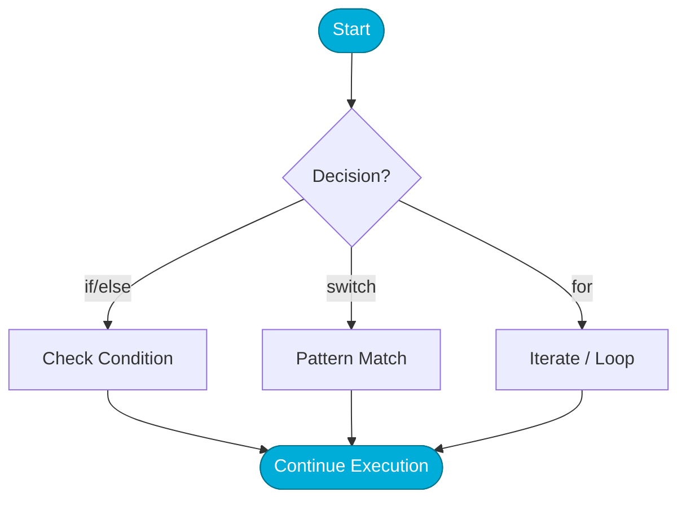

# 🔀 Control Flow in Go

> **"Logic is the steering wheel of automation. Whether you're retrying a failed cloud deployment or iterating through a list of Kubernetes pods, mastering Go's control flow ensures your scripts handle every edge case with precision."**

Control flow determines the path your program takes during execution. In Go, the philosophy is "simplicity over complexity"—there is only one way to loop, and conditional logic is designed to be as readable as possible.


## Visualizing Control Flow Patterns



## Table of Contents

* [💼 The Automation Why: The Orchestrator's Hand](#-the-automation-why-the-orchestrators-hand)
* [Conditional Logic: If and Else](#conditional-logic-if-and-else)
* [Pattern Matching: The Power of Switch](#pattern-matching-the-power-of-switch)
* [Loops: The Singular for Statement](#loops-the-singular-for-statement)
* [Iterating with range](#iterating-with-range)
* [Knowledge Vault (Scenarios, Interview, Quiz)](#knowledge-vault)

---

## 💼 The Automation Why: The Orchestrator's Hand

**The Beginner's Question**: "Loops and conditionals seem basic. How does this 'orchestrate' anything?"

**The Answer**: **Logic is the difference between a Script and an Agent.**
A script just runs commands. An **Agent** (like a Kubernetes Controller) uses control flow to observe, decide, and act. It doesn't just "deploy"—it checks if the pods are healthy (`if`), retries if they fail (`for`), and scales up if traffic hits a threshold (`switch`).

### The Assembly Line Analogy 🏭

- **Direct Execution (One-off commands)** = **The Blacksmith**: You hit the metal (run the command). You get one result. If you want ten, you hit it ten times.
- **Control Flow (The Agent)** = **The Automated Factory**: The assembly line moves a piece (The Loop). Sensors check for defects (The Conditionals). If a defect is found, it shunts the piece to a repair station (The Switch). The factory runs itself until the warehouse is full.

---

## Conditional Logic: If and Else

Go's `if` statements are familiar but distinct. You don't need parentheses, and you can include a "short statement" before the condition to keep variables scoped tightly.

### The Idiomatic "Short Statement" `if`
In DevOps, we often check the result of a function and then decide what to do.
```go
if cpu := getCPUUsage(); cpu > 90 {
    fmt.Printf("Alert! High CPU Usage: %.2f%%\n", cpu)
} else {
    fmt.Println("System performance within limits.")
}
// Note: 'cpu' is not available outside this if/else block!
```

---

## Pattern Matching: The Power of Switch

Go's `switch` is much more flexible than in other languages. It has no "fallthrough" by default (you don't need `break`), and it can be used with or without an expression.

### Switch for Complexity Management
Instead of nested `if/else` chains, use a "naked switch" to evaluate complex conditions.
```go
score := checkServerStatus()

switch {
case score < 50:
    fmt.Println("CRITICAL: Immediate action required")
case score < 80:
    fmt.Println("WARNING: System degraded")
default:
    fmt.Println("HEALTHY: No issues detected")
}
```

---

## Loops: The Singular for Statement

Go only has **one** looping construct: the `for` loop. It can do everything a `while` or `do-while` loop can do in other languages.

### Traditional For Loop
```go
for i := 0; i < 5; i++ {
    fmt.Printf("Retrying deployment... Attempt %d\n", i+1)
}
```

### The "While-Style" Loop
```go
count := 0
for count < 3 {
    fmt.Println("Connecting to vault...")
    count++
}
```

### The Infinite Loop
Common for long-running service "control loops" that monitor state.
```go
for {
    syncState()
    time.Sleep(10 * time.Second)
    if shouldHalt() {
        break // Escape the loop
    }
}
```

---

## Iterating with range

When dealing with lists of servers, pods, or IP addresses, `range` is your best friend. It returns both the **index** and the **value**.

```go
servers := []string{"web-01", "db-01", "api-01"}

for index, name := range servers {
    fmt.Printf("Analyzing server %d: %s\n", index, name)
}

// Ignore index if not needed
for _, name := range servers {
    deployApp(name)
}
```

---

## Knowledge Vault

### Real-World Scenarios

#### Scenario 1: The Exponential Backoff
A deployment script was failing because it hammer-pings a database before it was fully initialized. The simple loop was too fast.
**Go Solution**: By using a `for` loop combined with `time.Sleep` and a `switch` to handle different retry increments, the engineer implemented "Exponential Backoff." This allowed the database time to breathe between attempts, increasing deployment success rates by 40%.

#### Scenario 2: The "Control Loop" Pattern
A custom Kubernetes administrator needed to monitor a cluster and delete any pod that didn't have a specific security label.
**Go Solution**: An infinite `for` loop was used to fetch pods every minute. Inside, a `for range` loop iterated through each pod, and an `if` statement checked for the missing label. This "Control Loop" pattern is the foundation of how Kubernetes itself works.

### Interview Preparation

1. **Why does Go only have the `for` loop and no `while` loop?**
   > To keep the language minimal and the syntax consistent. A `for` loop with only a condition acts exactly like a `while` loop, reducing the number of keywords an engineer needs to learn.

2. **What is the benefit of the "if with a short statement"?**
   > It limits the scope of the variable to the `if/else` block. This prevents variable "shadowing" or accidental reuse in other parts of the script, making the code safer and more maintainable.

3. **How do you break out of a loop in Go?**
   > Use the `break` keyword. To skip an iteration and move to the next, use `continue`.

4. **Does Go's switch statement fall through by default?**
   > No. In Go, once a `case` is matched, it executes and exits the `switch`. If you explicitly want to move to the next case, you must use the `fallthrough` keyword (though this is rare in DevOps scripts).

### Knowledge Check (Quiz)

1. **How do you write an infinite loop in Go?**
   * a) `while(true) { }`
   * b) `for { }` ✅
   * c) `for(;;)`

2. **In a `switch` statement, which case is executed if no others match?**
   * a) `else`
   * b) `catch`
   * c) `default` ✅

3. **What does the `range` keyword return when iterating over a slice?**
   * a) Only the index
   * b) Only the value
   * c) Both index and value ✅

4. **Is it mandatory to use parentheses in an `if` statement?**
   * a) Yes
   * b) No ✅

5. **Which keyword is used to skip the rest of a loop iteration?**
   * a) `break`
   * b) `skip`
   * c) `continue` ✅

---

## Next Steps

Now that you can control the logic of your scripts, it's time to organize your code into reusable units.

Proceed to: **[Functions →](../04-Functions/README.md)**
