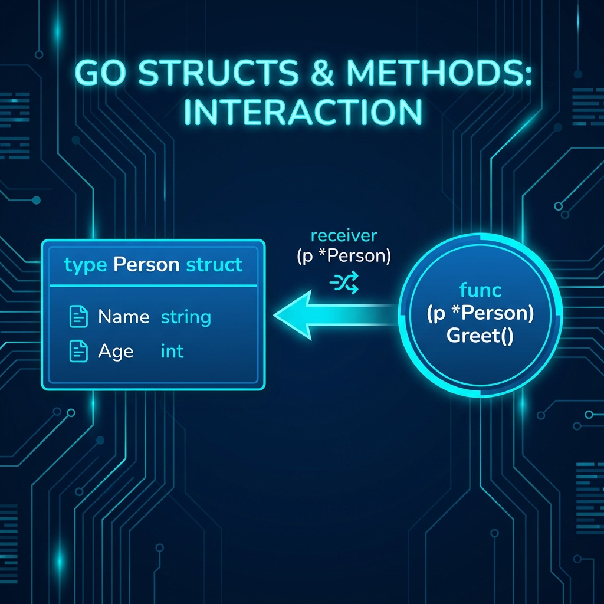

# 🏗️ Structs and Methods in Go

> **"Structs and methods are the architectural foundation of Go. By grouping data and behavior together, you can model complex systems—from server configurations to cloud resources—with clarity and type safety."**

In Go, there are no classes. Instead, we use **Structs** to define the shape of our data and **Methods** to define its behavior. This approach encourages composition over inheritance, leading to cleaner and more maintainable codebases.



## Table of Contents
- [💼 The Automation Why: The Blueprint for Complexity](#-the-automation-why-the-blueprint-for-complexity)
- [Introduction to Structs](#introduction-to-structs)
- [Working with Structs](#working-with-structs)
- [Introduction to Methods](#introduction-to-methods)
- [Practical Use Cases](#practical-use-cases)
- [Best Practices](#best-practices)
- [🧠 Knowledge Vault](#-knowledge-vault)
- [Additional Resources](#additional-resources)

---

## 💼 The Automation Why: The Blueprint for Complexity

**The Beginner's Question**: "I can just use maps or variables. Why bother with structs?"

**The Answer**: **Organization is the key to scaling.**
In DevOps, you rarely handle single variables. You handle **resources**. A "Server" isn't just a hostname; it's an IP, a region, an instance type, and a set of tags. If you pass these around as separate variables, your functions quickly become unreadable and error-prone. Structs allow you to package "The Truth" about a resource into a single, type-safe unit.

### The Passport Analogy 🛂

- **Variables (Loose Strings)** = **Loose Documents**: Name, Birth Date, and Nationality on separate scraps of paper. Hard to manage, easy to lose, and they have no group identity. If you lose one, the rest are useless.
- **Structs** = **The Passport**: A single booklet containing all related fields in one place. It's a cohesive unit that "travels" (passes through functions) together. You don't pass name/age separately; you pass the `Passport`. The computer (The Compiler) ensures every field in the booklet is present and valid.

---

## Introduction to Structs

### What is a Struct?
A **struct** (short for structure) is a composite data type that groups together variables (fields) under a single name. While basic types like `string` or `int` represent single values, a struct represents a collection of related data.

### Key Features
*   **Custom Data Types**: Structs allow you to create your own types that match your domain (e.g., `Server`, `User`, `Container`).
*   **Heterogeneous Fields**: Unlike arrays or slices, fields within a struct can have different data types.

### Example: A Simple Struct
```go
type Person struct {
    Name string
    Age  int
}
```

### Declaration and Initialization
```go
// Direct initialization
p := Person{Name: "Alice", Age: 30}

// Using zero values
var bob Person
bob.Name = "Bob"
bob.Age = 25

fmt.Println(p) // Output: {Alice 30}
```

---

## Working with Structs

### Accessing and Modifying Fields
You use the "dot" (`.`) operator to access or change the values inside a struct.
```go
p.Name = "Bob"
fmt.Println(p.Name) // Output: Bob
```

### Anonymous Structs
Sometimes you need a structure only once (e.g., for a quick configuration or a JSON response). You can define it without giving it a formal name.
```go
car := struct {
    Make  string
    Model string
}{
    Make:  "Toyota",
    Model: "Corolla",
}
fmt.Println(car)
```

### Struct Embedding (Composition)
Go doesn't have traditional inheritance. Instead, we use **Embedding** to "compose" larger structures from smaller ones.
```go
type Address struct {
    City    string
    Country string
}

type Employee struct {
    Name    string
    Address Address // Explicit field
}

// Or using anonymous embedding (promotion)
type Admin struct {
    Employee // Embedded field
    Role     string
}

e := Employee{
    Name: "John",
    Address: Address{
        City:    "New York",
        Country: "USA",
    },
}
fmt.Println(e.Address.City) // Output: New York
```

---

## Introduction to Methods

### What is a Method?
A **method** is a function with a special "receiver" argument. It allows you to "attach" behavior to a specific type, effectively making it act like a class method in other languages.

### Key Features
*   **Encapsulation**: Methods help hide complex logic behind a simple API.
*   **Receiver Types**: A receiver can be a **Value** (operates on a copy) or a **Pointer** (can modify the original data).

### Example: A Method with a Receiver
```go
func (p Person) Greet() string {
    return "Hello, my name is " + p.Name
}

p := Person{Name: "Alice", Age: 30}
fmt.Println(p.Greet()) // Output: Hello, my name is Alice
```

---

## Practical Use Cases

### Example: Modeling a Bank Account
This scenario demonstrates how structs hold state while methods manage the logic and validation.

```go
type Account struct {
    Owner   string
    Balance float64
}

// Deposit uses a pointer receiver to modify the balance
func (a *Account) Deposit(amount float64) {
    a.Balance += amount
}

// Withdraw returns an error if the balance is too low
func (a *Account) Withdraw(amount float64) error {
    if amount > a.Balance {
        return fmt.Errorf("insufficient funds for owner %s", a.Owner)
    }
    a.Balance -= amount
    return nil
}

func main() {
    account := Account{Owner: "Alice", Balance: 1000}
    account.Deposit(500)
    
    if err := account.Withdraw(2000); err != nil {
        fmt.Println("Error:", err)
    }
}
```

---

## Best Practices

*   **Meaningful Naming**: Choose field names that clearly describe the data they hold (e.g., `CPUAllocation` over `C`).
*   **Pointer Receivers**: Always use a pointer receiver (`*Type`) if the method needs to modify the struct, or if the struct is very large and you want to avoid expensive copies.
*   **Favor Composition**: Use struct embedding to build complex objects instead of trying to mimic deep class hierarchies.
*   **Visibility**: Use capitalization to control export status. `Name` is public; `age` is private to the package.

---

## 🧠 Knowledge Vault

### Real-World Scenarios

#### Scenario 1: The Cloud Resource Manager
A DevOps team needs to track the state of 500 Virtual Machines across three different providers.
**Go Solution**: They defined a `Resource` struct with fields like `ID`, `Tags`, and `State`. By attaching methods like `Start()`, `Stop()`, and `Decommission()`, they created a unified tool that manages any cloud resource regardless of its specific provider details.

#### Scenario 2: Configuration Validation
A CLI tool reads a YAML config file into a struct.
**Go Solution**: The engineer attached a `Validate() error` method to the `Config` struct. Every time the config is loaded, the method checks if required fields like `API_Key` or `Target_Region` are populated and valid, preventing silent script failures in production.

### Interview Preparation

1. **What is the difference between a Value Receiver and a Pointer Receiver?**
   > A Value Receiver works on a copy of the struct, so changes made inside the method won't affect the caller. A Pointer Receiver works on the original struct, allowing it to modify fields and improving performance by avoiding data copies.

2. **Can you add methods to basic types like `int`?**
   > No, you cannot add methods to built-in types directly. However, you can create a custom type (e.g., `type MyInt int`) and then attach methods to that custom type.

3. **How does Go handle "Inheritance"?**
   > Go uses **Composition** via struct embedding. Instead of a "Child" inheriting from a "Parent," the "Child" embeds the "Parent" as a field. All fields and methods of the embedded struct are "promoted" to the wrapper struct.

4. **Why are Struct Tags used?**
   > Struct tags (e.g., `` `json:"id"` ``) provide metadata to other packages, like `encoding/json` or `database/sql`. They tell the Go runtime how to map struct fields to external formats like JSON keys or database columns.

### Knowledge Check (Quiz)

1. **How do you denote a Pointer Receiver?**
   * a) `func (s Server) Start()`
   * b) `func (s *Server) Start()` ✅
   * c) `func Start(s Server)`

2. **Is it possible to define a struct without a name for immediate use?**
   * a) Yes, it's called an Anonymous Struct ✅
   * b) No, all structs must have a `type` definition
   * c) Only if it's inside a function

3. **What is "Promotion" in the context of embedded structs?**
   * a) Upgrading a field type to a higher bit-count
   * b) Accessing fields of an embedded struct as if they belonged to the top-level struct ✅
   * c) Using a struct to represent an interface

4. **Which operator is used to access a struct field?**
   * a) `->`
   * b) `::`
   * c) `.` ✅

5. **When should you prefer composition over inheritance?**
   * a) Only in large projects
   * b) Always in Go, as it doesn't support class inheritance ✅
   * c) Only when using pointers

---

## Additional Resources

*   **Official Go Documentation on Structs**: [https://golang.org/ref/spec#Struct_types](https://golang.org/ref/spec#Struct_types)
*   **Go Tour**: [https://tour.golang.org/moretypes/2](https://tour.golang.org/moretypes/2)
*   **Recommended Books**:
    *   *"The Go Programming Language"* by Alan A. A. Donovan and Brian W. Kernighan.

---

**Next Step**: [Interfaces →](../02-Interfaces/README.md)
