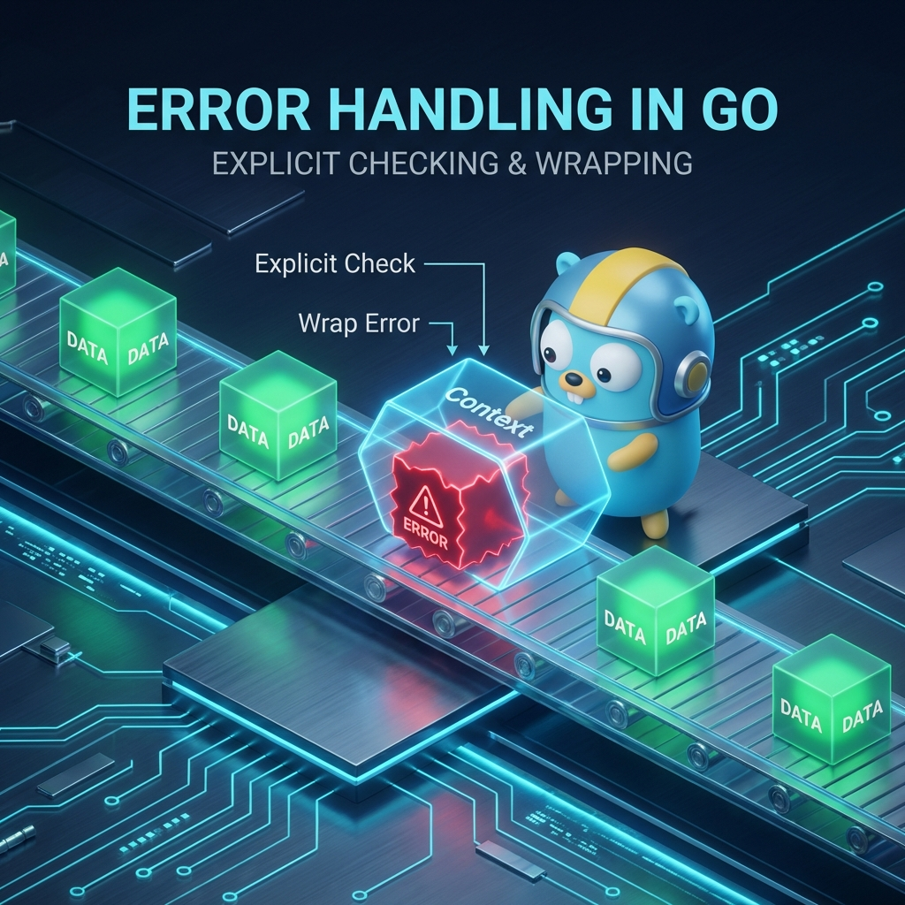

# ⚠️ Error Handling in Go

> **"Go's philosophy on errors is simple: errors are values. They aren't something to 'catch' and ignore; they are pieces of data to be inspected, handled, and wrapped with context to ensure your automation fails gracefully and informatively."**

In Go, there are no exceptions like in Python or Java. Instead, functions that can fail return an `error` as their last return value. This explicit approach prevents silent failures and ensures that your DevOps scripts are robust and predictable.



## Table of Contents

* [Introduction to Error Handling](#introduction-to-error-handling)
* [The error Interface](#the-error-interface)
* [Errors as Values: Basic Handling](#errors-as-values-basic-handling)
* [Custom Error Types](#custom-error-types)
* [Error Wrapping and Context](#error-wrapping-and-context)
* [Panic and Recover](#panic-and-recover)
* [Best Practices](#best-practices)
* [Knowledge Vault (Scenarios, Interview, Quiz)](#knowledge-vault)
* [Additional Resources](#additional-resources)

---

## 💼 The Automation Why: The Conversation with the Machine

**The Beginner's Question**: "Error checking after every line is so verbose. Why can't I just use `try-catch`?"

**The Answer**: **Silent failures are the root of all outages.**
In an automated system, if a database migration fails and the script "bubbles up" that error to an ignored catch block, the script keeps running. This leads to "Zombie Automation"—scripts that are technically running but causing massive damage. Go forces you to acknowledge every failure, ensuring that if anything goes wrong, the script stops immediately or takes corrective action.

### The Check Engine Light Analogy 🏎️

- **Exceptions (Python/Java)** = **The Airbag Deployment**: You keep driving until a catastrophic event happens (the exception). The airbag hits you in the face, the car stops, and the journey is over. It's violent, reactive, and often happens too late to save the "engine" (Your Data). 
- **Errors as Values (Go)** = **The Dashboard Check Engine Light**: The car’s sensors (Your Codes) notice a small problem (low oil, loose gas cap). It doesn't stop the car; it gives the driver (The Engineer) a clear indicator (The Error Value). You can choose to pull over immediately (`if err != nil`), or keep driving if you know the risk. It's a proactive conversation between the machine and the operator.

---

## Introduction to Error Handling

### Why No Exceptions?

Go avoids traditional `try-catch` blocks because they often encourage developers to ignore errors or handle them far away from where they occurred. By returning errors explicitly, Go forces you to deal with them immediately, making the "happy path" of your code clear and the "error path" intentional.

---

## The error Interface

In Go, an error is any type that satisfies the built-in `error` interface:

```go
type error interface {
    Error() string
}
```

This simple definition allows you to turn any custom struct into an error by just adding an `Error()` method.

---

## Errors as Values: Basic Handling

The most common pattern in Go is checking if the returned error is `nil`.

```go
func checkConnectivity(url string) error {
    resp, err := http.Get(url)
    if err != nil {
        return err // Basic return
    }
    defer resp.Body.Close()
    
    if resp.StatusCode != 200 {
        return fmt.Errorf("server returned status: %d", resp.StatusCode)
    }
    return nil
}

func main() {
    if err := checkConnectivity("https://api.health.com"); err != nil {
        log.Printf("Monitor Alert: %v", err)
        // Logic to handle failure (e.g., restart service)
    }
}
```

---

## Custom Error Types

For more complex automation, you may need to pass more than just a string message. You can create custom structs to hold metadata about the failure.

```go
type DeploymentError struct {
    Namespace string
    PodName   string
    ExitCode  int
}

func (e *DeploymentError) Error() string {
    return fmt.Sprintf("deploy failed in %s: pod %s exited with %d", e.Namespace, e.PodName, e.ExitCode)
}

func deployApp() error {
    return &DeploymentError{Namespace: "prod", PodName: "web-01", ExitCode: 1}
}
```

---

## Error Wrapping and Context

Since Go 1.13, you can **wrap** errors to add context while preserving the original error. Use `%w` with `fmt.Errorf`.

### Wrapping an Error

```go
func loadDBConfig() error {
    err := os.ReadFile("db.yaml")
    if err != nil {
        return fmt.Errorf("failed to load database config: %w", err)
    }
    return nil
}
```

### Inspecting Wrapped Errors

Use `errors.Is` to check for specific error values (sentinels) and `errors.As` to extract custom error types.

```go
// Check for specific value
if errors.Is(err, os.ErrNotExist) {
    fmt.Println("Config file missing!")
}

// Extract custom type
var dErr *DeploymentError
if errors.As(err, &dErr) {
    fmt.Printf("Cleaning up namespace: %s\n", dErr.Namespace)
}
```

---

## Panic and Recover

`panic` is used for truly unrecoverable states (like out-of-memory or logic bugs). It stops the normal execution of the program. `recover` can stop a panic from crashing the program, but it should be used sparingly (e.g., in a web server to prevent a single request from killing the whole process).

```go
func safeMode() {
    defer func() {
        if r := recover(); r != nil {
            fmt.Println("Recovered from panic:", r)
        }
    }()
    panic("catastrophic hardware failure")
}
```

---

## Best Practices

* **Check Errors Early**: Use the "line of sight" principle—indent the error handling and keep the success case at the lowest indentation level.
* **Add Context**: Don't just return `err`. Use `fmt.Errorf("context: %w", err)` so you know *where* the failure happened.
* **Sentinel Errors**: Define global variables for common errors (e.g., `var ErrPermissionDenied = errors.New(...)`) to make checking easier.
* **Don't Logging AND Return**: Either handle the error (log it) or return it to the caller. Doing both creates duplicate log entries and confusion.

---

## Knowledge Vault

### Real-World Scenarios

#### Scenario 1: The "Silent Deployment" Failure

A CI/CD tool was written in Python. A network timeout occurred during a critical database migration step, but because it was inside a broad `try-except: pass` block, the script continued. The production app launched against an unmigrated database and crashed instantly.
**Go Solution**: By using explicit error checking after the migration call, the Go version of the tool caught the timeout immediately and triggered an automatic rollback, preventing the broken deployment from ever reaching the live traffic.

#### Scenario 2: Error Wrapping for Troubleshooting

An SRE was debugging a "Connection Refused" error in a complex microservice chain. The logs just said `connection refused`, but there were 50 different API calls being made.
**Go Solution**: The engineer implemented error wrapping. The new log read: `provision_cluster: setup_nodes: verify_connection: dial tcp 10.0.1.5:80: connection refused`. The added context pointed exactly to which stage and which IP was failing, reducing MTTR (Mean Time To Repair) from hours to minutes.

### Interview Preparation

1. **How is Go's error handling more "portable" for DevOps tools?**
   > Because errors are values, they can be easily serialized into JSON or logged into structured formats (like ELK/Datadog) with their full context, making them much easier to analyze across a fleet of thousands of servers compared to stack-heavy exceptions.

2. **When should you use `panic` instead of returning an `error`?**
   > Almost never in business logic. `panic` should be reserved for "programming errors" (like accessing an out-of-bounds array index) or truly unrecoverable system states where the program cannot safely continue.

3. **What is the purpose of `errors.Is(err, ErrTarget)`?**
   > It checks if a specific error is present anywhere in the error chain (unwrapping it recursively). This is safer than `err == ErrTarget` because it handles wrapped errors correctly.

4. **Why is the "Value Receiver" vs "Pointer Receiver" important for custom errors?**
   > While both can work, it is standard practice to use a **Pointer Receiver** for custom error types (e.g., `*MyError`) to ensure that `errors.As` can correctly extract the type and metadata.

### Knowledge Check (Quiz)

1. **Which function is used to wrap an error with context?**
   * a) `errors.Wrap()`
   * b) `fmt.Errorf("context: %w", err)` ✅
   * c) `panic(err)`

2. **What does `errors.As()` do?**
   * a) Changes the error message
   * b) Extracts a specific type from an error chain if it exists ✅
   * c) Ignores the error

3. **What is a "Sentinel Error"?**
   * a) An error that happens at the end of a script
   * b) A predefined error variable used for comparison ✅
   * c) An error that prevents a panic

4. **Which keyword allows a program to 'catch' a panic?**
   * a) `catch`
   * b) `recover` ✅
   * c) `resume`

5. **In Go, the standard return for a failing function is:**
   * a) `(result, error)` ✅
   * b) `(error, result)`
   * c) `bool`

---

## Additional Resources

* **Official Blog on Errors**: [https://blog.golang.org/go1.13-errors](https://blog.golang.org/go1.13-errors)
* **Effective Go: Errors**: [https://golang.org/doc/effective_go#errors](https://golang.org/doc/effective_go#errors)
* **Go by Example: Errors**: [https://gobyexample.com/errors](https://gobyexample.com/errors)

---

**Next Step**: [File Operations →](../04-File-Operations/README.md)
