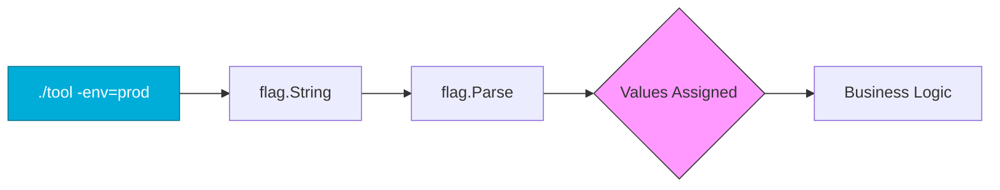

# ⌨️ CLI Flags: Building Professional DevOps Tools

> **"The interface of your tool is its contract with the engineer. Well-designed command-line flags transform a simple automation script into a production-grade utility that is discoverable, documented, and safe to use."**

In DevOps, we rarely write scripts that run in isolation. We build tools that need to know which **environment** to target, which **port** to listen on, or whether to enable **verbose** logging. Go's built-in `flag` package allows you to define these parameters with minimal code, while providing automatic `--help` documentation for free.

## Anatomy of CLI Parsing



## Table of Contents

* [Defining Flags: Pointers vs. Variables](#defining-flags-pointers-vs-variables)
* [The Critical flag.Parse() Step](#the-critical-flagparse-step)
* [Handling Positional Arguments](#handling-positional-arguments)
* [Customizing Help and Usage Text](#customizing-help-and-usage-text)
* [Practical Use Case: Infrastructure Deployer](#practical-use-case-infrastructure-deployer)
* [Best Practices](#best-practices)
* [Knowledge Vault (Scenarios, Interview, Quiz)](#knowledge-vault)
* [Additional Resources](#additional-resources)

---

## 💼 The Automation Why: The Steering Wheel of Logic

**The Beginner's Question**: "I can just edit 'const env = "prod"' in my code. Why bother with flags?"

**The Answer**: **Compiled tools shouldn't be rebuilt for small changes.**
One of Go's greatest strengths is distributing binaries. If your script has a hard-coded "Environment" variable, you have to re-compile and re-deploy that binary every time you want to switch from Staging to Production. Flags allow you to build the binary **once** and decide its behavior at **runtime**.

### The Steering Wheel Analogy 🎡

- **Hard-coded Scripts** = **A Train**: It goes exactly where the tracks (The Code) are laid. If you want to go somewhere else (Different Environment), you have to pull up the tracks and relay them. It's inflexible and dangerous if a mistake is made during the "relay."
- **CLI Flags** = **The Steering Wheel**: The car's engine (The Logic) stays the same, but the driver (The Engineer) can decide exactly where to go by turning the wheel. Flags allow you to steer the same code into different environments, regions, or configurations dynamically without touching the "engine" (The Source Code).

---

## Defining Flags: Pointers vs. Variables

Go provides two primary ways to define flags. Choose the one that fits your coding style.

### Option 1: Basic Pointer Types (Most Common)

Returns a pointer to the value. You must dereference it (`*var`) to get the value.

```go
host := flag.String("host", "localhost", "Server hostname")
port := flag.Int("port", 8080, "Server port")
```

### Option 2: Variable Binding

Binds the flag directly to an existing variable. Useful when flags are part of a struct.

```go
var region string
flag.StringVar(&region, "region", "us-east-1", "AWS Region")
```

---

## The Critical flag.Parse() Step

Defining flags is just "telling" Go what to look for. No data is actually read from the command line until you call `flag.Parse()`.

```go
func main() {
    env := flag.String("env", "staging", "Target environment")
    
    // CRITICAL: Values of 'env' remain default until this call
    flag.Parse() 
    
    fmt.Printf("Deploying to: %s\n", *env)
}
```

**Note**: `flag.Parse()` stops at the first "non-flag" argument it encounters.

---

## Handling Positional Arguments

Positional arguments are parameters provided after the flags (e.g., `./tool -v pod-name`). These are retrieved using `flag.Args()` or `flag.Arg(i)`.

```go
flag.Parse()

// Remaining arguments after flags
args := flag.Args() 
if len(args) < 1 {
    log.Fatal("Error: Mission pod name")
}

podName := args[0]
fmt.Println("Processing pod:", podName)
```

---

## Customizing Help and Usage Text

Every Go CLI tool automatically supports `-h` or `--help`. You can customize this output to provide a more professional experience.

```go
flag.Usage = func() {
    fmt.Fprintf(os.Stderr, "Custom Deploy Tool v1.0\n")
    fmt.Fprintf(os.Stderr, "Usage: deploy [options] <app-name>\n\nOptions:\n")
    flag.PrintDefaults()
}
```

---

## Practical Use Case: Infrastructure Deployer

A typical DevOps scenario where we need strings, integers, and booleans to control a deployment.

```go
func main() {
    region := flag.String("region", "us-east-1", "Cloud region to target")
    replicas := flag.Int("replicas", 2, "Number of pods to scale")
    dryRun := flag.Bool("dry-run", false, "Preview and validate without applying")
    
    flag.Parse()
    
    if *dryRun {
        fmt.Printf("[DRY RUN] Scaling app in %s to %d replicas\n", *region, *replicas)
        return
    }
    
    // Real deployment logic here...
}
```

---

## Best Practices

* **Meaningful Defaults**: Provide safe defaults (e.g., `localhost` or `staging`) to prevent accidental production impact.
* **Helpful Descriptions**: Always provide a clear description string; it’s what users see when they run `-help`.
* **Short vs. Long Flags**: Go's `flag` package treats `-env` and `--env` identically.
* **Avoid Complex Logic in main**: Parse your flags in `main`, but pass the resulting values/structs to separate functions to keep code testable.

---

## Knowledge Vault

### Real-World Scenarios

#### Scenario 1: The "Accidental Prod" Disaster

An engineer wrote a script to clean up old database backups. The script had a flag `-target` which defaulted to "production" because the engineer was working on prod most of the time. While testing locally, they forgot the flag, and the script wiped the production backups.
**Go Solution**: In the safe version, they set the default to "dev" or "none" and forced the user to explicitly type `-target=prod` to proceed, drastically reducing the "blast radius" of human error.

#### Scenario 2: Standardizing Logging with Flags

A team has 50 different microservices. Some output too much info, others too little.
**Go Solution**: They added a `-v` (verbose) flag to their shared library. By default, it's `false` (Info level). If an engineer needs to debug, they simply run `myservice -v`, which sets the logger to "Debug" mode instantly without a code rebuild.

### Interview Preparation

1. **How do you access non-flag arguments in Go?**
   > After calling `flag.Parse()`, you use `flag.Args()` to get a slice of all remaining arguments, or `flag.Arg(i)` to get a specific one by index.

2. **What happens if a user provides an undefined flag?**
   > The `flag` package will print an "error: flag provided but not defined" message, show the usage information, and the program will exit with a non-zero code.

3. **Why do the `flag.String` and `flag.Int` functions return pointers?**
   > Because the `flag.Parse()` function needs to update the values *after* they have been defined. By returning a pointer, the variable "points" to a location in memory that Go can update during parsing.

4. **Can you parse flags multiple times?**
   > `flag.Parse()` is generally called only once at the start of the program. If you need more complex parsing (like subcommands), you should use `flag.NewFlagSet`.

### Knowledge Check (Quiz)

1. **What is the correct way to get the value of a flag defined as `p := flag.Int("port", 80, "")`?**
   - a) `p`
   - b) `*p` ✅
   - c) `p.Value()`

2. **Where in your program must `flag.Parse()` be located?**
   - a) Before any flag definitions
   - b) After flag definitions but before using the flag values ✅
   - c) At the very end of the main function

3. **Which function allows you to bind a flag to an existing variable?**
   - a) `flag.BindString()`
   - b) `flag.StringVar()` ✅
   - c) `flag.Connect()`

4. **Which flag is automatically provided by Go's `flag` package?**
   - a) `-v`
   - b) `-f`
   - c) `-h` ✅

5. **When does `flag.Parse()` stop looking for flags?**
   - a) When it reaches the end of the line
   - b) When it encounters a non-flag argument (one that doesn't start with -) ✅
   - c) Both a and b

---

## Additional Resources

* **Official flag package docs**: [pkg.go.dev/flag](https://pkg.go.dev/flag)
* **Go by Example: Command Line Flags**: [gobyexample.com/command-line-flags](https://gobyexample.com/command-line-flags)
* **Better CLI library**: [Cobra](https://github.com/spf13/cobra) (Standard for tools like `kubectl` and `hugo`)

---

**Next Step**: [Environment Variables →](../02-Environment-Variables/README.md)
