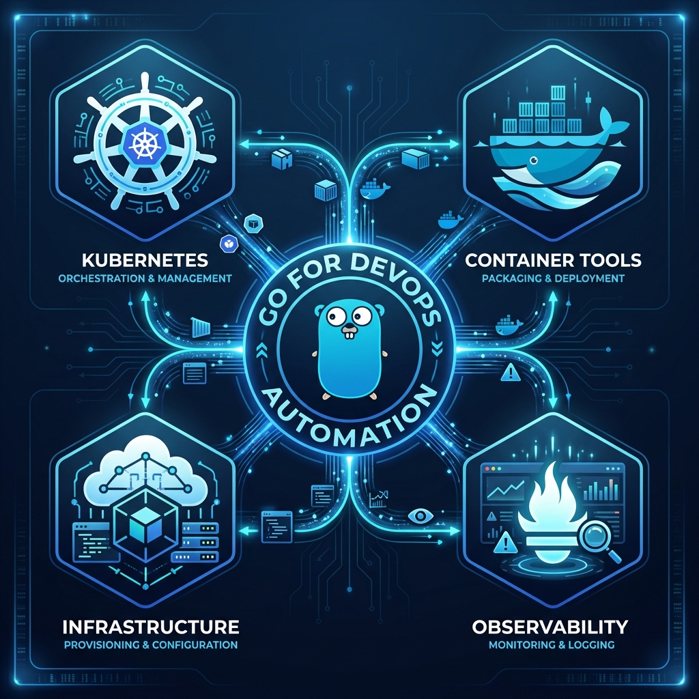
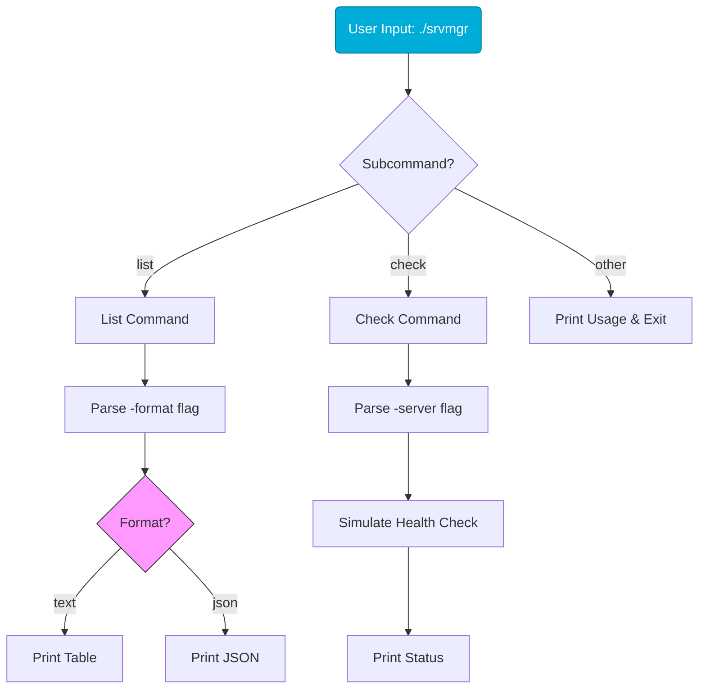

# 🚀 Capstone: Your First Go CLI Tool

> **"Congratulations! You've mastered the building blocks. Now it's time to assemble them into a professional-grade DevOps tool. In this capstone, we will build `srvmgr`, a lightweight server management CLI that mimics tools like `kubectl` or `aws-cli`."**

The power of Go in DevOps comes from its ability to compile into a single, static binary that runs anywhere. We will combine **Command Line Flags**, **Structs**, **JSON**, and **Switch Statements** to build a tool that supports subcommands (`list` and `check`), output formatting, and Linux/MacOS cross-compilation.



## Table of Contents

* [Tool Architecture & Design](#tool-architecture--design)
* [Step 1: Implementing Subcommands](#step-1-implementing-subcommands)
* [Step 2: JSON & Text Output Formatting](#step-2-json--text-output-formatting)
* [Step 3: Building and Cross-Compiling](#step-3-building-and-cross-compiling)
* [Full Source Code](#full-source-code)
* [Knowledge Vault (Scenarios, Interview, Quiz)](#knowledge-vault)
* [Next Steps](#next-steps)

---

## 💼 The Automation Why: The Birth of a Product

**The Beginner's Question**: "I have 10 separate scripts that work. Why combine them into one CLI tool?"

**The Answer**: **Distribution is the bottleneck of automation.**
If you have 10 scripts, your team needs to manage 10 files. If you update one, you have to ensure everyone has the latest version. By combining them into a single CLI tool with subcommands (like `git`), you create a **Product**, not just a script. One file to download, one version to track, and a single, unified interface for your entire team.

### The Leatherman Analogy 🛠️

- **Scripts** = **A Collection of Single Tools**: A drawer full of loose screwdrivers, pliers, and knives. They are hard to carry, easy to lose, and you never have the right one when you are "in the field" (SSH'd into a production server).
- **The Capstone CLI** = **The Professional Leatherman**: You take all those utility functions (List Servers, Check Health, Deploy Config) and fold them into a single, pocket-sized unit (The Go Binary). One tool, many functions. It’s light (Zero dependencies), durable (Compiled), and works exactly the same whether you are at your desk or 10,000 feet in the air (In the Cloud).

---

## Tool Architecture & Design

Our tool, `srvmgr`, will handle two primary operations:
1.  **List**: Display all servers in the inventory (Support for JSON or Table format).
2.  **Check**: Perform a simulated health check on a specific server by name.



---

## Step 1: Implementing Subcommands

Go's `flag` package supports **FlagSets**, which allow different commands to have different flags (just like `git commit` has different flags than `git status`).

```go
// Define subcommands
listCmd := flag.NewFlagSet("list", flag.ExitOnError)
checkCmd := flag.NewFlagSet("check", flag.ExitOnError)

// Check which command was provided
switch os.Args[1] {
case "list":
    listCmd.Parse(os.Args[2:])
case "check":
    checkCmd.Parse(os.Args[2:])
default:
    fmt.Println("Expected 'list' or 'check' subcommands")
    os.Exit(1)
}
```

---

## Step 2: JSON & Text Output Formatting

DevOps tools must be friendly to both humans (Tables) and machines (JSON).

```go
func listServers(format string) {
    servers := []Server{
        {Name: "web-01", IP: "10.0.1.10", Status: "healthy"},
        {Name: "db-01", IP: "10.0.2.10", Status: "warning"},
    }
    
    if format == "json" {
        // Machine-readable output
        data, _ := json.MarshalIndent(servers, "", "  ")
        fmt.Println(string(data))
    } else {
        // Human-readable table
        w := tabwriter.NewWriter(os.Stdout, 0, 0, 3, ' ', 0)
        fmt.Fprintln(w, "NAME\tIP\tSTATUS")
        for _, s := range servers {
            fmt.Fprintf(w, "%s\t%s\t%s\n", s.Name, s.IP, s.Status)
        }
        w.Flush()
    }
}
```

---

## Step 3: Building and Cross-Compiling

The feature that makes Go the "Language of the Cloud" is the ease of building binaries for other operating systems.

### Standard Build
```bash
go build -o srvmgr
./srvmgr list
```

### Cross-Compile for Linux (e.g., for Docker/EC2)
```bash
# On Windows PowerShell
$env:GOOS = "linux"
$env:GOARCH = "amd64"
go build -o srvmgr-linux
```

### Cross-Compile for MacOS (Apple Silicon)
```bash
$env:GOOS = "darwin"
$env:GOARCH = "arm64"
go build -o srvmgr-mac
```

---

## Full Source Code

```go
package main

import (
    "encoding/json"
    "flag"
    "fmt"
    "os"
    "text/tabwriter"
    "time"
)

type Server struct {
    Name   string `json:"name"`
    IP     string `json:"ip"`
    Status string `json:"status"`
}

func main() {
    // 1. Validate Arguments
    if len(os.Args) < 2 {
        fmt.Println("Usage: srvmgr <command> [options]")
        os.Exit(1)
    }

    // 2. Define Subcommands
    listCmd := flag.NewFlagSet("list", flag.ExitOnError)
    listFormat := listCmd.String("format", "text", "Output format (text|json)")

    checkCmd := flag.NewFlagSet("check", flag.ExitOnError)
    checkServer := checkCmd.String("server", "", "Server name to check")

    // 3. Switch on Command
    switch os.Args[1] {
    case "list":
        listCmd.Parse(os.Args[2:])
        listServers(*listFormat)
    case "check":
        checkCmd.Parse(os.Args[2:])
        if *checkServer == "" {
            checkCmd.PrintDefaults()
            os.Exit(1)
        }
        performCheck(*checkServer)
    default:
        fmt.Println("Unknown command:", os.Args[1])
        os.Exit(1)
    }
}

func listServers(format string) {
    servers := []Server{
        {Name: "web-01", IP: "10.0.1.10", Status: "healthy"},
        {Name: "api-01", IP: "10.0.1.20", Status: "healthy"},
        {Name: "db-01", IP: "10.0.2.10", Status: "warning"},
    }

    if format == "json" {
        data, _ := json.MarshalIndent(servers, "", "  ")
        fmt.Println(string(data))
        return
    }

    w := tabwriter.NewWriter(os.Stdout, 0, 0, 3, ' ', 0)
    fmt.Fprintln(w, "NAME\tIP\tSTATUS")
    for _, s := range servers {
        fmt.Fprintf(w, "%s\t%s\t%s\n", s.Name, s.IP, s.Status)
    }
    w.Flush()
}

func performCheck(name string) {
    fmt.Printf("Checking connectivity to %s...\n", name)
    time.Sleep(500 * time.Millisecond) // Simulate network latency
    fmt.Printf("✓ %s is %s\n", name, "ONLINE")
}
```

---

## Knowledge Vault

### Real-World Scenarios

#### Scenario 1: The "Works on My Machine" Problem
A Python script used for deployment worked on the developer's laptop but failed on the Alpine Linux production server because of missing library dependencies (`pip install` failed).
**Go Solution**: The developer rewrote the utility in Go and cross-compiled it (`GOOS=linux`). The resulting single binary had **zero dependencies** and ran perfectly on the Alpine server immediately.

#### Scenario 2: Platform CLI Tools
Companies like HashiCorp (Terraform, Vault) and Docker (Docker CLI) write their CLIs in Go. Why?
**Reason**: Because Go enables "Platform Engineering" teams to distribute a single tool that unifies complex workflows (e.g., "setup-cloud", "deploy-app") into simple commands that developers love to use.

### Interview Preparation

1.  **What is a Subcommand in a CLI?**
    > A subcommand is the primary argument that tells the tool what big action to take (e.g., in `git commit`, `commit` is the subcommand). In Go, we implement this using `flag.NewFlagSet` and a `switch` statement on `os.Args[1]`.

2.  **How do you cross-compile a Go program?**
    > You set the `GOOS` (Target Operating System) and `GOARCH` (Target Architecture) environment variables before running `go build`.

3.  **Why use `text/tabwriter`?**
    > `tabwriter` is a standard Go package that aligns text into columns automatically. It's essential for creating professional-looking CLI tables where columns (like Name, IP, Status) line up perfectly regardless of data length.

### Knowledge Check (Quiz)

1.  **Which environment variable sets the target OS for compilation?**
    *   a) `TARGET_OS`
    *   b) `GO_OS`
    *   c) `GOOS` ✅

2.  **To implement subcommands like `tool list` and `tool get`, what concept do we use?**
    *   a) `flag.SubCommand`
    *   b) `flag.NewFlagSet` ✅
    *   c) `os.Exec`

3.  **What happens if you run a binary compiled for Linux on Windows?**
    *   a) It runs slowly
    *   b) It fails to run (incompatible binary format) ✅
    *   c) It automatically recompiles itself

4.  **What function is used to pretty-print JSON?**
    *   a) `json.Pretty()`
    *   b) `json.MarshalIndent()` ✅
    *   c) `fmt.PrintJSON()`

---

## 🎓 Skills Applied

| Module | Application |
|--------|-------------|
| **Go Fundamentals** | Program structure, imports, main package |
| **Control Flow** | Switch statement for routing subcommands |
| **Structs & JSON** | Defining the Server data model and API output |
| **Flags** | Parsing command-line arguments and flags |
| **Testing** | (Recommended) Verifying command logic |

---

**🎉 Congratulations!** You have completed the **Go Basics** Phase.

**Your Portfolio**: You now have a production-grade CLI tool written in Go that is cross-compiled, type-safe, and ready for use in any CI/CD pipeline.

**Next Phase**: Proceed to **Go Intermediate** to master Concurrency, Channels, and Cloud Integration.
