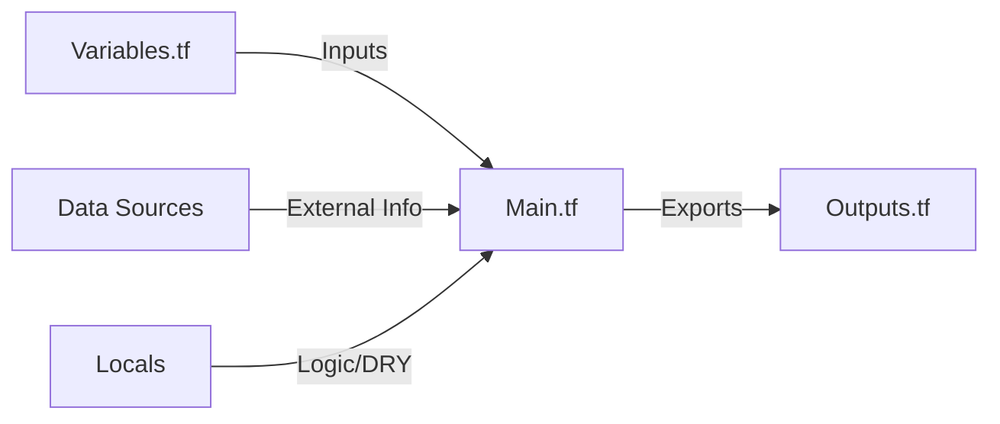
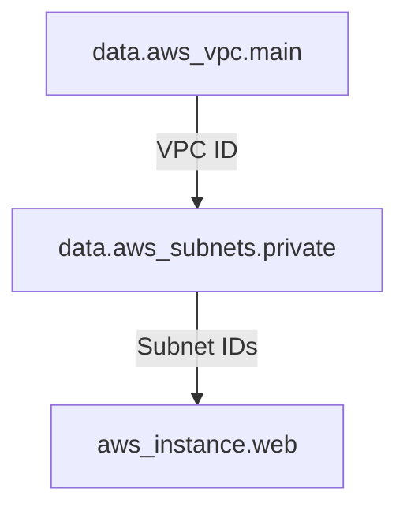

# 🟢 Part 1: Core Fundamentals & Variable Logic

## 📖 Introduction

In professional Terraform, we don't just "hardcode" strings. We build **Flexible Logic**. This level moves beyond simply knowing what a variable is and focuses on how to make variables **defensive** and **intelligent**.

### The Flow of Data


---

## 🧱 The Defensive Variable Pattern

Professional variables include **Validation** and **Strong Typing**. This prevents a developer from accidentally passing a "small" string when the code expects a "t3.micro".

### 1. Input Variables with Validation
```hcl
variable "instance_count" {
  description = "Number of instances to deploy"
  type        = number
  
  validation {
    condition     = var.instance_count > 0 && var.instance_count < 10
    error_message = "For safety, instance count must be between 1 and 9."
  }
}

variable "environment" {
  type        = string
  description = "Target environment"
  
  validation {
    condition     = contains(["dev", "staging", "prod"], var.environment)
    error_message = "Environment must be dev, staging, or prod."
  }
}
```

### 2. Locals: The "DRY" Engine
Locals are variables that are computed inside the module. They are used to simplify complex strings or to prevent repeating logic. They are **not** configurable by the user.

```hcl
locals {
  common_tags = {
    Project     = "Apollo-Automation"
    Environment = var.environment
    ManagedBy   = "Terraform"
  }
  # A complex naming convention computed once
  server_name = "${var.project_name}-${var.environment}-web-node"
}
```

---

## 🔍 Data Sources: The "Read-Only" Query

Data sources allow you to fetch information from AWS without managing the resource. 

### Why use them?
-   To find the **Latest AMI** automatically.
-   To fetch the **VPC ID** created by another team.
-   To get your **Current Account ID**.

### Chaining Data Sources


---

## 🚀 Hands-On Lab: Defensive Lab

In this lab, you will create a configuration that refuses to run if the variables are invalid.

### Step 1: Create the files
I have provided two files for you: `variables.tf` and `main.tf`.

### Step 2: Test Validation
Try running `terraform plan` and passing an invalid environment:
```bash
terraform plan -var="environment=hack"
```

### Step 3: Observe Data Resolution
Notice how Terraform queries AWS to find the subnets before showing you what it will build.

---

## 🛠️ Performance Tip: Data Source Latency
Data sources are resolved during the `plan` phase. If you have 50 data sources querying a slow API (like a legacy on-prem system), your `terraform plan` will be slow. Use **`locals`** to store the results of expensive queries if they are used multiple times.

---

## ❓ Knowledge Check

1.  **Q: What is the difference between a `variable` and a `local`?**
    *   **A:** A variable is an **Input** provided by the user. A local is a **Private Constant** computed within the code to keep it DRY.
    
2.  **Q: Why use `data` sources instead of hardcoding IDs?**
    *   **A:** Hardcoding IDs makes code non-portable. If you move from `us-east-1` to `us-west-2`, hardcoded IDs will break. Data sources find the correct ID dynamically.

---

**Next Step**: Learn to bundle these patterns into LEGO blocks in **[Part 2: Modular Architecture](README.md)** 🟡
