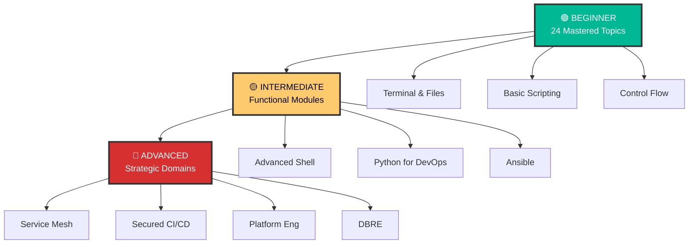

# 🤖 Automation - Shell Scripting Mastery

> **"Automation is the foundation of modern DevOps. Master shell scripting, and you master the infrastructure."**

## 📚 Overview

Welcome to the comprehensive **Automation curriculum**! This module is designed to transform you from a beginner to an expert capable of building robust, scalable automation across Shell, Python, and Ansible.

## Core Concept: The Three Laws of Automation
**[REFERENCE: Automation Strategy](./REFERENCE/Automation-Strategy-Ref.md)**

Infrastructure scalability begins with a rigorous automation mindset:
- **Fast Failure**: Using Bash Strict Mode (`set -euo pipefail`) to stop scripts instantly at the first error.
- **Idempotency**: Designing scripts that can be safely run multiple times without causing duplicate side effects.
- **Tool Selection**: Choosing the right tool for the job—Shell for fast OS tasks, Python for complex API logic.

## Enterprise Governance: Automation Standards
**[REFERENCE: Automation Strategy](./REFERENCE/Automation-Strategy-Ref.md)**

Moving from "hacks" to production-grade engineering:
- **Secret Management**: Mandatory use of Vault or Secret Managers instead of hardcoded strings or `.env` files.
- **Wrapper Pattern**: Encapsulating pipeline logic in standalone scripts that can be tested locally by any developer.
- **Least Privilege**: Ensuring automation service accounts are restricted to specific namespaces or resources.
- **Script Linting**: Using `shellcheck` and `pylint` to enforce clean, readable, and secure code standards.

## 📋 Professional Pattern: "Configuration separation"

Don't bake your environment values into your HCL logic. Keep your Terraform code strictly for **Architectural Logic** and use **YAML/JSON files** for your **Environment Configuration**. Your module should read the YAML file, parse it into a map, and use `for_each` to create the infrastructure. This allows you to add new environments or services just by editing a simple data file—zero HCL changes required.

## 🎯 Learning Objectives

By completing this curriculum, you will:

- ✅ Master Bash shell scripting from fundamentals to advanced techniques
- ✅ Automate complex DevOps workflows confidently
- ✅ Write production-ready, maintainable automation scripts
- ✅ Understand Unix philosophy and best practices
- ✅ Debug and troubleshoot shell scripts effectively
- ✅ Build CI/CD pipeline components (GitHub Actions, etc.)

## 🗺️ Curriculum Structure

### Three-Tier Learning System

---

## 📖 Module Listings

### 🟢 Level 1: Beginner (Foundation Building)

Master the fundamentals of shell scripting and terminal navigation.

| # | Topic | Description | Status |
| --- | --- | --- | --- |
| 01 | [**Introduction**](README.md) | Shell types, first script | ✅ |
| 02 | [**Terminal and Finder**](README.md) | Navigation, paths | ✅ |
| 03 | [**Basic File Manipulation**](README.md) | cp, mv, rm | ✅ |
| ... | [**View Full Beginner Index**](03-Go-Basics/GO_AUTOMATION_MASTER_INDEX.md) | Topics 04-24 (Mastered) | ✅ |

---

### 🟡 Level 2: Intermediate & Advanced Automation

Functional modules for building real-world tools.

| # | Module | Description | Path |
| :---: | :--- | :--- | :---: |
| 01 | **Intermediate Shell** | Functions, Loops, Strict Mode | [Explore Module](README.md) |
| 02 | **Advanced Bash** | jq, sed, awk, xargs, traps | [Explore Module](README.md) |
| 03 | **Python for DevOps** | Boto3, APIs, Web Scraping | [Explore Module](README.md) |
| 04 | **Job Scheduling & Cron** | Crontab, Overlap, K8s Jobs | [Explore Module](./04-Job-Scheduling-and-Cron/) |
| 05 | **Event-Driven Webhooks** | HTTP POST, Security, Async | [Explore Module](./05-Event-Driven-Webhooks/) |
| 06 | **Ansible Dynamic Inventory** | Plugins, Keyed Groups, Caching | [Explore Module](./06-Ansible-Dynamic-Inventory/) |
| 07 | **Terraform Patterns** | Modules, State Locking, DRY | [Explore Module](./07-Terraform-Patterns/) |
| 08 | **Best Practices** | Idempotency, Secrets | [Explore Module](README.md) |
| 09 | **Ansible Fundamentals** | Playbooks, Roles | [Explore Module](README.md) |
| 10 | **Real Life Scenarios** | Troubleshooting War Stories | [Explore Module](README.md) |
| 11 | **FinOps (Cost as Code)** | Infracost, Kubecost | [Explore Module](README.md) |

---

### 🔴 Level 3: Strategic Domains

High-level implementation strategies.

- **[GitOps](README.md)**
- **[Service Mesh](README.md)**
- **[Multi-Cluster K8s](README.md)**
- **[AIOps & Incident Response](README.md)**
- **[Platform Engineering](README.md)**
- **[Supply Chain Security](README.md)**
- **[Bare Metal Automation](README.md)**
- **[Serverless Incident Mgmt](README.md)**
- **[FinOps K8s Optimization](README.md)**
- **[Chaos Engineering](README.md)**
- **[Advanced Identity Federation](README.md)**
- **[Service Mesh Security](README.md)**
- **[Automated Compliance Auditing](README.md)**
- **[Secret Management (Vault)](README.md)**
- **[Fleet Mgmt (ApplicationSets)](README.md)**
- **[Admission Controllers (OPA)](README.md)**
- **[Advanced CI/CD Patterns](README.md)**
- **[Service Mesh Observability](README.md)**
- **[Cloud-Native Backup (Velero)](README.md)**
- **[Automated Security Scanning](README.md)**
- **[Advanced Terraform Workflows](README.md)**
- **[Automated Performance Testing](README.md)**
- **[Cloud-Native Logging (Loki)](README.md)**
- **[Cost Governance (Infracost)](README.md)**
- **[Advanced K8s Networking (eBPF)](README.md)**
- **[DBRE (Database Reliability)](README.md)**
- **[Observability](README.md)**

---

## 📊 Progress Tracker

- [x] **Beginner Level** (24/24 completed)
- [x] **Intermediate/Advanced Level** (26/26 completed)
- [ ] **Specialization/Planned** (0/12 planned)

**Total Completion**: 81% ⬜⬜⬜⬜⬜⬜⬜⬜⬛⬛

---

## 📂 Practical Code & Scripts

Build your first tools with these guided examples:

- **[Shell Scripting Examples](./01-Shell-Scripting/examples/)**: Hello World, variable tests, and basic OS diagnostics.
- **[Python Basics](./02-Python-Basics/examples/)**: Essential syntax and automation logic for DevOps.

**Happy Automating!** 🤖

---
## 🧭 Additional Modules
- [00 Foundations](00-Foundations/README.md)
- [03 Go Basics](03-Go-Basics/README.md)
- [03 Idempotency](03-Idempotency/README.md)
- [resources](resources/README.md)
