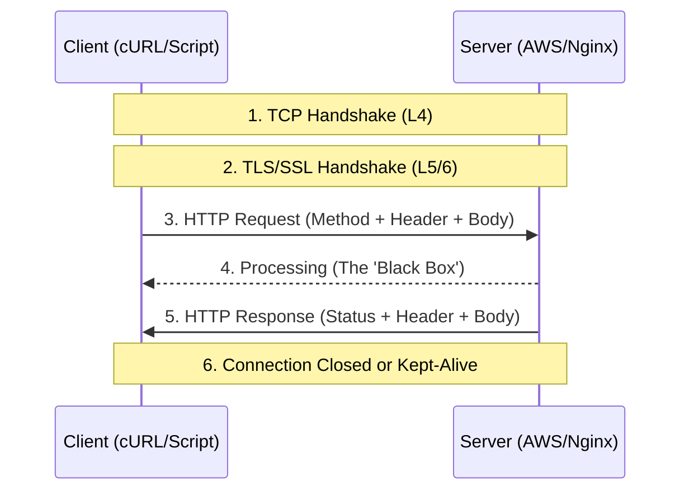
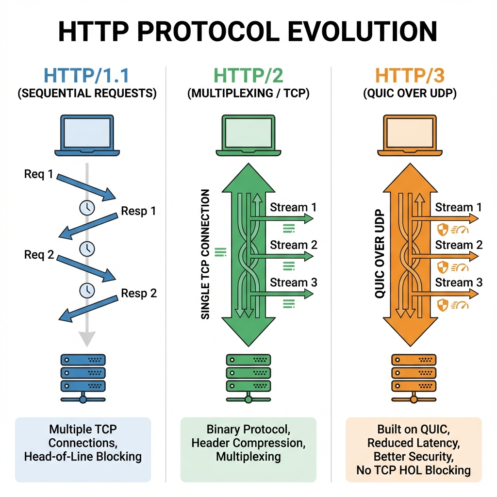

# 📡 Part 1.1: The HTTP Protocol

> **"HTTP is the grammar of the internet. To control the cloud, you must speak its language fluently—not just as a user, but as an architect."**

## 📖 Overview

**HyperText Transfer Protocol (HTTP)** is the request-response protocol that serves as the foundation of data communication for the World Wide Web. In DevOps, HTTP isn't just for loading websites; it's the bridge through which monitoring tools scrape metrics, CI/CD pipelines trigger deployments, and infrastructure components coordinate.

---

## 🏗️ High-Level Flow

The lifecycle of an HTTP interaction.




---

## 🌐 Protocol Evolution



---

## 🎯 Learning Objectives

By the end of this module, you will:

- ✅ **Decode** the HTTP Message Anatomy (Start Line, Headers, Payload).
- ✅ **Master** the Verb Taxonomy: GET, POST, PUT, PATCH, DELETE, and HEAD.
- ✅ **Leverage** Headers for content negotiation, caching, and security.
- ✅ **Differentiate** between HTTP/1.1 (Streaming), HTTP/2 (Multiplexing), and HTTP/3 (QUIC).

---

## 🧱 The Anatomy of a Request

Every time you "call an API," you are sending a structured text block.

### 1. The Request Line

- **Method**: The action (`GET`, `POST`).
- **Path**: The resource location (`/v1/clusters/123`).
- **Version**: The protocol (`HTTP/1.1`).

### 2. Headers (Metadata)

Headers are key-value pairs that provide context:

- `Host`: Required in HTTP/1.1 for virtual hosting.
- `Content-Type`: The format of the data being sent (`application/json`).
- `Accept`: What the client can understand (`application/json`).

### 3. The Body (Payload)

The actual data. Usually empty for `GET` and `DELETE`, but essential for `POST` and `PUT` to carry configuration or user data.

---

## 🛠️ The HTTP Verb Taxonomy


| Verb | Idempotent | Purpose | DevOps Use Case |
| :--- | :--- | :--- | :--- |
| **GET** | Yes | Retrieve data. | Checking server health status. |
| **POST** | No | Create resource. | Triggering a new Jenkins build. |
| **PUT** | Yes | Replace resource. | Updating an entire config file. |
| **PATCH** | No | Partial update. | Changing one field in a DB record. |
| **DELETE** | Yes | Remove resource. | Tearing down a test server. |
| **HEAD** | Yes | Get headers ONLY. | Checking if a 10GB log file exists. |

---

## 🚀 Professional Patterns: The "Metadata" Strategy

### Pattern A: Caching with ETag

To save bandwidth, servers send an `ETag` (a hash of the data). In the next request, the client sends `If-None-Match: <hash>`. If the data hasn't changed, the server sends a **304 Not Modified**, saving execution time and data egress costs.

### Pattern B: User-Agent Identity

Many servers block "bot-like" requests. When writing automation scripts, always set a custom User-Agent to identify your source.

```bash
curl -A "CI-Pipeline-Bot/2.1" <https://api.prod.example.com/deploy>
```

---

## 🎓 Career Readiness

**Interview Question:** "Why is POST not idempotent, while PUT is?"

**Strong Answer:** "An operation is idempotent if multiple identical requests have the same effect as a single request. If you call **PUT** to update a user's email to '<test@mail.com>' ten times, the result is always that the email is '<test@mail.com>'. However, if you call **POST** to 'create-user' ten times, you will likely end up with ten different user records (or a conflict error). This is why retrying a failed POST without caution can lead to duplicate data."

---

**Next Step**: [Part 1.2: REST Architecture](../02-REST-Architecture/) 🚀
