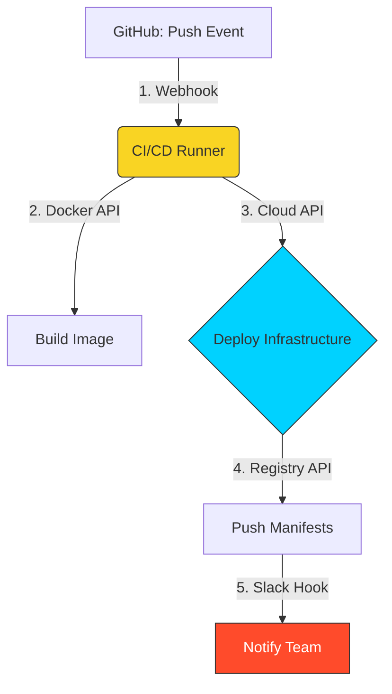

# 🚀 Part 3: Advanced API Workflows & DevOps Integration

> **"In DevOps, every tool is an API client, and every platform is an API provider. Automation is simply the 'glue' that connects these distributed brains."**

## 📖 Overview

This final module bridges the gap between theoretical API knowledge and practical **DevOps Engineering**. We explore the automation loops that define our industry—from Webhooks triggering pipelines to the defensive programming required to build resilient, distributed systems.

---

## 🏗️ The Automation Loop

How events flow through the DevOps ecosystem.

---

## 🎯 Learning Objectives

By the end of this module, you will:

- ✅ **Master** Webhooks: The "Reverse API" pattern for reactive automation.
- ✅ **Implement** Resilience: Exponential Backoff & Jitter to prevent cascading failures.
- ✅ **Navigate** Rate Limits: Handling 429 responses with surgical precision.
- ✅ **Enforce** Idempotency: Ensuring retries never cause duplicate infrastructure or charges.
- ✅ **Troubleshoot** APIs: Using `cURL` as a diagnostic Swiss Army Knife.

---

## 🏗️ Resilience & Stability Patterns

### 1. Webhooks (The "Push" Pattern)

Instead of polling GitHub every minute to see if code changed (wasting resources), GitHub "calls you" the moment an event occurs.

- **Critical DevOps Check**: Always verify the **Payload Signature** to ensure the request isn't a spoof from an attacker.

### 2. Exponential Backoff & Jitter

When an API is struggling (returning 503 or 429), don't just loop.

- **Backoff**: Wait 1s, 2s, 4s...
- **Jitter**: Add a random millisecond delay (e.g., 2.1s instead of 2.0s) to prevent the **Thundering Herd** problem where 10,000 clients retry at the exact same microsecond.

### 3. Idempotency (The Safety Valve)

An operation is idempotent if it can be performed multiple times with the same result. Sending an `X-Idempotency-Key` header ensures that if a "Create Server" request times out and you retry it, the Cloud API recognizes the second request and doesn't charge you for two servers.

---

## 🚀 The SRE's Toolkit: cURL Mastery

cURL is the ultimate low-level debugger for API issues.

| Flag | Purpose |
| :--- | :--- |
| `-v` | **Verbose**: Show the full TLS handshake and all headers. |
| `-I` | **Head**: Fetch metadata only (useful for checking file existence). |
| `-X` | **Method**: Explicitly set the verb (GET, POST, etc). |
| `-H` | **Header**: Pass tokens, content types, or custom metadata. |
| `-L` | **Location**: Follow redirects (important for troubleshooting 301s). |

---

## 🏆 Real-World DevOps Story: The Thundering Herd

**The Scenario**: A fleet of 5,000 servers was configured to download a security update via API every day at midnight.

**The Crisis**: At exactly 00:00:00, all 5,000 servers hit the API gateway simultaneously. The gateway crashed instantly under the load.
**The Fix**: The SRE team implemented **Jitter** in the update script. Now, each server picks a random time between 00:00 and 00:15 to check for updates.

**The Lesson**: Synchronization is the enemy of stability in distributed systems.

---

## 🎓 Career Readiness

**Interview Question:** "What is a 'Thundering Herd' and how does adding Jitter to your API retries solve it?"

**Strong Answer:** "A Thundering Herd occurs when many clients attempt to access a resource or retry a failed request at the same time, causing a traffic spike that can crash a service. By adding **Jitter**—a random delay—to our retry interval, we ensure that client attempts are staggered over a time window rather than occurring in unison. This smooths out the traffic spike and allows the infrastructure to process requests more reliably."

---

**Completion**: You have completed the **API Basics** module! 🏆
Return to the [Automation Track](../../README.md) to explore the next frontier.
