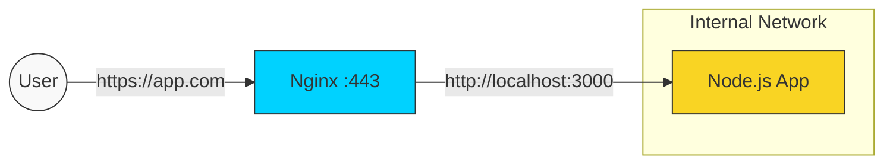

# 🛡️ Module 02: Reverse Proxy Basics

> **"Never let your application server talk directly to the internet. Nginx is the professional firewall for your code."**



## 📚 Overview

A **Reverse Proxy** is a server that sits in front of one or more web servers, intercepting requests from clients. This is DIFFERENT from a Forward Proxy (like a VPN), which acts on behalf of the client.

In DevOps, we use Reverse Proxies to mask our application servers, handle SSL, and provide a single point of logs and security.

## 🎓 Learning Objectives

- ✅ Understand the difference between **Forward vs. Reverse** proxies.
- ✅ Implement the `proxy_pass` directive.
- ✅ Pass proper **Headers** to the backend (`Host`, `X-Forwarded-For`).
- ✅ Configure **Context Routing** (Paths like `/api` vs `/static`).

---

## 🏗️ The Basic Configuration

To turn Nginx into a proxy, you use the `location` block:

```nginx
server {
    listen 80;
    server_name myapp.com;

    location / {
        proxy_pass http://localhost:3000;
        
        # Passing essential headers
        proxy_set_header Host $host;
        proxy_set_header X-Real-IP $remote_addr;
        proxy_set_header X-Forwarded-For $proxy_add_x_forwarded_for;
        proxy_set_header X-Forwarded-Proto $scheme;
    }
}
```

### Why do we need the headers?

Without `X-Forwarded-For`, your application will think EVERY single visitor is `127.0.0.1` (the Nginx server itself). This would break your analytics and security blocking.

---

## 🚀 Key Patterns: Context Routing

Nginx can route traffic to different backends based on the URL path:

```nginx
server {
    listen 80;

    # Frontend (React/Vue)
    location / {
        root /var/www/html;
        index index.html;
    }

    # API Backend (Python/Java)
    location /api/ {
        proxy_pass http://localhost:8080/;
    }

    # Legacy Service
    location /old/ {
        proxy_pass http://legacy-server:9000;
    }
}
```

---

## 🏆 Real-World DevOps Story: The Analytics Ghost Town

**The Scenario**: A company launched a new app behind Nginx. Their analytics tool showed that 10,000 users all lived in the same "house" (the same IP address).

**The Discovery**: They forgot to configure `proxy_set_header X-Forwarded-For`. Nginx was stripping the client's real IP and replacing it with its own.

**The Fix**: Adding the Header-Pass lines allowed the app to see the world again.
**The Lesson**: Nginx is a "Middleman." If you don't tell the middleman to share the secrets, your app server becomes "blind."

---

## ❓ Interview Preparation

1. **Q: What is the most important directive for Nginx proxying?**
   *A: `proxy_pass`. It defines the protocol (http/https) and the address (IP/Domain) of the server to which requests should be forwarded.*

2. **Q: How do you handle a trailing slash in `proxy_pass`?**
   *A: It's critical. If you use `/api/` and `proxy_pass http://backend:8080/`, Nginx strips the `/api/` and sends just the rest. If you leave it off, it sends the full path.*

3. **Q: Why use Nginx in front of a Node.js or Python app?**
   *A: Security and efficiency. Nginx is faster at SSL, better at buffering slow clients, and provides a barrier against direct attacks on your app server's port.*

4. **Q: What does 'X-Forwarded-Proto' do?**
   *A: It tells the backend whether the original request was HTTP or HTTPS. This is crucial for apps that need to generate secure links.*

5. **Q: Can Nginx proxy to a server on a different physical network?**
   *A: Yes, as long as the Nginx server has network connectivity to that IP/Domain.*

---

## 🔗 Next Steps

The shield is up. Now let's handle the crowd!

Proceed to: **[Part 2: Traffic Management & Performance](../../Part-02-Traffic-Management-and-Performance/01-Load-Balancing-Strategies/README.md)** →

---

[Back to Part 1 Overview](../README.md) | [Back to Home](../../README.md)
