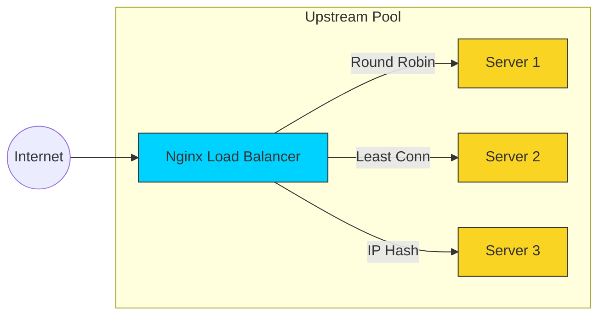

# 🏎️ Part 2: Traffic Management & Performance

> **"Scaling isn't just about adding more servers; it's about making sure your traffic lands in the right place, at the right time, as fast as possible."**

## 📖 Overview

In this module, we move beyond single-server setups to **High Availability (HA)** and **Infrastructure Optimization**. You will learn how to turn Nginx into a powerful Load Balancer and a caching accelerator that can save your backend from total collapse during traffic spikes.

---

## 🏗️ The Load Balancing Life-Cycle

Nginx sits at the center of your cluster, distributing tasks to the "Workers" (Application Servers).



---

## 🎯 Learning Objectives

By the end of this part, you will:

- ✅ **Master** the `upstream {}` block to define server pools.
- ✅ **Analyze** different load balancing algorithms (Round Robin, Least Connections, IP Hash).
- ✅ **Implement** Health Checks to automatically bypass failing servers.
- ✅ **Drastically** reduce page load times using Gzip and Brotli compression.
- ✅ **Accelerate** content delivery with Nginx Content Caching.

---

## 🗺️ Included Modules

1. **[01-Load Balancing Strategies](./01-Load-Balancing-Strategies/README.md)**: Learning how to distribute traffic and build resilient clusters.
2. **[02-Performance Optimization](./02-Performance-Optimization/README.md)**: Speeding up the edge. Gzip, Caching, and connection tuning.

---

## 🚀 Professional Pattern: The "Fail-Over" Logic

In production, servers go down. Nginx handles this with the `max_fails` and `fail_timeout` directives.

**The Resilience Config:**

```nginx
upstream backend_pool {
    server 10.0.0.1;
    server 10.0.0.2 max_fails=3 fail_timeout=30s;
    server 10.0.0.3 backup; # Only used if others fail
}
```

- **max_fails**: How many times Nginx tries to reach a server before marking it "down."
- **backup**: A safety server that remains idle until the primary cluster is completely unavailable.

---

## 🎓 Career Readiness

**Interview Question:** "What is 'IP Hash' load balancing and when would you use it?"

**Strong Answer:** "IP Hash is a load balancing algorithm where the client's IP address is used as a hashing key to determine which server receives the request. This ensures **Session Persistence** (Stickiness), meaning a specific user will always be routed to the same backend server. This is useful for legacy applications that store user sessions (like logins or shopping carts) in local RAM rather than a shared database like Redis."

---

**Next Step**: Start with **[01-Load Balancing Strategies](./01-Load-Balancing-Strategies/README.md)** 🚀
