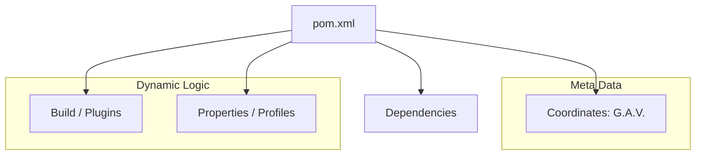

# 🧠 Module 03: The Project Object Model (POM)

> **"If the filesystem is the body of the project, the `pom.xml` is its brain. It contains the instructions that define what the project is, what it needs, and how it should be born."**



## 📚 Overview
The **Project Object Model (POM)** is the unit of work in Maven. It is an XML file that contains information about the project and configuration details used by Maven to build the project. 

In this module, we move beyond the basics of "GAV" coordinates and explore how to use **Profiles**, **Resource Filtering**, and **Inheritance** to create enterprise-grade build scripts.

## 🎓 Learning Objectives
- ✅ Understand the **GAV (GroupId, ArtifactId, Version)** naming convention.
- ✅ Implement **POM Inheritance** to share configurations across projects.
- ✅ Master **Resource Filtering** to inject environment variables into files.
- ✅ Use **Build Profiles** to switch between Dev, QA, and Prod settings.
- ✅ Configure **Plugin Management** for consistent tool versioning.

---

## 🏗️ The Anatomy of a POM

Every `pom.xml` starts with the coordinates.

```xml
<project>
  <modelVersion>4.0.0</modelVersion>
  <groupId>com.acme.financial</groupId>
  <artifactId>payment-gateway</artifactId>
  <version>1.2.0-SNAPSHOT</version>
  <packaging>jar</packaging>
</project>
```

### Key Elements:
- **GroupId**: Usually the reversed domain name of your company (e.g., `com.google`).
- **ArtifactId**: The name of the project.
- **Version**: Use `-SNAPSHOT` for work in progress. Remove it for releases.
- **Packaging**: `jar` (library), `war` (web app), or `pom` (parent project).

---

## 🚀 Professional Pattern: Build Profiles

You don't want your database password for Production sitting in your source code. You use **Profiles** to change configurations based on the environment.

```xml
<profiles>
  <profile>
    <id>dev</id>
    <properties>
      <db.url>jdbc:h2:mem:test</db.url>
    </properties>
  </profile>
  <profile>
    <id>prod</id>
    <properties>
      <db.url>jdbc:mysql://prod-db:3306/db</db.url>
    </properties>
  </profile>
</profiles>
```

**Usage**: `mvn clean package -P prod` (This activates the production settings).

---

## 🏆 Real-World DevOps Story: The Hardcoded API Key Leak

**The Scenario**: A developer hardcoded a staging API key into `src/main/resources/application.properties`. When the project was built for Production, the app continued to use the staging credentials.
**The Discovery**: The build process wasn't "aware" of the environment. 
**The Fix**: The SRE team implemented **Resource Filtering**. They changed the property value to `${api.key}` in the file and configured Maven to "inject" the correct value from a secure Build Profile during the CI/CD run.
**The Lesson**: The `pom.xml` is the bridge between your **Code** and your **Infrastructure**. Use it to keep your code "Environment Agnostic."

---

## ❓ Interview Preparation

1. **Q: What is the significance of the '-SNAPSHOT' suffix in a version?**
   *A: It indicates that the version is under active development. Maven will look for updates to snapshots more frequently because they are not "immutable" releases.*

2. **Q: What is the 'Effective POM'?**
   *A: It is the final POM interpreted by Maven after combining your project's POM with all parent POMs and the Super POM. You can see it by running `mvn help:effective-pom`.*

3. **Q: What is Resource Filtering?**
   *A: It is the process where Maven replaces placeholders (like `${name}`) in your resource files with actual values defined in your `pom.xml` properties or profiles.*

4. **Q: Explain `<dependencyManagement>` vs `<dependencies>`.**
   *A: `<dependencies>` actually includes the libraries in the project. `<dependencyManagement>` only "pre-configures" the versions. It is used in parent POMs to ensure all child modules use the same version of a library if they choose to include it.*

5. **Q: How can you inherit from a parent POM?**
   *A: By using the `<parent>` tag in the child POM. This allows the child to inherit all properties, dependencies, and plugin configurations from the parent.*

---

## 🔗 Next Steps

The brain is configured. Now let's feed it the libraries it needs.

Proceed to: **[04-Dependencies](../../Part-02-Core-Build-Workflows/01-Dependencies/README.md)** →