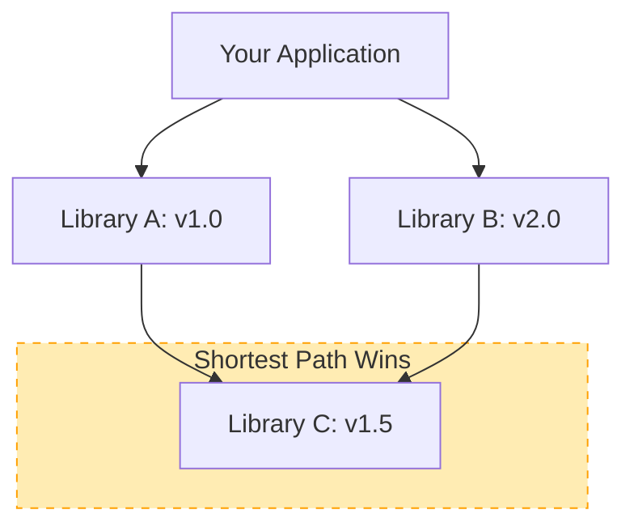

# 🟡 Part 2: Core Build Workflows

> **"A build is a sequence of events. To optimize it, you must understand the chain from source to artifact."**

## 📖 Overview

In this part, we explore the most powerful features of Maven: **Dependency Management** and the **Build Lifecycle**. You will learn how Maven resolves the "web of libraries" and how it moves through distinct phases to produce a finished product.

---

## ⛓️ The Dependency Tree

Maven doesn't just download files; it manages a complex graph of relationships.

---

## 🎯 Learning Objectives

By the end of this part, you will:

- ✅ **Manage** transitive dependencies and handle version conflicts.
- ✅ **Understand** dependency scopes (compile, test, provided, runtime).
- ✅ **Master** the default build lifecycle (compile -> test -> package -> install).
- ✅ **Utilize** the `clean` and `verify` phases for build quality.

---

## 🗺️ Included Modules

1. **[01-Dependencies](./01-Dependencies/README.md)**: Handling external libraries and transitive dependencies.
2. **[02-Build-Lifecycle](./02-Build-Lifecycle/README.md)**: Understanding the phases of a build.

---

## 🚀 Professional Pattern: The "Super-Dependency"

When you have a library you use in *every* project (like JUnit or Jackson), manage its version in a **Parent POM** or a **BOM (Bill of Materials)**. This ensures that every developer in the company is using the exact same version, preventing "it works on my machine" bugs.

---

## 🎓 Career Readiness

**Interview Question:** "What happens if two libraries in your project depend on different versions of the same third library?"

**Strong Answer:** "Maven uses the 'Shortest Path' rule to resolve conflicts. It will pick the version that is closest to your project in the dependency tree. If they are at the same depth, the first one declared in the `pom.xml` wins. To fix this professionally, we use the `<dependencyManagement>` section to explicitly force the version we want."

---

**Next Step**: Dive into **[01-Dependencies](./01-Dependencies/README.md)** 🚀
