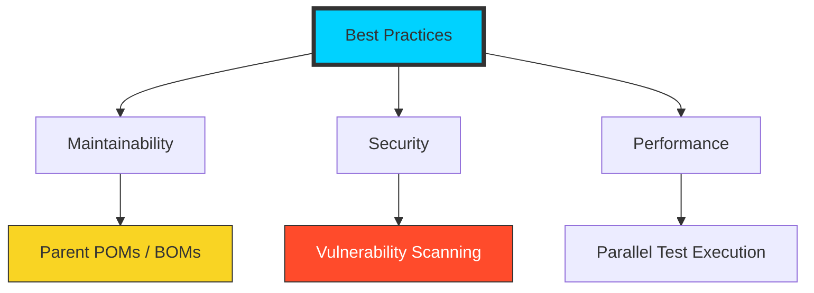

# 🏆 Module 07: Maven Best Practices

> **"Anyone can build a project once. A DevOps master builds a project that can be built by anyone, anywhere, at any time, for the next ten years."**



## 📚 Overview
Mastering Maven is not just about knowing the commands; it's about following the patterns that ensure **Stability** and **Security** at scale. In this module, we explore how to professionalize your build scripts for enterprise environments.

## 🎓 Learning Objectives
- ✅ Implement **Parent-Child Hierarchy** for configuration sharing.
- ✅ Leverage **BOM (Bill of Materials)** for version consistency.
- ✅ Automate **Dependency Security Checks** (OWASP).
- ✅ Optimize build speed with **Parallel Testing**.
- ✅ Use **Properties** to centralize all version numbers.

---

## 🚀 The Enterprise Setup: BOMs and Dependency Management

Never define a version number inside a child module. Define everything in a central **Dependency Management** block in the parent.

```xml
<!-- In the PARENT POM -->
<dependencyManagement>
  <dependencies>
    <dependency>
      <groupId>org.springframework.boot</groupId>
      <artifactId>spring-boot-starter-web</artifactId>
      <version>3.1.2</version>
    </dependency>
  </dependencies>
</dependencyManagement>

<!-- In the CHILD POM -->
<dependencies>
  <dependency>
    <groupId>org.springframework.boot</groupId>
    <artifactId>spring-boot-starter-web</artifactId>
    <!-- No version needed! -->
  </dependency>
</dependencies>
```

---

## 🔐 Security Best Practice: OWASP Scanning

You don't want to deploy code with known vulnerabilities. Bind the **OWASP Dependency Check** to your build.

```xml
<plugin>
    <groupId>org.owasp</groupId>
    <artifactId>dependency-check-maven</artifactId>
    <version>8.3.1</version>
    <executions>
        <execution>
            <goals><goal>check</goal></goals>
        </execution>
    </executions>
</plugin>
```

**Outcome**: If a library has a critical security flaw (CVE), Maven will **Fail the Build** automatically.

---

## 🏎️ Performance Best Practice: Threaded Testing

If you have 1,000 unit tests, running them one by one is slow. Configure the **Surefire Plugin** to use multiple CPU cores.

```xml
<plugin>
    <groupId>org.apache.maven.plugins</groupId>
    <artifactId>maven-surefire-plugin</artifactId>
    <configuration>
        <parallel>methods</parallel>
        <threadCount>4</threadCount>
    </configuration>
</plugin>
```

---

## 🏆 Real-World DevOps Story: The 45-Minute Build

**The Scenario**: A company's main build was taking **45 minutes** to run on the CI/CD server, causing a massive bottleneck for developers.
**The Discovery**: The build was performing a full "Site Report," running integration tests against a slow database, and downloading the entire internet on every run because the local cache wasn't being preserved.
**The Fix**: The SRE team implemented **Parallel Testing**, moved the Site generation to a separate nightly job, and configured **Docker Volume Caching** for the `~/.m2` directory.
**The Lesson**: A build tool is only as fast as you configure it to be. **Optimize the developer loop** to keep the company moving.

---

## ❓ Interview Preparation

1. **Q: Why should you use `<pluginManagement>` in a parent POM?**
   *A: It allows you to define the version and configuration of a plugin once. Child modules will then use that exact version automatically when they call the plugin, ensuring consistency across a large organization.*

2. **Q: What is the benefit of using properties for version numbers?**
   *A: It provides a "Single Source of Truth." If you need to upgrade Spring from version 5 to 6, you only have to change one line in the `<properties>` block instead of searching through dozens of dependencies.*

3. **Q: How does Maven help with Security Compliance?**
   *A: By using plugins like **OWASP Dependency Check** or **Snyk**, Maven can scan for known vulnerabilities during the build process and stop a deployment if the code is unsafe.*

4. **Q: What is a 'BOM' (Bill of Materials)?**
   *A: It is a special type of Maven project that defines a curated list of versions for a set of related libraries. Importing a BOM ensures that all libraries (like those in Spring Boot) are compatible with each other.*

5. **Q: Is it a good practice to use 'Range Versions' (e.g., [1.0, 2.0])?**
   *A: Generally, **no**. It makes your build "Non-Deterministic." You might build successfully today, but if a library releases a broken version tomorrow, your build will suddenly fail without any code changes. Always use fixed versions in production.*

---

## 🔗 Next Steps

Standards are set. Now let's learn how to fix things when they break.

Proceed to: **[08-Troubleshooting](../03-Troubleshooting/README.md)** →