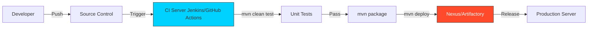

# 🔴 Part 3: Enterprise Maven and Optimization

> **"In the enterprise, a build isn't just a compile step; it's the gateway to production. Reliability, speed, and reproducibility are the measurements of success."**

## 📖 Overview

## Enterprise Governance & Supply Chain Security
**[REFERENCE: Enterprise Security & Settings](../REFERENCE/Enterprise-Security-Settings-Ref.md)**

At the enterprise level, Maven is the gatekeeper of your software supply chain.
- **Dependency Governance**: Using `dependencyManagement` in a Parent POM to enforce versions across 100s of apps.
- **Vulnerability Blocking**: Stopping a build if a library has a CVE (using OWASP plugin).
- **Artifact Authority**: We only trust artifacts that come from *our* Nexus/Artifactory, never direct from the internet.

> See **[Dependency-Mechanism-Ref.md](../REFERENCE/Dependency-Mechanism-Ref.md)** for how to win the war against Dependency Hell.

This final part bridges the gap between local development and enterprise-scale delivery. We move beyond simply building code to **optimizing** the process, integrating with **CI/CD Pipelines**, and adhering to **Best Practices** that keep builds fast and reliable.

---

## 🚀 The Golden Pipeline

Enterprise Maven usage focuses on automation and artifact lifecycle management.

---

## 🎯 Learning Objectives

By the end of this part, you will:

- ✅ **Integrate** Maven with CI/CD tools to automate the path to production.
- ✅ **Differentiate** between SNAPSHOT (unstable) and Release (stable) artifacts.
- ✅ **Implement** Maven Profiles to handle different environments (Dev, QA, Prod).
- ✅ **Optimize** build times using parallel builds and dependency caching.
- ✅ **Troubleshoot** complex build failures like a pro.

---

## 🗺️ Included Modules

1. **[01-CI-CD-Integration](./01-CI-CD-Integration/README.md)**: Automating builds with Jenkins/GitHub Actions and managing the Release Lifecycle.
2. **[02-Best-Practices](./02-Best-Practices/README.md)**: Profiles, Multi-module projects, and the "Golden Rules" of Maven.
3. **[03-Troubleshooting](./03-Troubleshooting/README.md)**: Debugging dependency conflicts, slow builds, and cryptic errors.

---

## 🛡️ Professional Pattern: The "Snapshot" vs "Release" Rule

**Never deploy a SNAPSHOT to Production.**

- **SNAPSHOT (`1.0.0-SNAPSHOT`)**: Represents a "work in progress". Maven checks for updates daily (or always). It is identifying a *development* branch.
- **RELEASE (`1.0.0`)**: Represents a "frozen in time" artifact. Once deployed to a repository, it **cannot** be overwritten.

This immutability guarantees that if you rollback to version `1.0.0` today, it is the exact same code that was there a year ago.

---

## 🎓 Career Readiness

**Interview Question:** "What is the meaningful difference between `mvn install` and `mvn deploy`?"

**Strong Answer:** "`mvn install` packages the artifact and places it in your **local repository** (`~/.m2`). It is used for local testing or sharing between projects on your own machine. `mvn deploy`, typically run by a CI server, uploads the artifact to a **remote repository** (like Nexus or Artifactory) to be shared with the entire team or deployed to production servers."

---

**Next Step**: Master the pipeline in **[01-CI-CD-Integration](./01-CI-CD-Integration/README.md)** 🚀

