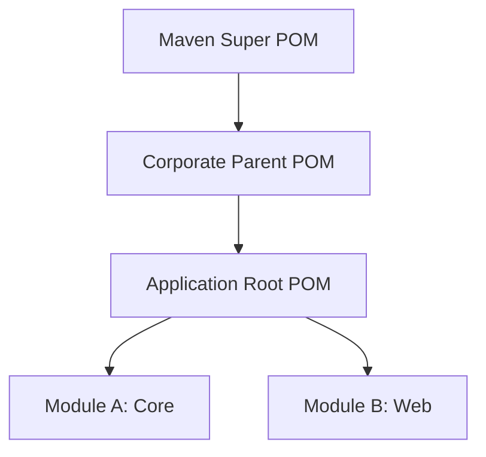

# POM Inheritance & Interaction Reference

**Doc Version:** 1.0.0
**Role:** Senior DevOps Engineer
**Scope:** Multi-Module Builds & Parent POMs

---

## 1. The Power of Inheritance (Parent POM)

Just as Java classes inherit from Objects, POMs inherit from Parent POMs. This is the primary mechanism for **Standardization** across an enterprise.

### What is Inherited?
- **Dependencies** (via `<dependencies>`)
- **Plugin Configurations**
- **Properties**
- **Repositories**

### What is NOT Inherited?
- **ArtifactId/Name**: Obviously unique to the child.
- **Profiles**: Unless activated.

---

## 2. The Super POM

Every POM implicitly inherits from the **Super POM** (embedded in Maven Core). This is why you don't need to define `src/main/java`—the Super POM defined strictly:
- Source starts at `${project.basedir}/src/main/java`
- Output goes to `${project.basedir}/target`

**Enterprise Override:**
We never touch the Super POM. Instead, we create a `Corporate-Parent-POM` that sits between the project and the Super POM.

---

## 3. Multi-Module Architecture (Reactor)

A Multi-module project allows managing a monolith or a set of microservices as a single unit.

```xml
<modules>
    <module>core-api</module>    <!-- Builds First -->
    <module>service-impl</module> <!-- Depends on core-api -->
    <module>web-ui</module>       <!-- Depends on service-impl -->
</modules>
```

### The Concept of Aggregation vs. Inheritance
- **Aggregation (`<modules>`)**: "I am a bucket holding these projects." (One command builds all).
- **Inheritance (`<parent>`)**: "I define the DNA for these projects." (Common versions/plugins).

**Best Practice:** The root `pom.xml` in a multi-module project usually acts as **both** the Parent (Inheritance) and the Aggregator (Modules).

---

## 4. Bill of Materials (BOM) Pattern

A BOM is a special POM that contains *only* a `<dependencyManagement>` section.
It acts as a "Menu" of compatible versions.

**Example usage in Child:**
```xml
<dependencyManagement>
    <dependencies>
        <dependency>
            <groupId>com.company.stack</groupId>
            <artifactId>enterprise-bom</artifactId>
            <version>2024.1.0</version>
            <type>pom</type>
            <scope>import</scope>
        </dependency>
    </dependencies>
</dependencyManagement>
```
Now the child can include ANY enterprise library *without specifying a version*, ensuring the whole company uses the vetted version strings.

---

## 5. Visual Hierarchy


