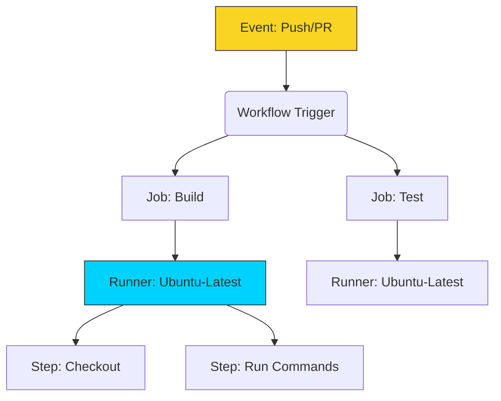

# 🟡 Part 2: GitHub Actions Core

> **"GitHub Actions turned 'CI' from a specialized server task into a universal developer skill. It lives right next to your code, and it speaks the same language."**

## 📖 Overview

In this part, we get our hands dirty. We move from theory to implementation using **GitHub Actions**, the industry-standard CI tool for modern development. You will write your first workflows, understand the YAML syntax, and learn how to control the execution flow.

---

## ⚙️ The GitHub Actions Engine

---

## 🎯 Learning Objectives

By the end of this part, you will:

- ✅ Write a valid **`.github/workflows` YAML** file.
- ✅ Understand **Triggers** (`on: push`, `on: pull_request`, `on: schedule`).
- ✅ Manage **Runners** (Ubuntu, Windows, Mac).
- ✅ Use **Actions** from the Marketplace (like `actions/checkout`).
- ✅ Define **Variables** and **Secrets**.

---

## 🗺️ Included Modules

1. **[01-GitHub-Actions-Basics](./01-GitHub-Actions-Basics/README.md)**: Your first workflow. Understanding the syntax and structure.
2. **[02-Pipeline-Components](./02-Pipeline-Components/README.md)**: Advanced building blocks. Jobs, Steps, and Strategy Matrices.

---

## 🎓 Career Readiness

**Interview Question:** "What is the difference between a Job and a Step in GitHub Actions?"

**Strong Answer:** "A **Job** is a collection of steps that run on the same runner (server). Jobs run in parallel by default. A **Step** is an individual task within a job (like running a script or calling an action). Steps run sequentially and share data."

---

**Next Step**: Build your first workflow in **[01-GitHub-Actions-Basics](./01-GitHub-Actions-Basics/README.md)** 🚀
