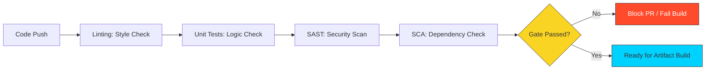

# 🛡️ Module 04: Quality & Security Gates

> **"A pipeline without a quality gate is just a faster way to ship broken software."**

## 📚 Overview
DevOps is about velocity, but **Security** is about safety. In this module, we learn how to turn our CI pipeline into a "Gatekeeper." We will integrate automated tools that check for bad coding style (Linting), logic errors (Testing), and known vulnerabilities (Security Scanning) before a single line of code ever reaches a user.

## 🎓 Learning Objectives
- ✅ Understand the **"Shift Left"** movement in Security.
- ✅ Implement **Static Application Security Testing (SAST)**.
- ✅ Use **Software Composition Analysis (SCA)** for dependencies.
- ✅ Integrate **Linting** (ESLint, Pylint, etc.) into workflows.
- ✅ Master **Status Checks** and PR blocking rules.

---

## 🏗️ The Four Pillars of Quality Gates

### 1. Linting (The Architect)
Ensures the team follows the same coding style. If a developer uses tabs instead of spaces (against policy), the build fails.
- **Example Tools**: ESLint (JS), Rubocop (Ruby), ShellCheck (Scripts).

### 2. Unit Testing (The Inspector)
Verifies that individual functions work as expected.
- **Goal**: 80%+ Code Coverage.

### 3. SAST (The Security Guard)
Analyzes the source code for common security flaws like SQL Injection or Hardcoded Credentials.
- **Example Tool**: **CodeQL** (Built into GitHub).

### 4. SCA (The Supply Chain Manager)
Checks your libraries (dependencies) against databases of known vulnerabilities (CVEs).
- **Example Tool**: **Snyk** or `npm audit`.

---

## 🚀 Professional Pattern: The Blocking PR

Don't trust developers to "remember" to run tests. Configure **GitHub Branch Protection Rules**.
1. Go to Repository **Settings > Branches**.
2. Require **Status Checks** to pass before merging.
3. Select your "Test" and "Security" jobs.

**Outcome**: The "Merge" button stays greyed out until the machine gives its approval.

---

## 🏆 Real-World DevOps Story: The Billion Dollar CVE

**The Scenario**: A large insurance company used an open-source library for "Image Processing." One night, a security researcher found a "Remote Code Execution" (RCE) bug in that library.
**The Crisis**: Because the company didn't have a **Security Gate** in their pipeline, they didn't even know they were using the vulnerable library. A week later, hackers used the bug to steal the personal data of 10 million customers.
**The Fix**: The SRE team integrated **Dependabot** and an **SCA Scanner** into their CI/CD pipeline. Now, the moment a library becomes insecure, the pipeline automatically opens a Pull Request to fix it.
**The Lesson**: Security isn't a "Phase" at the end; it's a **Gate** in the middle.

---

## ❓ Interview Preparation

1. **Q: What does it mean to 'Shift Left' in the context of Security?**
   *A: It means moving security testing earlier in the software development lifecycle. Instead of waiting for a manual security audit right before release, we run automated scans (SAST/SCA) during the very first code commit.*

2. **Q: What is the difference between Static (SAST) and Dynamic (DAST) scanning?**
   *A: SAST looks at the "Source Code" without running it (like a spellchecker). DAST tests the "Running Application" by trying to hack it from the outside (like a burglar testing a lock).*

3. **Q: Why should Linting be the first step in a pipeline?**
   *A: Because it is the fastest test. There is no point in spending 10 minutes running complex integration tests if the code is so poorly formatted that it violates the team's core standards.*

4. **Q: What is Code Coverage, and why is 100% coverage often unrealistic?**
   *A: Code Coverage measures what percentage of your source code is executed by your tests. 100% is often unrealistic because some code is purely boilerplate or handles extremely rare hardware failures that are difficult to simulate in a CI environment.*

5. **Q: How do you handle a 'False Positive' in a security scan?**
   *A: Most tools allow you to "Ignore" or "Suppress" a specific finding by adding a comment in the code or a configuration file. However, this should always require a second pair of eyes or a security lead's approval.*

---

## 🔗 Next Steps

The code is safe. Now let's ship it.

Proceed to: **[Module 05: Continuous Deployment](../02-Continuous-Deployment/README.md)** →
