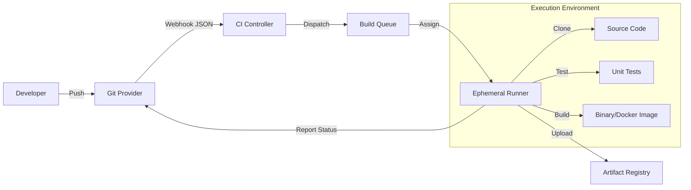

# CI/CD Architecture & Components Reference

**Doc Version:** 1.0.0
**Role:** Senior DevOps Engineer
**Scope:** The Anatomy of a Build System

---

## 1. The Core Architecture: Master/Agent Model

Modern CI/CD systems rely on a distributed architecture to separate "Management" from "Execution".

### The Controller (The Brain)
*AKA: Jenkins Master, GitHub Actions Service, GitLab Server*
- **Responsibilities:**
    - Manages the **Build Queue**.
    - Handles **Authentication & Authorization** (Who can run what?).
    - Stores **Build History** and Logs.
    - Orchestrates **Triggers** (Webhooks, Cron).
- **Governance Note:** The Controller should **NEVER** run builds directly. Executing code on the Controller is a security vulnerability (RCE risk).

### The Agent/Runner (The Muscle)
*AKA: Jenkins Node, GitHub Runner, GitLab Runner*
- **Responsibilities:**
    - Checks out source code.
    - Executes build scripts (shell, docker).
    - Uploads **Artifacts** back to storage.
    - **Ephemeral:** Ideally, agents are destroyed after use (Containerized Agents) to prevent "Configuration Drift" and cross-build contamination.

---

## 2. The Trigger Mechanism

How does the system know when to run?

### A. Webhooks (Push Model)
The "Modern" standard.
1.  Developer pushes to Git.
2.  Git Server sends an HTTP POST payload to the CI Server.
3.  CI Server parses JSON (Branch? Tag? PR?) and triggers the pipeline.
- **Pro:** Instant feedback.
- **Con:** Requires network reachability.

### B. Polling (Pull Model)
The "Legacy" method.
- CI Server asks Git "Any new commits?" every 5 minutes.
- **Pro:** Works behind strict firewalls.
- **Con:** Wasteful resources, delayed feedback.

---

## 3. The Feedback Loop (Status Checks)

CI is useless without visibility. The system must report back to the Source of Truth (Git).

- **Commit Status:** The CI server updates the Git commit with a set of "Status Checks" (Pending -> Success/Failure).
- **Merge Gates:** Enterprise repositories are configured to block merges if the Status Checks fail. This is the **Primary Defense Line** against bad code.

---

## 4. Visualizing the Flow

> **Enterprise Note:** In high-security environments, Runners are often isolated inside a Virtual Private Cloud (VPC) with no inbound access, communicating only via outgoing long-polling connections to the Controller.
